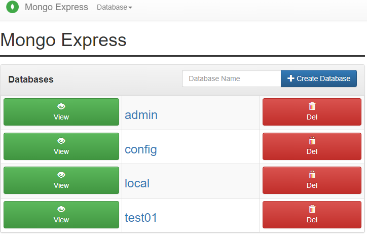

```shell
# 进入目录
cd /app

# 管理员权限打开文件管理器粘贴 docker-compose 文件
sudo nautilus

# 启动
docker compose -f docker-compose-mongo.yml up -d

# 查看 docker 日志
docker ps
docker logs d26ff8e6e155

# 查看 docker 占用的 tcp
netstat -nltp | grep docker

# 本地访问 http://localhost:27027/
# 查看 ip 访问 mongo-express http://192.168.31.151:27027/
ip addr

# 停止 
docker compose -f docker-compose-mongo.yml down
```

