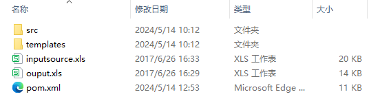
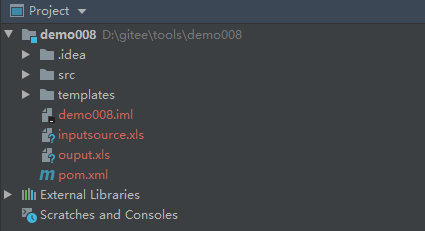
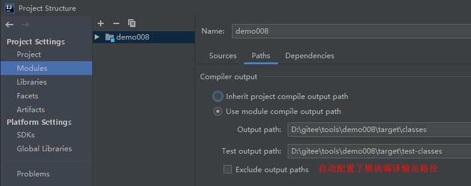
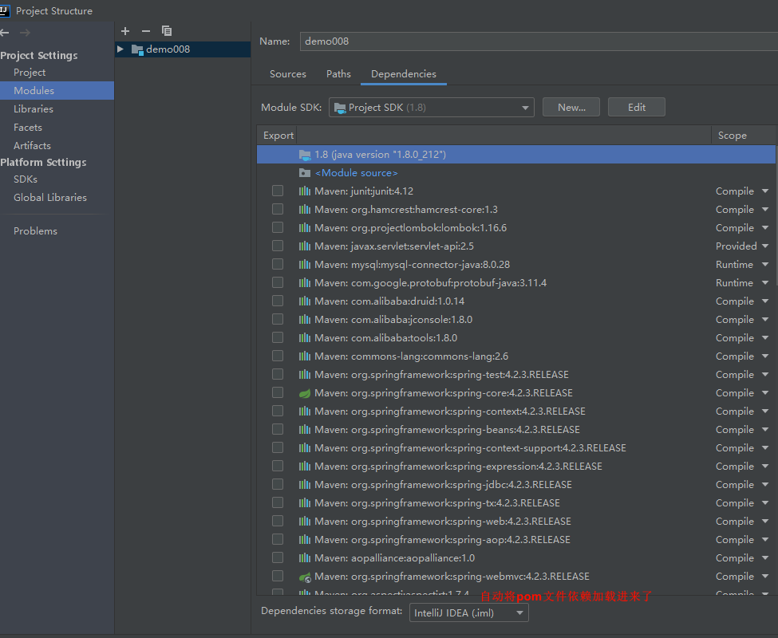
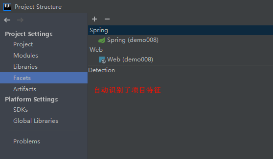
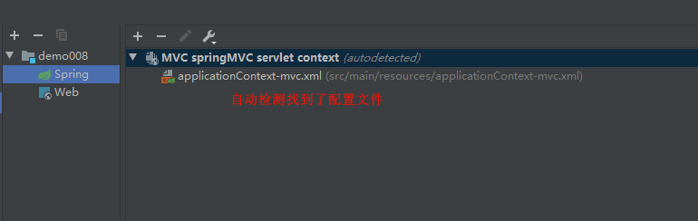
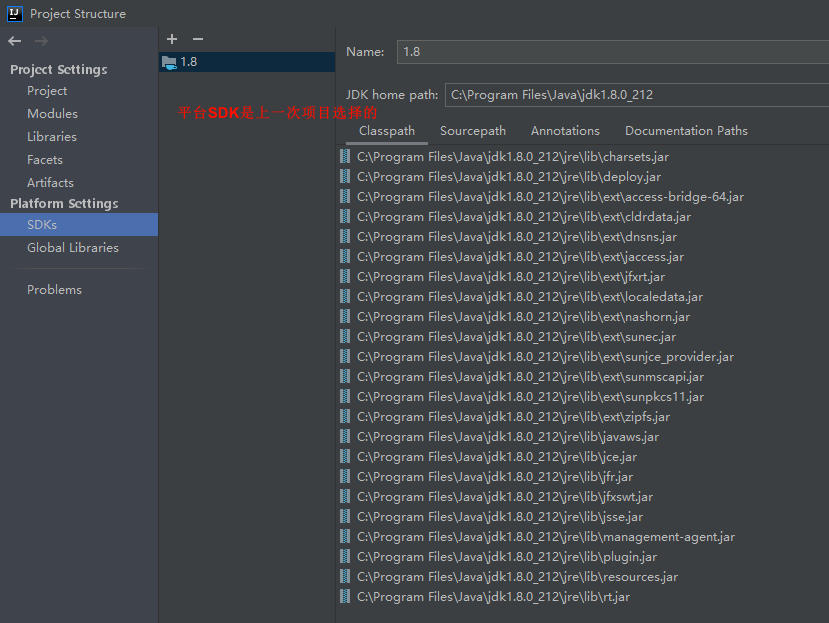
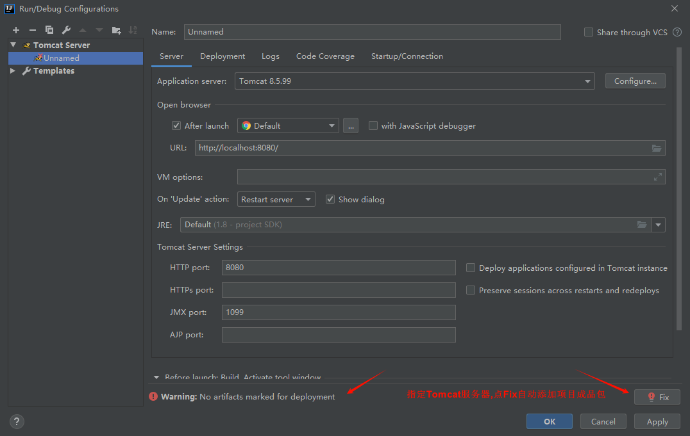
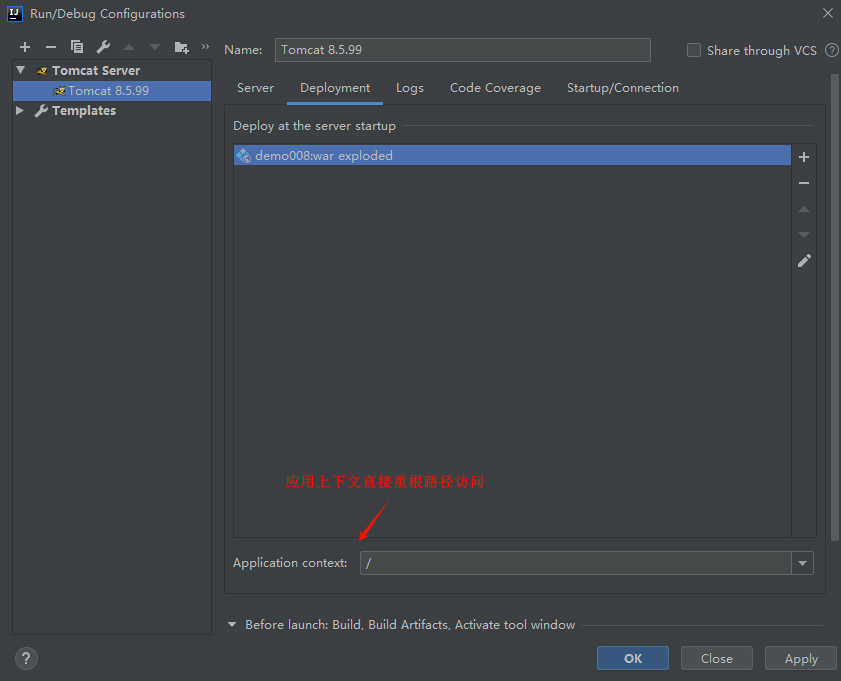
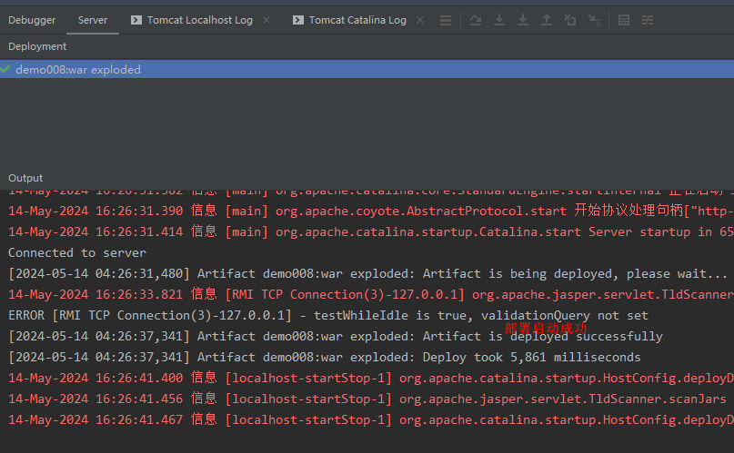

# Spring + Spring MVC + MyBatis

# 主要内容

> [项目背景](#项目背景)  
> [操作步骤](#操作步骤)

# 正文

## 项目背景

在`Spring Boot`到来之前,`Java Web`生态区涌现了一大批优秀的项目框架,其中SSM(Spring,Spring MVC,MyBatis)框架,因其诸多特性易于企
业开发,一度成为Web开发首选.特性如下:
- 轻量级: `Spring`框架是一种轻量级框架(重量级框架EJB),部署简单,启动速度快.
- 灵活性: `Spring`框架采用了依赖注入`DI`和面向切面编程`AOP`的思想,使得开发人员可以更加灵活地组织和管理代码.
- 可扩展性: `Spring`框架提供了丰富的扩展点和插件机制,可以方便地扩展和定制框架的功能.
- 无缝衔接: `SpringMVC`与`Spring`师出同源无缝衔接,还有灵活的`数据验证`, `格式化`, `数据绑定`等机制.
- 代码解耦: `Mybatis`采用xml文件配置原生SQL,解除了SQL和代码的耦合.
- 易于集成: `SSM`框架与其他第三方库和工具的集成比较容易,例如与`数据库`, `缓存`, `消息队列`等的集成.

## 操作步骤

#### 操作前提

本文以 IntelliJ IDEA 2019.3.1 为例

----

#### 项目启动

去除了不需要的文件后,就剩下如图文件,核心的是`src`源文件夹和`pom.xml`依赖库管理文件,其它的文件也是可以去掉的,这个项目结构结构不
太规范,为保证项目正常运行,保留其它文件.

----

项目打开后在IDE上显示如上图,原始文件目录都有,还自动生成了`.`开头的文件.

----

打开项目结构(Project Structure),我们看到Project栏已经自动配置好了.自动配置依赖于电脑Java开发环境和IDE开发环境的正常运行,如果
环境配置不正常,IDE自动配置是不生效的

----

模块(Module),源文件也自动标记了,自动标记源于约定好的文件夹命名,按照规范来命名能够给开发者节省很多配置工作.

----

自动配置了模块编译输出路径.

----

自动引入了项目pom.xml中记录的依赖

----

Libraries也自动引入了项目pom.xml中记录的依赖

----

自动识别了项目特征,自动识别也是源于规范的文件命名

----

重新打开模块(Modules),可以看到正确找到了`web.xml`文件

----

`web.xml`文件里面记录了配置文件路径.

----

根据`web.xml`文件记录的配置文件路径.正确找到了配置文件.

----

项目成品(Artifacts)中自动添加了两个成品文件,一个是压缩包(war),一个是解压包(exploded).

----

项目SDK是上个项目配置的SDK,不影响项目运行,编译环境下可能会使用.

----

项目依赖也是上个项目配置的项目依赖,不影响运行,编译环境下可能会使用.

----

看整个项目结构,这次没有做任何修改,也没有任何问题,这很好的表现了规范的重要性,根据规范来编写代码,能够减少大量配置工作,这是
`约定大于配置`的思想,`Spring Boot`是此思想的集大成者.

----

添加Tomcat服务器,自动提示要添加项目成品包.

----

选择已解压的项目成品包,便于开发调试.

----

应用上下文改成根目录,减少访问链接长度及输错可能性.然后点击应用(Apply).

----

项目需要访问数据库,就需要初始化数据库表.

----

启动服务,显示项目成品部署成功(deployed successfully),即可访问了.

----

从数据库中找用户名密码登录.

----

### 总结

规范的项目是很容易上手的,IDE的智能处理也是基于规范来处理.

[Github 源码](https://github.com/Awaion/tools/tree/master/demo008)

[返回顶部](#主要内容)

