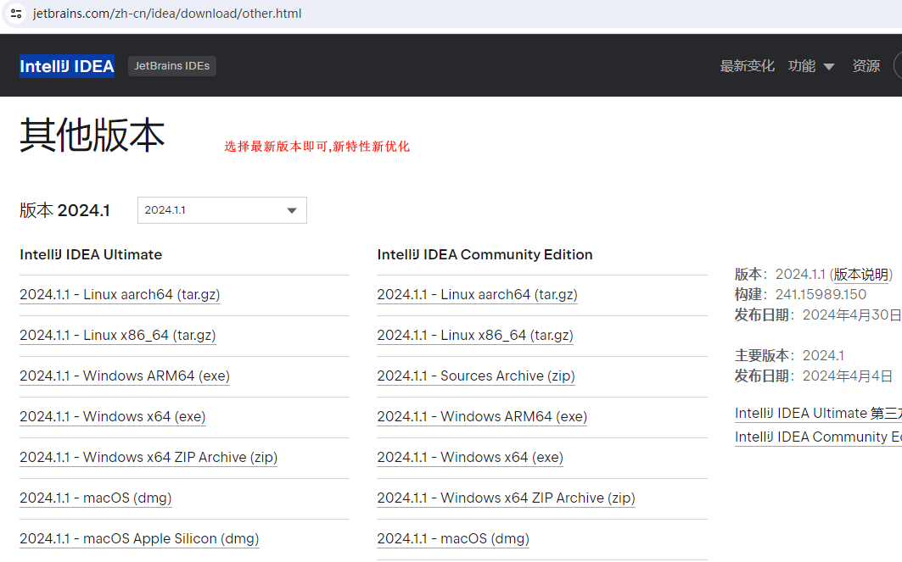
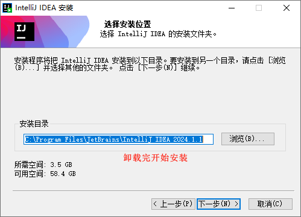
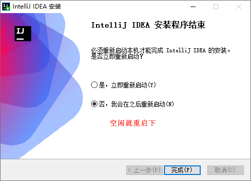
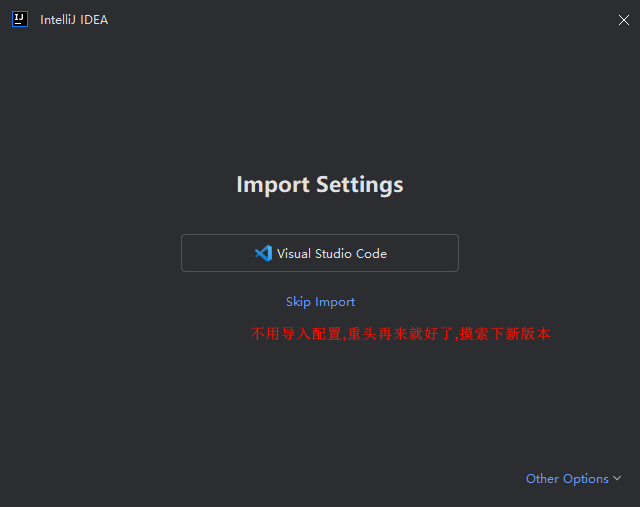
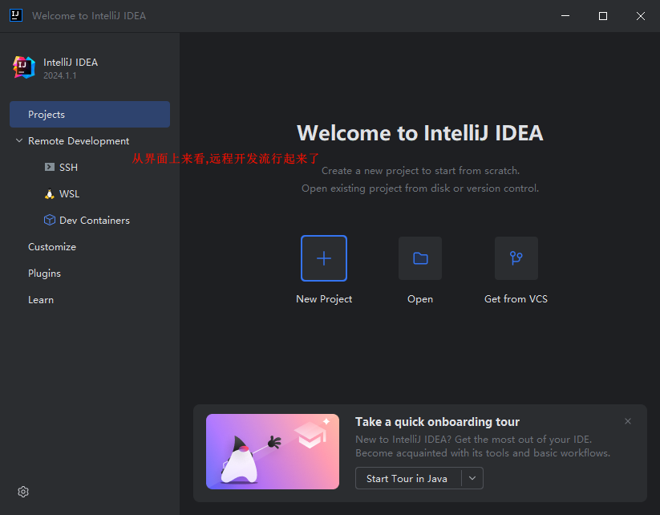
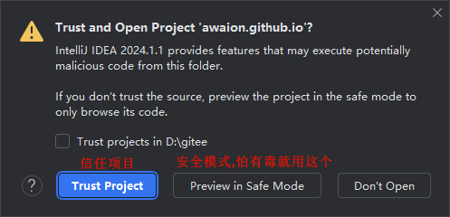
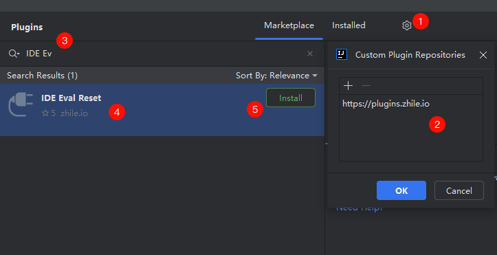
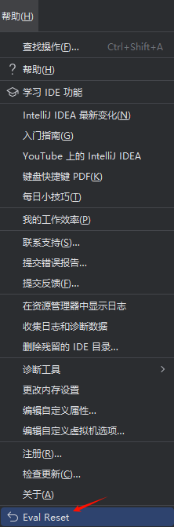

# 模块化项目

# 主要内容

> [项目背景](#项目背景)  
> [操作步骤](#操作步骤)

# 正文

## 项目背景

模块化是软件开发模式的一种,它将一个大型的软件系统划分成多个独立的模块,每个模块完成一个特定的子功能,并且能够与其他模块独立地工作.
模块集成起来可以构成一个整体,完成特定的功能,进而满足用户需求.
模块化的原因是：
- 提高开发效率: 模块化开发可以使得团队成员在不同模块上并行开发,从而提高开发效率.
- 降低项目的风险: 模块化开发可以使得开发人员更加关注模块之间的接口和依赖关系,从而降低项目的风险.
- 提高代码的可读性: 模块化可以使得代码更加结构化,清晰明了,从而提高代码的可读性和可维护性.
- 提高代码的复用性: 模块化可以将代码划分成可重用的部分,降低代码的冗余和重复,提高代码的复用性.
- 简化代码的维护和调试: 当一个软件系统变得越来越复杂时,进行模块化开发可以使得每个模块都相对独立,这样就可以方便地维护和调试每个模
块,而不必考虑整个系统的复杂性.

模块化设计的原则:
- 单一职责原则(SRP):它规定一个模块应该只有一个修改的原因,即一个模块只负责一个功能.这样可以提高模块的内聚性,降低模块之间的耦合度.
- 开放关闭原则(OCP):一个模块或类应该对扩展开放,对修改关闭.也就是说,当需要增加新的功能时,应该通过扩展模块或类的行为,而不是修改已
有的代码.这样可以减少对已有功能的影响,提高系统的可维护性和可扩展性.
- 依赖倒置原则(DIP):在模块之间建立抽象层,上层模块不应该依赖于下层模块的具体实现细节,而应该依赖于抽象.这样可以降低模块之间的耦合
度,提高系统的灵活性和可测试性.
- 接口隔离原则(ISP):一个大而全的接口拆分为多个小而精细的接口,使得每个模块只需要依赖于自己所需要的接口.这样可以降低模块之间的依赖
关系,提高系统的灵活性和可维护性.
- 最小知识原则(迪米特法则)(LKP):模块之间只能依赖于最小的一组接口,即模块只能访问它所需的最少信息.这样可以降低模块之间的耦合度,提高系统的灵活
性和可维护性.

本篇将用古老的SSM框架模块化来操作演示模块化项目.

## 操作步骤

#### 操作前提

本文以 IntelliJ IDEA 2019.3.1 为例

项目在最初开始还是有点凌乱,并且不可运行的,经过一些调式修改后,项目变成可用的,本文是拿可用后项目做演示,避免中间繁杂的调式流程.

----

#### 项目启动

去除了不需要的文件后,就剩下如图文件,模块化文件夹和`pom.xml`文件,每个模块化文件包含`src`文件夹和`pom.xml`文件.

----

项目打开后在IDE上显示如上图,项目结构规范清晰.

----

打开项目结构(Project Structure),我们看到Project栏已经自动配置好了.无需改动,规范带来便捷.

----

模块(Module),源文件也自动标记了,自动标记源于约定好的文件夹命名,按照规范来命名能够给开发者节省很多配置工作.

----

自动配置了模块编译输出路径.

----

自动引入了项目pom.xml中记录的依赖

----

Libraries也自动引入了项目pom.xml中记录的依赖

----

自动识别了项目特征,自动识别也是源于规范的文件命名

----

项目成品(Artifacts)中自动添加了4个成品文件,2个是压缩包(war),2个是解压包(exploded).

----

项目SDK是上个项目配置的SDK,不影响项目运行,编译环境下可能会使用.

----

项目依赖也是上个项目配置的项目依赖,不影响运行,编译环境下可能会使用.

----

添加Tomcat服务器,自动提示要添加项目成品包.

----

选择项目成品解压包,并配置访问路径为根路径,然后点击Apply

----

改下服务启动后,浏览器访问路径,无需手动输入网址.

----

有两个web项目木,需要再配置一台Tomcat服务器,选择项目成品解压包,并配置访问路径为根路径,然后点击Apply

----

再改下服务启动后,浏览器访问路径,以及端口号不要和上一个服务器重复.

----

项目需要访问数据库,就需要初始化数据库表.

----

启动服务器后,看服务器输出日志,显示部署成功

----

自动打开浏览器后,正常访问.

----

启动另一台服务器后,看服务器输出日志,显示部署成功

----

自动打开浏览器后,正常访问.

----

### 总结

规范的项目是很容易上手的,IDE的智能处理也是基于规范来处理.

[Github 源码](https://github.com/Awaion/tools/tree/master/demo010)

[返回顶部](#主要内容)

