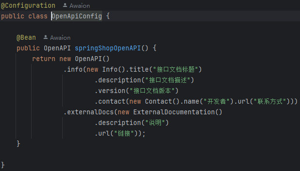
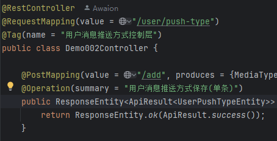
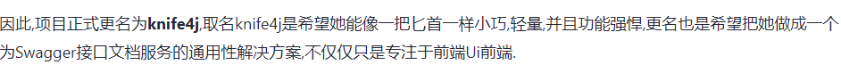

# Spring Boot + Knife4j

# 主要内容

> [简介](#简介)  
> [展示](#展示)  
> [集成步骤](#集成步骤)

# 正文

## 简介

众所周知,`SpringBoot`默认功能十分强大,使用它来启动一个`Java Web`服务,甚至不需要任何配置,只需要一个`pom.xml`文件和`Application.java`启动
类,就能启动`Java Web`服务.`简洁高效`应用的淋淋尽致,但企业使用场景各种各样,在最简配置下,我们需要去变更额外的配置以满足需求,`Tomcat`作为一款
`经典的`, `热门的`, `实现Java Servlet`的服务器,一直服务着广大Java应用程序,`SpringBoot`直接内嵌了`Tomcat核心组件`以快速启动`Web服务`,代价
是抛弃了一些功能,想要将`Tomcat`应用到极致,使用完整的`Tomcat`是必不可少的,这就引出了`如何用外部Tomcat启动SpringBoot项目`这个问题.

## 展示


基于`SpringBoot2.7`集成`Knife4j4.3` + `OpenApi3.0`UI界面

----

## 集成步骤


```
<!-- knife4j-openapi3 -->
<dependency>
    <groupId>com.github.xiaoymin</groupId>
    <artifactId>knife4j-openapi3-spring-boot-starter</artifactId>
    <version>4.3.0</version>
</dependency>
```
`pom.xml`文件新增knife4j-openapi3依赖

----



```
@Configuration
public class OpenApiConfig {

    @Bean
    public OpenAPI springShopOpenAPI() {
        return new OpenAPI()
                .info(new Info().title("接口文档标题")
                        .description("接口文档描述")
                        .version("接口文档版本")
                        .contact(new Contact().name("开发者").url("联系方式")))
                .externalDocs(new ExternalDocumentation()
                        .description("说明")
                        .url("链接"));
    }

}
```

新增配置类`OpenApiConfig.java`,声明`OpenAPI`对象.

----



```
@Tag(name = "用户消息推送方式控制层")
public class Demo002Controller {

    @Operation(summary = "用户消息推送方式保存(单条)")
    public ResponseEntity<ApiResult<UserPushTypeEntity>> save(
    
    @Schema(description = "用户消息推送方式")
    public class UserPushTypeEntity {
    
    @Schema(description = "用户id")
    private Long userId;
```

添加文档注解,注意v3注解有改变,注解名倾向于`OpenApi3`标准化,标准化是指在`经济`, `技术`, `科学`和`管理`等`社会实践`中,对重复性的事物和概念,通过
`制订`, `发布`和`实施`标准达到统一, 以获得最佳秩序和社会效益.标准化产品的出现有利于事物的发展,我们应该在实现功能的基础上,花点时间去研究标准,给未来
可能重复的工作提供标准工具.

```
@Api → @Tag
@ApiIgnore → @Parameter(hidden = true) or @Operation(hidden = true) or @Hidden
@ApiImplicitParam → @Parameter
@ApiImplicitParams → @Parameters
@ApiModel → @Schema
@ApiModelProperty(hidden = true) → @Schema(accessMode = READ_ONLY)
@ApiModelProperty → @Schema
@ApiOperation(value = "foo", notes = "bar") → @Operation(summary = "foo", description = "bar")
@ApiParam → @Parameter
@ApiResponse(code = 404, message = "foo") → @ApiResponse(responseCode = "404", description = "foo")
```
----

以上就是本文核心内容.

## 题外话

基于`SpringBoot`的开源项目,基本上都实现了`自动装载`,该框架的是在`knife4j-spring-boot-strater`中实现的,详细内容可以看
`Knife4jAutoConfiguration`类.

详细配置: https://doc.xiaominfo.com/docs/features/enhance

贴两段作者的话  




[Github 源码](https://github.com/Awaion/tools/tree/master/demo002)

[返回顶部](#主要内容)

