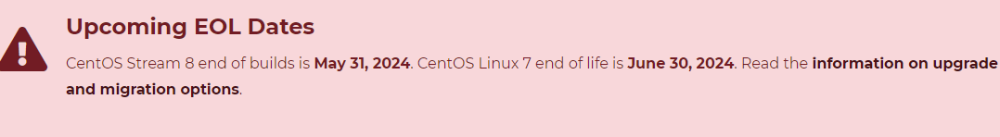
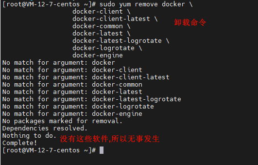
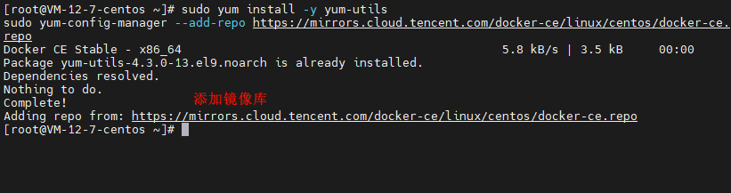
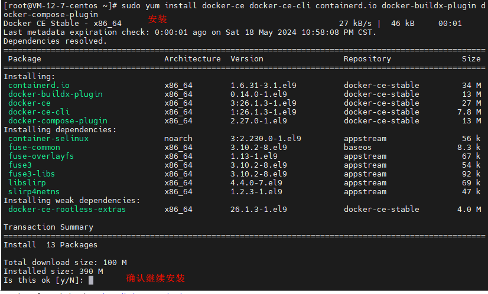
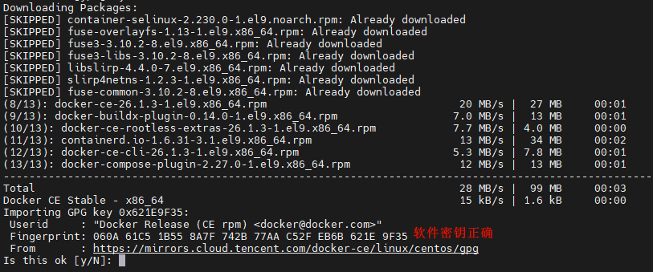
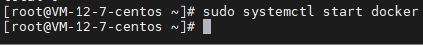
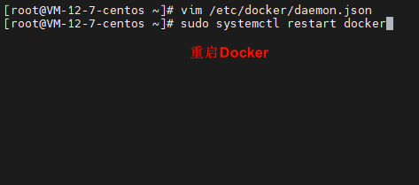

# Docker 安装

# 主要内容

> [简介](#简介)  
> [安装](#安装)

# 正文

## 简介

Docker 是一个用于开发,发布和运行应用程序的开放平台. Docker 使您能够将应用程序与基础设施分离,以便您可以快速交付软件.借助 Docker,您可以像管理应
用程序一样管理基础设施.通过利用 Docker 的方法来传送,测试和部署代码,您可以显着减少编写代码和在生产中运行代码之间的延迟.

Docker 是码头工人的意思,码头工人装填一个个独立的集装箱,然后放在交通工具上走向四面八方.

Docker 是把软件和其依赖环境一块打包到容器里.

Docker 官方概述: https://docs.docker.com/get-started/overview/

## 安装

不同的操作系统,安装方式会有些许不同,对于企业来说,稳定和性能是关注要点,本篇就拿 CentOS Stream 9 操作系统来演示,云服务商自家加工的操作系统也符合
企业要求,但会和云服务商强绑定,此文章更关注通用性,故不选.

----


CentOS Stream 是一个开源的Linux发行版,它基于Red Hat Enterprise Linux(RHEL)构建,提供了一个更加灵活的,与上游开发更紧密的环境.



官网公告说: CentOS Stream 8 构建结束日期为2024年5月31日.CentOS Linux 7 生命周期终止日期为2024年6月30日.

CentOS 官网: https://www.centos.org/

----



```shell
sudo yum remove docker \
                  docker-client \
                  docker-client-latest \
                  docker-common \
                  docker-latest \
                  docker-latest-logrotate \
                  docker-logrotate \
                  docker-engine
```

旧版本的 Docker 采用docker或docker-engine.在尝试安装新版本之前卸载任何此类旧版本以及相关的依赖项.

yum 可能会报告您没有安装这些软件包,这是没关系的,卸载操作是为了避免旧 docker 软件干扰.

/var/lib/docker/卸载 Docker 时,不会自动删除存储的映像,容器,卷和网络.

----



```shell
sudo yum install -y yum-utils
sudo yum-config-manager --add-repo https://mirrors.cloud.tencent.com/docker-ce/linux/centos/docker-ce.repo
```

安装 yum-utils 软件包(提供yum-config-manager 实用程序)并设置存储库,服务器在国内还是用镜像库网络比较稳定.

----






```shell
sudo yum install docker-ce docker-ce-cli containerd.io docker-buildx-plugin docker-compose-plugin
```

安装 Docker engine, containerd 和 Docker Compose：

如果提示接受 GPG 密钥,请验证指纹是否匹配 060A 61C5 1B55 8A7F 742B 77AA C52F EB6B 621E 9F35,如果匹配,则接受.这是软件安全认证.

此命令会安装 Docker,但不会启动 Docker.它还创建一个 docker组,但是默认情况下不会将任何用户添加到该组.

----



```shell
sudo systemctl start docker
```

启动 Docker 服务

关于Docker启动报错：docker.socket: Failed to listen on sockets: Address already in use

```shell
# 查询关于docker的文件夹
ls -l /var/run/ | grep docker

# 删除 docker.sock 文件夹
rm -rf /var/run/docker.sock
```

----


```shell
sudo docker run hello-world
```

运行个 hello-world 容器看看是否正常,这个容器很小.

此命令下载测试映像并在容器中运行它,当容器运行时,它会打印一条确认消息并退出.

----

Docker官方镜像库,是在国外,经常会有连接问题,我们配置国内镜像源,以减少网络问题.


```shell
vim /etc/docker/daemon.json
```

打开 /etc/docker/daemon.json 配置文件.

----


```shell
{
   "registry-mirrors": [
   "https://mirror.ccs.tencentyun.com"
  ]
}
```

按 i 切换至编辑模式,添加镜像源并保存.

----



```shell
sudo systemctl restart docker
```

重启 Docker 使配置生效

----


```shell
sudo docker info
```

查看镜像源是否配置成功

## 快速安装 docker

```shell
# 环境 CentOS 8 Stream
# 卸载旧版本
sudo yum remove docker \
                  docker-client \
                  docker-client-latest \
                  docker-common \
                  docker-latest \
                  docker-latest-logrotate \
                  docker-logrotate \
                  docker-engine

# 修改镜像仓库,CentOS 8默认的仓库被删除了
sudo sed -i -e "s|mirrorlist=|#mirrorlist=|g" /etc/yum.repos.d/CentOS-*
sudo sed -i -e "s|#baseurl=http://mirror.centos.org|baseurl=http://vault.centos.org|g" /etc/yum.repos.d/CentOS-*

# 安装软件工具包                  
sudo yum install -y yum-utils

# 给 yum 添加镜像仓库
sudo yum-config-manager --add-repo https://mirrors.cloud.tencent.com/docker-ce/linux/centos/docker-ce.repo

# 查看 docker 仓库有哪些版本
yum list docker-ce --showduplicates | sort -r

# 安装 docker 核心组件
sudo yum -y install docker-ce docker-ce-cli containerd.io docker-buildx-plugin docker-compose-plugin --allowerasing

# 启动 docker 服务
sudo systemctl start docker

# 给 docker 添加镜像仓库和 cgroup (资源限制,优先级管理,资源统计,控制访问)
sudo tee /etc/docker/daemon.json <<-'EOF'
{
  "registry-mirrors": ["https://mirror.ccs.tencentyun.com"],
  "exec-opts": ["native.cgroupdriver=systemd"],
  "log-driver": "json-file",
  "log-opts": {
    "max-size": "100m"
  },
  "storage-driver": "overlay2"
}
EOF

# 重启 docker
sudo systemctl restart docker

# 查看 docker 信息
sudo docker info

# 验证镜像部署是否正常
sudo docker run hello-world

# docker 常用命令
# 列出所有容器
docker ps -a

# 停止容器
docker stop my-container

# 删除容器
docker rm my-container

# 指定文件构建镜像
docker build -t demo002:latest -f demo002/Dockerfile demo002

# 推送镜像到镜像仓库
docker push my-image

# 拉取镜像
docker pull my-image

# 查看容器日志
docker logs my-container

# 进入容器
docker exec -it my-container bash

# 如 docker.sock 被占用,使用以下命令
# 查询关于docker的文件夹
ls -l /var/run/ | grep docker

# 删除 docker.sock 文件夹
rm -rf /var/run/docker.sock
```

----

以上就是本文核心内容.

## 题外话

Docker CentOS官方安装文档: https://docs.docker.com/engine/install/centos/

Docker 官方概述: https://docs.docker.com/get-started/overview/

CentOS 官网: https://www.centos.org/

[返回顶部](#主要内容)

