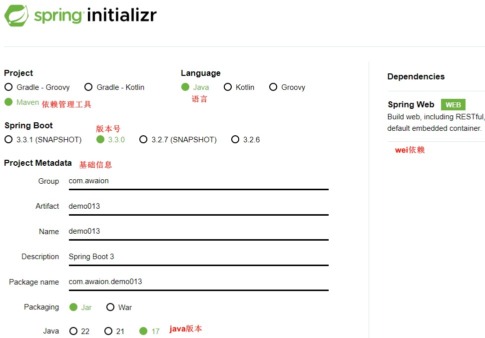
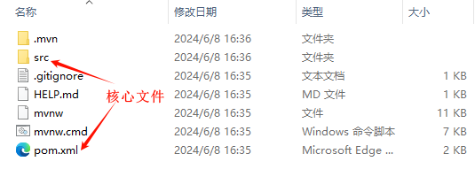
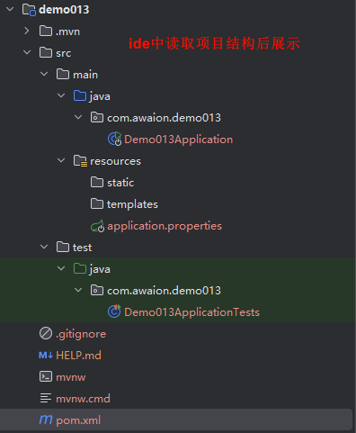

# Spring Boot 3

# 主要内容

> [简介](#简介)  
> [Hello World 项目](#hello-world-项目)  
> [项目分析](#项目分析)  
> [特性详解](#特性详解)  
> [核心机制分析](#核心机制分析)  
> [Spring Boot 最佳实践流程](#spring-boot-最佳实践流程)  
> [扩展](#扩展)  

## 简介

SpringBoot 基于约定大于配置的原则,无需编写或少量编写配置即可快速整合 Spring 框架以及第三方技术框架,帮我们简单快速地创建一个独立的,生产级别的 
Spring 应用.

SpringBoot 3 改动

- JDK 最低版本为 17
- 新增自动配置包 META-INF/spring/org.springframework.boot.autoconfigure.AutoConfiguration.imports
- javax.* 迁移至 jakarta.* 原因是 Java EE 版权转移到 Eclipse Foundation
- 函数式Web
- ProblemDetails
- GraalVM 与 AOT
- 响应式编程

可概括为以下特性:

- 快速创建独立 Spring 应用
- 直接嵌入 Tomcat, Jetty, Undertow 等 Servlet 容器
- 提供可选的 starter 应用启动组件,简化应用整合
- 按需自动配置 Spring 以及 第三方库
- 提供生产级特性,监控指标,健康检查,外部化配置等
- 无需写代码加载配置,无需使用 xml 文件配置

如不用 SpringBoot,该如何构建发布一个生产级别的 Java 应用呢?

以经典 SSM 框架为例
- 导入 SSM 所需的一大堆 jar 包,版本冲突经常发生
- 配置 web.xml 文件,指定 xml 文件,反射创建各种 Bean
- 集成第三方驱动,如 MySQL 驱动,可能需要自己写代码,初始化所需 Bean 
- 需要下载 Servlet 容器,如 Tomcat.
- 部署需要打包成 war 包,放在 Servlet 容器指定 webapps 等目录下.
- 应用监控需要自己集成
- 生产问题追踪需要熟练使用 jconsole, jvisualvm 等基础工具.

通过对比,SpringBoot 可以简化整合,配置,开发,部署,监控,运维等.

Spring Boot: https://spring.io/projects/spring-boot

----

## Hello World 项目

1. 使用 spring 工具创建项目 https://start.spring.io/
2. 导入到 ide 中,读取 pom 文件自动配置项目结构
3. 写一个 Hello World 入口
4. 启动,并访问程序 http://localhost:8080/api
5. 使用 java -jar demo013-0.0.1-SNAPSHOT.jar 部署程序

从以上操作来看,使用 SpringBoot 构建生产级别 Java 应用非常简单.








----

## 项目分析

```xml
<parent>
    <groupId>org.springframework.boot</groupId>
    <artifactId>spring-boot-starter-parent</artifactId>
    <version>3.3.0</version>
    <relativePath/> <!-- lookup parent from repository -->
</parent>
```

spring-boot-starter-parent->spring-boot-dependencies 管理所有 starter 组件的版本号,引入 starter 组件及常用 jar 可不声明版本号,也可
就近覆盖版本号或自定义版本号,第三方 jar 需自行声明版本号.

----

```xml
<dependency>
    <groupId>org.springframework.boot</groupId>
    <artifactId>spring-boot-starter-web</artifactId>
</dependency>
```

web 开发启动组件,将基础的依赖全部整合进来,如 json, tomcat, webmvc

----

```xml
<plugin>
    <groupId>org.springframework.boot</groupId>
    <artifactId>spring-boot-maven-plugin</artifactId>
</plugin>
```

maven 一键打包插件,直接在可视化界面点击按钮即可打包

----

```java
@SpringBootApplication
public class Demo013Application {

	public static void main(String[] args) {
		SpringApplication.run(Demo013Application.class, args);
	}

}
```

声明启动入口

----

## 特性详解

- 简化整合

官方支持的所有 starter 组件：https://docs.spring.io/spring-boot/reference/using/build-systems.html

官方提供的 starter 命名为：spring-boot-starter-*

第三方提供的 starter 命名为：*-spring-boot-starter

- 简化配置

集中式管理配置文件 application.properties, application.yml 和 application.yaml
官方配置说明:https://docs.spring.io/spring-boot/appendix/application-properties/index.html

- 简化开发

使用默认配置则无需编写任何配置,直接开发业务

- 简化部署

打包为可执行的 jar 包,在 java 环境下直接用 java -jar 命令即可启动

- 简化监控

提供 actuator 组件,来查看应用的健康状况

- 简化运维

支持外部配置和命令行参数,修改配置无需重新打包

----

## 核心机制分析

```java
public static void main(String[] args) {
    var ioc = SpringApplication.run(Demo013Application.class, args);
    String[] names = ioc.getBeanDefinitionNames();
    for (String name : names) {
        System.out.println(name);
    }
}
```

spring-boot-starter-web

启动类运行,会把 web 所需的 Bean 加载到 ioc 容器,如DispatcherServlet,ViewResolver,CharacterEncodingFilter,是通过条件加载
spring-boot-autoconfigure 里面的 AutoConfiguration 自动配置类实现的.

@SpringBootApplication 扫描主程序所在的包及其下面的子包的注解,根据不同注解加载开发代码.

@ComponentScan 可自定义扫描路径

默认配置值: https://docs.spring.io/spring-boot/appendix/application-properties/index.html

----

细节梳理

- 导入 spring-boot-starter-web
  - 导入了 web 开发基础依赖:spring-boot-starter-json, spring-boot-starter-tomcat, spring-webmvc
  - 导入了 boot 基础依赖 spring-boot-starter
  - spring-boot-starter 自动配置依赖 spring-boot-autoconfigure
  - spring-boot-autoconfigure 根据条件注解,生效指定配置

- @SpringBootApplication
  - @SpringBootApplication 有注解 @SpringBootConfiguration, @EnableAutoConfiguration, @ComponentScan
  - @SpringBootApplication 默认扫描不到 spring-boot-autoconfigure
  - @EnableAutoConfiguration 是由 @Import(AutoConfigurationImportSelector.class) 批量给容器中导入组件
  - 启动会默认加载 spring-boot-autoconfigure 下 META-INF/spring/org.springframework.boot.autoconfigure.AutoConfiguration.imports文件
  - 启动的时候用 @Import 批量导入组件机制把 autoconfigure 包下的 xxxxAutoConfiguration类导入进来
  - 每一个自动配置类都有条件注解 @ConditionalOnxxx,只有条件成立才能生效

- xxxxAutoConfiguration自动配置类
  - 给容器中使用 @Bean 放一堆组件
  - 每个自动配置类都可能有这个注解 @EnableConfigurationProperties, 用来把配置文件中配的指定前缀的属性值封装到 xxxProperties 属性类中
  - 以Tomcat为例:把服务器的所有配置都是以 server 开头的配置都封装到了属性类中
  - 给容器中放的所有组件的一些核心参数都来自 xxxProperties
  - xxxProperties 都是和配置文件绑定,只需要改配置文件的值,核心组件的底层参数都能修改

总结：
- 启动组件 spring-boot-starter
- 自动配置组件 spring-boot-autoconfigure
- 默认配置类 META-INF/spring/org.springframework.boot.autoconfigure.AutoConfiguration.imports
- 加载配置注解 @EnableAutoConfiguration
- 属性值 xxxProperties

了解底层的作用:
- 增强了对程序运行的理解,灵活声明所需功能,提高开发效率和问题修复效率
- 运用底层实现机制,扩展自定义组件

----

## Spring Boot 最佳实践流程

- 根据需求选择启动组件
  - 官方有则选择官方 spring-boot-starter-* ,如 spring-boot-starter-data-redis https://docs.spring.io/spring-boot/reference/using/build-systems.html
  - 官方没有则第三方库搜索 *-spring-boot-starter,如 druid-spring-boot-starter https://mvnrepository.com/search
  - 第三方文档没有,则使用搜索引擎搜索 https://github.com/topics/java
  - 搜不到则自定义 *-spring-boot-starter
- 编写配置文件
  - 看官方配置文档说明 https://docs.spring.io/spring-boot/appendix/application-properties/index.html
  - 看第三方配置文档说明
  - 看 *AutoConfiguration 中的 *Properties 代码
- 编写代码
  - 查看 *AutoConfiguration 中有哪些可用对象
  - 查看文档说明
  - 找不到想要的代码,则使用搜索引擎搜索 https://github.com/topics/java
  - 搜索不到,则自己实现

----

## 扩展

### 注解

Spring Boot 摒弃 xml 配置方式,改为全注解驱动

#### 组件注册
- @ComponentScan 组件扫描,指定扫描路径
- @SpringBootConfiguration @Configuration 配置注解,底层实现一样
- @Controller @Service @Repository @Component 主键注解,底层实现一样
- @Bean @Scope 对象注解和作用域(单例,多例)注解
- @Import 引用注解

#### 条件注解
- @ConditionalOnXxx 条件注解统一命名方式
- @ConditionalOnClass 如果类路径中存在这个类,则触发指定行为
- @ConditionalOnMissingClass 如果类路径中不存在这个类,则触发指定行为
- @ConditionalOnBean 如果容器中存在这个 Bean,则触发指定行为
- @ConditionalOnMissingBean 如果容器中不存在这个Bean,则触发指定行为
- 更多请看文档或代码

#### 属性绑定注解
- @ConfigurationProperties 声明组件的属性和配置文件哪些前缀开始项进行绑定,多用于编写项目代码
- @EnableConfigurationProperties 注册注解,即使没有扫描也能进行属性绑定,多用于编写脚手架工具

----

### YAML 语法

YAML 是 YAML Ain't a Markup Language(YAML 不是一种标记语言)在开发的这种语言时,YAML 的意思其实是 Yet Another Markup Language
(是另一种标记语言)
- 设计目标,方便人类读写
- 层次分明,更适合做配置文件
- 使用 .yaml 或 .yml 作为文件后缀

#### 基本语法

- 大小写敏感
- 相同层级的元素左侧对齐
- 使用缩进表示层级关系
- k: v 表达
- `#` 表示注释

#### 支持的写法
- 对象:键值对的集合 如:映射 map / 哈希 hash / 字典 dictionary
- 数组:一组按次序排列的值 如:序列 sequence / 列表 list
- 纯量:单个的,不可再分的值 如:字符串 数字 布尔 日期
- birthDay 推荐写为 birth-day
- 文本 单引号内特殊符号不会转义,双引号内特殊符号会转义
- 大文本 `|`开头,大文本写在下层,保留文本格式,换行符正确显示;`>`开头,大文本写在下层,折叠换行符
- 多文档合并 使用`---`可以把多个 yaml 文档合并在一个文档中,每个文档区依然认为内容独立

----

### 简化代码

```xml
<dependency>
    <groupId>org.projectlombok</groupId>
    <artifactId>lombok</artifactId>
    <scope>compile</scope>
</dependency>
```

- @Data
- @Getter
- @Setter
- @ToString
- @Builder
- @NoArgsConstructor
- @AllArgsConstructor
- 更多看文档

----

以上就是本文核心内容.

[Github 源码](https://github.com/Awaion/tools/tree/master/demo013)

[返回顶部](#主要内容)

