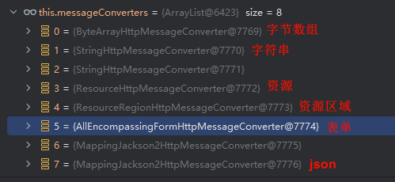

# SpringBoot 3 Web

# 主要内容

> [简介](#简介)  
> [使用方式](#使用方式)  
> [源码解析](#源码解析)  
> [静态资源](#静态资源)  
> [路径匹配](#路径匹配)  
> [内容协商](#内容协商)  
> [模板引擎](#模板引擎)  
> [国际化](#国际化)  
> [错误处理](#错误处理)  
> [嵌入式容器](#嵌入式容器)  
> [全手动配置](#全手动配置)  
> [ProblemDetailsExceptionHandler](#problemdetailsexceptionhandler)  
> [函数式](#函数式)  
> [最佳实践](#最佳实践)  


## 简介

Spring Boot 非常适合 Web 应用程序开发,本文主讲 spring-boot-starter-web.

官方文档: https://docs.spring.io/spring-boot/reference/web/index.html

## 使用方式

```text
// 手动引入 web 组件
<dependency>
    <groupId>org.springframework.boot</groupId>
    <artifactId>spring-boot-starter-web</artifactId>
</dependency>

// 自动加载自动配置 org.springframework.boot:spring-boot-autoconfigure

// 自动加载组件列表 @EnableAutoConfiguration @Import(AutoConfigurationImportSelector.class)

// 自动读取配置文件 META-INF/spring/org.springframework.boot.autoconfigure.AutoConfiguration.imports

// web 相关配置
org.springframework.boot.autoconfigure.web.servlet.DispatcherServletAutoConfiguration
org.springframework.boot.autoconfigure.web.servlet.ServletWebServerFactoryAutoConfiguration
org.springframework.boot.autoconfigure.web.servlet.error.ErrorMvcAutoConfiguration
org.springframework.boot.autoconfigure.web.servlet.HttpEncodingAutoConfiguration
org.springframework.boot.autoconfigure.web.servlet.MultipartAutoConfiguration
org.springframework.boot.autoconfigure.web.servlet.WebMvcAutoConfiguration

// 自动读取配置文件
spring.mvc SpringMVC 配置
spring.web Web 配置
spring.servlet.multipart 文件上传配置
server 服务器的配置
```

- 默认配置
- 视图解析 ContentNegotiatingViewResolver 和 BeanNameViewResolver
- 静态资源 放在 static 文件夹下即可直接访问
- 默认视图 index.html 放在 static 文件夹下即可直接访问
- 数据类型转换 Converter, GenericConverter, Formatter
- http类型转换 HttpMessageConverters,可以方便返回 json 等数据类型
- 国际化及错误消息处理 MessageCodesResolver
- 数据绑定 ConfigurableWebBindingInitializer,实现消息处理,数据绑定,类型转化,数据校验等功能
- 扩展 实现 WebMvcConfigurer,添加 interceptors, formatters, view controllers 等
- 扩展 实现 WebMvcRegistrations,添加 RequestMappingHandlerMapping, RequestMappingHandlerAdapter, ExceptionHandlerExceptionResolver
- 全手动配置 实现 WebMvcConfigurer 接口,并添加 @EnableWebMvc 注解

## 源码解析

```java
@AutoConfiguration(after = { DispatcherServletAutoConfiguration.class, TaskExecutionAutoConfiguration.class,
		ValidationAutoConfiguration.class }) // 在这些自动配置之后
@ConditionalOnWebApplication(type = Type.SERVLET) // 如果是web应用就生效 类型SERVLET,REACTIVE
@ConditionalOnClass({ Servlet.class, DispatcherServlet.class, WebMvcConfigurer.class }) // 需要有这些类才会加载
@ConditionalOnMissingBean(WebMvcConfigurationSupport.class) // 容器中没有这个Bean才生效,默认就是没有,自身实现后就无法加载了
@AutoConfigureOrder(Ordered.HIGHEST_PRECEDENCE + 10) // 优先级很低
@ImportRuntimeHints(WebResourcesRuntimeHints.class) // 运行时类型提示
public class WebMvcAutoConfiguration { 
}

// WebMvcAutoConfiguration 是一个自动配置类, 它里面有一个 EnableWebMvcConfiguration
// EnableWebMvcConfiguration 继承 DelegatingWebMvcConfiguration
// DelegatingWebMvcConfiguration 利用 DI 把容器中所有 WebMvcConfigurer 注入进来
// 调用 DelegatingWebMvcConfiguration 的方法配置底层规则,从而调用所有 WebMvcConfigurer 的配置底层方法
```

```java
@Configuration(proxyBeanMethods = false) // 使用时创建新实例,提高启动速度
@Import(EnableWebMvcConfiguration.class) // 额外导入了其他配置
@EnableConfigurationProperties({ WebMvcProperties.class, WebProperties.class }) // 加载属性键值对
@Order(0) // 优先级很高
public static class WebMvcAutoConfigurationAdapter implements WebMvcConfigurer, ServletContextAware{
    
}

// HiddenHttpMethodFilter 页面表单提交 Rest 请求 GET,POST,PUT,DELETE
// FormContentFilter 表单内容过滤器 GET(url参数),POST(body参数)可以携带数据, PUT DELETE 的数据会被忽略
// 所有的功能最终会和配置文件进行绑定
// WebMvcProperties spring.mvc.* 配置
// WebProperties spring.web.* 配置
```


截图展示的是提供的功能和可扩展的功能

```text
// 静态资源处理
@Override
public void addResourceHandlers(ResourceHandlerRegistry registry) {
    if (!this.resourceProperties.isAddMappings()) {
        logger.debug("Default resource handling disabled");
        return;
    }
    // 访问 /webjars/** 路径就去 classpath:/META-INF/resources/webjars/ 下找资源
    addResourceHandler(registry, this.mvcProperties.getWebjarsPathPattern(),
            "classpath:/META-INF/resources/webjars/");
    // 访问 /** 路径就去 classpath:/META-INF/resources/, classpath:/resources/, classpath:/static/, classpath:/public/ 四个默认路径
    addResourceHandler(registry, this.mvcProperties.getStaticPathPattern(), (registration) -> {
        registration.addResourceLocations(this.resourceProperties.getStaticLocations());
        if (this.servletContext != null) {
            ServletContextResource resource = new ServletContextResource(this.servletContext, SERVLET_LOCATION);
            registration.addResourceLocations(resource);
        }
    });
}

// 缓存配置 spring.web.*
// cachePeriod 缓存时间,以秒为单位
registration.setCachePeriod(getSeconds(this.resourceProperties.getCache().getPeriod()));
// HTTP缓存控制 https://developer.mozilla.org/zh-CN/docs/Web/HTTP/Caching
registration.setCacheControl(this.resourceProperties.getCache().getCachecontrol().toHttpCacheControl());
// 是否使用最后一次修改,配合 HTTP Cache 规则
registration.setUseLastModified(this.resourceProperties.getCache().isUseLastModified());
```

```java
// SpringBoot 给容器中放 WebMvcConfigurationSupport 组件
// 我们如果自己放了 WebMvcConfigurationSupport 组件, SpringBoot 的 WebMvcAutoConfiguration 都会失效
@Configuration(proxyBeanMethods = false)
@EnableConfigurationProperties(WebProperties.class)
public static class EnableWebMvcConfiguration extends DelegatingWebMvcConfiguration implements ResourceLoaderAware 
{
}
```

```java
// 根据请求路径,找对应 handler 处理请求
public interface HandlerMapping {
    @Nullable
    HandlerExecutionChain getHandler(HttpServletRequest request) throws Exception;
}

// 默认有 WelcomePageHandlerMapping 找静态资源目录下的 index.html
```

```text
// http 默认消息转换,有 json,xml,smile
jackson2Present = ClassUtils.isPresent("com.fasterxml.jackson.databind.ObjectMapper", classLoader) &&
				ClassUtils.isPresent("com.fasterxml.jackson.core.JsonGenerator", classLoader);
jackson2XmlPresent = ClassUtils.isPresent("com.fasterxml.jackson.dataformat.xml.XmlMapper", classLoader);
jackson2SmilePresent = ClassUtils.isPresent("com.fasterxml.jackson.dataformat.smile.SmileFactory", classLoader);
```

## 静态资源

- 静态资源映射规则在 WebMvcAutoConfiguration 中进行了定义
- /webjars/** 的所有路径资源都在 classpath:/META-INF/resources/webjars/
- /** 的所有路径资源都在 classpath:/META-INF/resources/, classpath:/resources/, classpath:/static/, classpath:/public/
- 所有静态资源都定义了缓存规则,但此功能参数无默认值
  - period 缓存间隔,默认 0S
  - cacheControl 缓存控制,默认无
  - useLastModified 是否使用 lastModified,默认 false
- 欢迎页规则在 WebMvcAutoConfiguration 中进行了定义
  - 在静态资源目录下找 index.html
  - 没有就在 templates 下找 index 模板页
- 在静态资源目录下找 favicon.ico

```text
# 通过配置修改静态资源规则
# 开启静态资源映射规则
spring.web.resources.add-mappings=true

# 设置缓存时间,单位/秒
spring.web.resources.cache.period=3600
# 缓存详细合并项配置,覆盖 period 配置
# 浏览器第一次请求服务器,服务器告诉浏览器此资源缓存 7200 秒, 7200 秒以内的所有此资源访问不用发给服务器请求, 7200 秒以后发请求给服务器
spring.web.resources.cache.cachecontrol.max-age=7200
# 共享缓存
spring.web.resources.cache.cachecontrol.cache-public=true
# 使用资源 last-modified 时间,来对比服务器和浏览器的资源是否相同没有变化.相同返回 304
spring.web.resources.cache.use-last-modified=true

# 自定义静态资源文件夹位置
spring.web.resources.static-locations=classpath:/a/,classpath:/b/,classpath:/static/

# 自定义 webjars 路径前缀
spring.mvc.webjars-path-pattern=/wj/**
#  静态资源访问路径前缀
spring.mvc.static-path-pattern=/static/**
```

```java
// 通过代码修改静态资源规则 方式一
@Configuration //这是一个配置类
public class MyConfig implements WebMvcConfigurer {
    @Override
    public void addResourceHandlers(ResourceHandlerRegistry registry) {
        //保留以前规则
        //自己写新的规则
        registry.addResourceHandler("/static/**")
                .addResourceLocations("classpath:/a/","classpath:/b/")
                .setCacheControl(CacheControl.maxAge(1180, TimeUnit.SECONDS));
    }
}
```

```java
// 通过代码修改静态资源规则 方式二
@Configuration //这是一个配置类,给容器中放一个 WebMvcConfigurer 组件,就能自定义底层
public class MyConfig {
    @Bean
    public WebMvcConfigurer webMvcConfigurer(){
        return new WebMvcConfigurer() {
            @Override
            public void addResourceHandlers(ResourceHandlerRegistry registry) {
                registry.addResourceHandler("/static/**")
                        .addResourceLocations("classpath:/a/", "classpath:/b/")
                        .setCacheControl(CacheControl.maxAge(1180, TimeUnit.SECONDS));
            }
        };
    }
}
```

## 路径匹配

Spring5.3 之后加入了更多的请求路径匹配的实现策略,以前只支持 AntPathMatcher 策略,现在提供了 PathPatternParser(默认) 策略,并且可以指定策略.

- *：表示任意数量的字符
- ?：表示任意一个字符
- **：表示任意数量的目录
- {}：表示一个命名的模式占位符
- []：表示字符集合,例如[a-z]表示小写字母
- 特殊字符需要转义,如:匹配文件路径中的星号,则需要转义为\\*
- PathPatternParser 在 jmh 基准测试下,有 6~8 倍吞吐量提升,降低 30%~40%空间分配率
- PathPatternParser 兼容 AntPathMatcher 语法,并支持更多类型的路径模式
- PathPatternParser  "**" 多段匹配的支持仅允许在模式末尾使用,其它位置无法生效
- 默认的路径匹配规则,是由 PathPatternParser 提供的
- 改变路径匹配策略 spring.mvc.pathmatch.matching-strategy=ant_path_matcher

## 内容协商

基于请求头内容协商(默认开启)
客户端向服务端发送请求,携带 HTTP 标准的 Accept 请求头.
Accept: application/json、text/xml、text/yaml
服务端根据客户端请求头期望的数据类型进行动态返回

基于请求参数内容协商(需要开启)
发送请求 GET /projects/spring-boot?format=json,优先返回 json 类型数据
发送请求 GET /projects/spring-boot?format=xml,优先返回 xml 类型数据

```text
// xml 依赖
<dependency>
    <groupId>com.fasterxml.jackson.dataformat</groupId>
    <artifactId>jackson-dataformat-xml</artifactId>
</dependency>

// xml 注解
@JacksonXmlRootElement

// 配置
# 开启基于请求参数的内容协商功能,默认此功能不开启
spring.mvc.contentnegotiation.favor-parameter=true
# 指定内容协商时使用的参数名,默认是 format
spring.mvc.contentnegotiation.parameter-name=type
```

```text
// 自定义内容协商
// yaml 依赖
<dependency>
    <groupId>com.fasterxml.jackson.dataformat</groupId>
    <artifactId>jackson-dataformat-yaml</artifactId>
</dependency>

// 添加配置
spring.mvc.contentnegotiation.media-types.yaml=text/yaml

// 新增 *HttpMessageConverter Bean
@Bean
public WebMvcConfigurer webMvcConfigurer(){
    return new WebMvcConfigurer() {
        @Override //配置一个能把对象转为yaml的messageConverter
        public void configureMessageConverters(List<HttpMessageConverter<?>> converters) {
            converters.add(new MyYamlHttpMessageConverter());
        }
    };
}

// 实现 *HttpMessageConverter
public class MyYamlHttpMessageConverter extends AbstractHttpMessageConverter<Object> {

    private ObjectMapper objectMapper = null; // 把对象转成yaml

    public MyYamlHttpMessageConverter(){
        // 告诉 SpringBoot 这个 MessageConverter 支持哪种媒体类型
        super(new MediaType("text", "yaml", Charset.forName("UTF-8")));
        YAMLFactory factory = new YAMLFactory()
                .disable(YAMLGenerator.Feature.WRITE_DOC_START_MARKER);
        this.objectMapper = new ObjectMapper(factory);
    }

    @Override
    protected boolean supports(Class<?> clazz) {
        // true 表示支持
        return true;
    }

    @Override
    protected Object readInternal(Class<?> clazz, HttpInputMessage inputMessage) throws IOException, HttpMessageNotReadableException {
        // 从 body 中读取
        return null;
    }

    @Override
    protected void writeInternal(Object methodReturnValue, HttpOutputMessage outputMessage) throws IOException, HttpMessageNotWritableException {
        // 从 body 中写出
        try(OutputStream os = outputMessage.getBody()){
            this.objectMapper.writeValue(os,methodReturnValue);
        }
    }
}
```

- 内容协商原理
- controller 方法的返回值标注 @ResponseBody 注解
- 请求进来先来到 DispatcherServlet 的 doDispatch() 进行处理
- 找到一个 HandlerAdapter 适配器,利用适配器执行目标方法
- RequestMappingHandlerAdapter来执行,调用 invokeHandlerMethod() 来执行目标方法
- HandlerMethodArgumentResolver 参数解析器,确定目标方法每个参数值
- HandlerMethodReturnValueHandler 返回值处理器,确定目标方法的返回值改怎么处理
- RequestMappingHandlerAdapter 里面的 invokeAndHandle() 真正执行目标方法
- 目标方法执行完成,返回返回值对象
- 找到一个合适的返回值处理器 HandlerMethodReturnValueHandler
- 最终找到 RequestResponseBodyMethodProcessor 能处理 标注了 @ResponseBody 注解的方法
- RequestResponseBodyMethodProcessor 调用 writeWithMessageConverters,指定 *HttpMessageConverter 把返回值写出去

EnableWebMvcConfiguration 通过 addDefaultHttpMessageConverters 添加了默认的 MessageConverter
- ByteArrayHttpMessageConverter 字节数据读写
- StringHttpMessageConverter 字符串读写
- ResourceHttpMessageConverter 资源读写
- ResourceRegionHttpMessageConverter 分区资源写出
- AllEncompassingFormHttpMessageConverter 表单 xml/json 读写
- MappingJackson2HttpMessageConverter 请求响应体Json读写



## 模版引擎

由于 SpringBoot 使用了嵌入式 Servlet 容器,所以 JSP 默认是不能使用的. 如果需要服务端页面渲染,优先考虑使用模板引擎. SpringBoot 包含以下模板
引擎的自动配置有 FreeMarker,Groovy,Thymeleaf,Mustach.模板引擎页面默认放在 src/main/resources/templates

Thymeleaf官网 https://www.thymeleaf.org/

```text
<dependency>
    <groupId>org.springframework.boot</groupId>
    <artifactId>spring-boot-starter-thymeleaf</artifactId>
</dependency>

// ctrl+F9 刷新页面,不建议用在 Java 代码上
<dependency>
  <groupId>org.springframework.boot</groupId>
  <artifactId>spring-boot-devtools</artifactId>
</dependency>
```

- 自动配置 org.springframework.boot.autoconfigure.thymeleaf.ThymeleafAutoConfiguration 
- 属性对象 ThymeleafProperties 中,对应配置文件 spring.thymeleaf
- 所有的模板页面默认在 classpath:/templates 文件夹下
- 默认后缀名 .html
-
- 标签
- th:text 文本值渲染
- th:utext 不转义文本值渲染
- th:属性 属性渲染
- th:attr 任意属性渲染
- th:if 条件判断
- th:each 遍历
- th:switch 条件选择
-
- 表达式
- ${} model 变量取值
- @{} url路径
- #{} 国际化消息
- ~{} 片段引用
- *{} 变量选择,需要配合 th:object 绑定对象
- [[...]] or [(...)] 
- 定义模板 th:fragment
- 引用模板 ~{templatename::selector}
- 插入模板 th:insert, th:replace
-
- 内置对象
- param 请求参数对象
- session session对象
- application application对象
- #execInfo 模板执行信息
- #messages 国际化消息
- #uris uri/url工具
- #conversions 类型转换工具
- #dates java.util.Date 对象的工具类
- #calendars java.util.Calendar对象的工具类
- #temporals JDK8+ java.time API 工具类
- #numbers 数字操作工具
- #strings 字符串操作
- #objects 对象操作
- #bools bool操作
- #arrays array工具
- #lists list工具
- #sets set工具
- #maps map工具
- #aggregates 集合聚合工具(sum,avg)
- #ids id生成工具

## 国际化

- 国际化的自动配置 MessageSourceAutoConfiguration
- 默认配置文件 messages.properties
- 中文环境配置文件 messages_zh_CN.properties
- 英语环境配置文件 messages_en_US.properties
- 在程序中可以自动注入 MessageSource 组件,获取国际化的配置项值
- 在页面中可以使用表达式 #{} 获取国际化的配置项值

## 错误处理

错误处理的自动配置都在 ErrorMvcAutoConfiguration 中,两大核心机制
- SpringBoot 会自适应处理错误,响应页面或 JSON 数据
- SpringMVC 的错误处理机制依然保留,MVC 处理不了,才会交给 boot 进行处理

错误处理流程图
- 如果发生了500,404,503,403 这些错误
  - 如果有模板引擎,默认在 classpath:/templates/error/精确码.html
  - 如果没有模板引擎,在静态资源文件夹下找 精确码.html
- 如果匹配不到精确码.html这些精确的错误页,就去找5xx.html,4xx.html模糊匹配
  - 如果有模板引擎,默认在 classpath:/templates/error/5xx.html
  - 如果没有模板引擎,在静态资源文件夹下找 5xx.html
- 如果模板引擎路径templates下有 error.html页面,就直接渲染
- 找不到继续在静态资源目录下找 error.html页面
- 什么都找不到就返回默认 error 视图


```text
// 返回 html 页面
@RequestMapping(produces = MediaType.TEXT_HTML_VALUE) 
public ModelAndView errorHtml(HttpServletRequest request, HttpServletResponse response) {
    HttpStatus status = getStatus(request);
    Map<String, Object> model = Collections
        .unmodifiableMap(getErrorAttributes(request, getErrorAttributeOptions(request, MediaType.TEXT_HTML)));
    response.setStatus(status.value());
    ModelAndView modelAndView = resolveErrorView(request, response, status, model);
    return (modelAndView != null) ? modelAndView : new ModelAndView("error", model);
}

// 返回 ResponseEntity 对象 json 数据
@RequestMapping  
public ResponseEntity<Map<String, Object>> error(HttpServletRequest request) {
    HttpStatus status = getStatus(request);
    if (status == HttpStatus.NO_CONTENT) {
        return new ResponseEntity<>(status);
    }
    Map<String, Object> body = getErrorAttributes(request, getErrorAttributeOptions(request, MediaType.ALL));
    return new ResponseEntity<>(body, status);
}

// 解析错误的自定义视图地址
ModelAndView modelAndView = resolveErrorView(request, response, status, model);
// 如果解析不到错误页面的地址,默认的错误页就是 error
return (modelAndView != null) ? modelAndView : new ModelAndView("error", model);

// 默认错误视图解析器
@Bean
@ConditionalOnBean(DispatcherServlet.class)
@ConditionalOnMissingBean(ErrorViewResolver.class)
DefaultErrorViewResolver conventionErrorViewResolver() {
    return new DefaultErrorViewResolver(this.applicationContext, this.resources);
}

// 找 template/error/500.html 等对应状态码错误页面
@Override
public ModelAndView resolveErrorView(HttpServletRequest request, HttpStatus status, Map<String, Object> model) {
    ModelAndView modelAndView = resolve(String.valueOf(status.value()), model);
    if (modelAndView == null && SERIES_VIEWS.containsKey(status.series())) {
        modelAndView = resolve(SERIES_VIEWS.get(status.series()), model);
    }
    return modelAndView;
}

// 找 template/error/5xx.html 等模糊状态码错误页面
private ModelAndView resolve(String viewName, Map<String, Object> model) {
    String errorViewName = "error/" + viewName;
    TemplateAvailabilityProvider provider = this.templateAvailabilityProviders.getProvider(errorViewName,
            this.applicationContext);
    if (provider != null) {
        return new ModelAndView(errorViewName, model);
    }
    return resolveResource(errorViewName, model);
}

// 找 static/500.html 等对应错误页面
private ModelAndView resolveResource(String viewName, Map<String, Object> model) {
    for (String location : this.resources.getStaticLocations()) {
        try {
            Resource resource = this.applicationContext.getResource(location);
            resource = resource.createRelative(viewName + ".html");
            if (resource.exists()) {
                return new ModelAndView(new HtmlResourceView(resource), model);
            }
        }
        catch (Exception ex) {
        }
    }
    return null;
}

// 默认视图页,和 DefaultErrorViewResolver 搭配
@Bean(name = "error")
@ConditionalOnMissingBean(name = "error")
public View defaultErrorView() {
    return this.defaultErrorView;
}

// 默认 json 错误格式,可自定义继承 ErrorAttributes 覆盖
@Bean
@ConditionalOnMissingBean(value = ErrorAttributes.class, search = SearchStrategy.CURRENT)
public DefaultErrorAttributes errorAttributes() {
    return new DefaultErrorAttributes();
}
```

- 自定义json响应 使用 @ControllerAdvice + @ExceptionHandler 进行统一异常处理
- 自定义页面响应 根据 boot 的错误页面规则,自定义页面模板
-
- 最佳实战
- 前后分离 @ControllerAdvice + @ExceptionHandler 进行统一异常处理
- 服务端页面渲染
  - 不可预知的一些,HTTP码表示的服务器或客户端错误
  - 给classpath:/templates/error/下面,放常用精确的错误码页面.500.html,404.html
  - 给classpath:/templates/error/下面,放通用模糊匹配的错误码页面.5xx.html,4xx.html
  - 发生业务错误
  - 核心业务,每一种错误,都应该代码控制,跳转到自己定制的错误页.
  - 通用业务,classpath:/templates/error.html页面,显示错误信息.

## 嵌入式容器

Servlet容器:管理,运行Servlet组件(Servlet,Filter,Listener)的环境,一般指服务器,SpringBoot 默认嵌入Tomcat作为Servlet容器,自动配置类是 
ServletWebServerFactoryAutoConfiguration, EmbeddedWebServerFactoryCustomizerAutoConfiguration

源码分析 
- ServletWebServerFactoryAutoConfiguration 自动配置了嵌入式容器场景
- 绑定 ServerProperties 配置类,所有和服务器有关的配置 server
- ServletWebServerFactoryAutoConfiguration 导入了嵌入式的三大服务器 Tomcat, Jetty, Undertow
  - 导入对应服务器包才会生效
  - 默认 Tomcat 配置生效.给容器中放 TomcatServletWebServerFactory
  - 都给容器中 ServletWebServerFactory 加载 web 服务器工厂
  - web服务器工厂 getWebServer 获取 web 服务器
  - TomcatServletWebServerFactory 创建了 tomcat
- ServletWebServerApplicationContext ioc 容器,启动的时候会调用创建 web 服务器
- Spring 容器刷新启动的时候,会预留一个时机,刷新 onRefresh() 子容器.
- refresh() 容器刷新十二步的刷新子容器会调用 onRefresh()
- Web 场景的 Spring 容器启动,在 onRefresh 的时候,会调用创建 web 服务器的方法
- Web 服务器的创建是通过 WebServerFactory 搞定的,容器根据条件注解启动相关服务器配置,默认 TomcatServletWebServerFactory.

```text
// 服务器容器自动配置
@AutoConfiguration
@AutoConfigureOrder(Ordered.HIGHEST_PRECEDENCE)
@ConditionalOnClass(ServletRequest.class)
@ConditionalOnWebApplication(type = Type.SERVLET)
@EnableConfigurationProperties(ServerProperties.class)
@Import({ ServletWebServerFactoryAutoConfiguration.BeanPostProcessorsRegistrar.class,
		ServletWebServerFactoryConfiguration.EmbeddedTomcat.class,
		ServletWebServerFactoryConfiguration.EmbeddedJetty.class,
		ServletWebServerFactoryConfiguration.EmbeddedUndertow.class })
public class ServletWebServerFactoryAutoConfiguration {
    
}

// 刷新启动时创建 webServer
@Override
protected void onRefresh() {
    super.onRefresh();
    try {
        createWebServer();
    }
    catch (Throwable ex) {
        throw new ApplicationContextException("Unable to start web server", ex);
    }
}

// 切换内嵌容器
<dependency>
    <groupId>org.springframework.boot</groupId>
    <artifactId>spring-boot-starter-web</artifactId>
    <exclusions>
        <!-- Exclude the Tomcat dependency -->
        <exclusion>
            <groupId>org.springframework.boot</groupId>
            <artifactId>spring-boot-starter-tomcat</artifactId>
        </exclusion>
    </exclusions>
</dependency>
<!-- Use Jetty instead -->
<dependency>
    <groupId>org.springframework.boot</groupId>
    <artifactId>spring-boot-starter-jetty</artifactId>
</dependency>
```

## 全手动配置

全手动模式: @EnableWebMvc(禁用默认配置),实现 WebMvcConfigurer(定义MVC的底层行为)

SpringMVC 自动配置场景给我们配置了如下所有默认行为
- WebMvcAutoConfiguration
- HiddenHttpMethodFilter 支持RESTful的filter
- FormContentFilter 支持非POST请求,请求体携带数据
- EnableWebMvcConfiguration.RequestMappingHandlerAdapter
- EnableWebMvcConfiguration.WelcomePageHandlerMapping 欢迎页功能支持(模板引擎目录,静态资源目录放index.html),默认展示页面
- EnableWebMvcConfiguration.RequestMappingHandlerMapping 找每个请求由谁处理的映射关系
- EnableWebMvcConfiguration.ExceptionHandlerExceptionResolver 默认的异常解析器
- EnableWebMvcConfiguration.LocaleResolver 国际化解析器
- EnableWebMvcConfiguration.ThemeResolver 主题解析器
- EnableWebMvcConfiguration.FlashMapManager 临时数据共享
- EnableWebMvcConfiguration.FormattingConversionService 数据格式化,类型转化
- EnableWebMvcConfiguration.Validator 数据校验 JSR303 提供的数据校验功能
- EnableWebMvcConfiguration.WebBindingInitializer 请求参数的封装与绑定
- EnableWebMvcConfiguration.ContentNegotiationManager 内容协商管理器
- WebMvcAutoConfigurationAdapter WebMvcConfigurer 定义 mvc 底层组件
- WebMvcAutoConfigurationAdapter.WebMvcConfigurer 底层组件默认功能,所有功能详见列表
- WebMvcAutoConfigurationAdapter.InternalResourceViewResolver 视图解析器
- WebMvcAutoConfigurationAdapter.BeanNameViewResolver,视图解析器 视图名(controller方法的返回值字符串)就是组件名
- WebMvcAutoConfigurationAdapter.ContentNegotiatingViewResolver 内容协商解析器
- WebMvcAutoConfigurationAdapter.RequestContextFilter 请求上下文过滤器,任意位置直接获取当前请求
- WebMvcAutoConfigurationAdapter.静态资源链规则
- WebMvcAutoConfigurationAdapter.ProblemDetailsExceptionHandler 错误详情, SpringMVC 内部场景异常被它捕获
- WebMvcConfigurer 定义了MVC默认的底层行为

@EnableWebMvc 禁用默认行为实现原理
- @EnableWebMvc给容器中导入 DelegatingWebMvcConfiguration 组件,是 WebMvcConfigurationSupport 实现
- WebMvcAutoConfiguration 有一个条件注解 @ConditionalOnMissingBean(WebMvcConfigurationSupport.class)
- @EnableWebMvc 导入 WebMvcConfigurationSupport 导致 WebMvcAutoConfiguration 失效,禁用了默认行为

WebMvcConfigurer 功能列表

| 提供方法 | 核心参数 | 功能 | 默认 |
|-------|-------|-------|-------|
| addFormatters | FormatterRegistry | 格式化 | GenericConversionService |  
| getValidator | 无 | 数据校验 | 无 |
| addInterceptors | InterceptorRegistry | 拦截器 | 无 |
| configureContentNegotiation | ContentNegotiationConfigurer | 内容协商 | 支持 json |
| configureMessageConverters | List<HttpMessageConverter<?>> | 消息转换器 | byte,string,multipart,resource,json |
| addViewControllers | ViewControllerRegistry | 视图映射| 无 |
| configureViewResolvers | ViewResolverRegistry | 视图解析器 | ViewResolverComposite |
| addResourceHandlers | ResourceHandlerRegistry | 静态资源处理 | ResourceHandlerRegistry |
| configureDefaultServletHandling | DefaultServletHandlerConfigurer | 默认 Servlet | 无 |
| configurePathMatch | PathMatchConfigurer | 路径匹配 | 无 |
| configureAsyncSupport | AsyncSupportConfigurer | 异步支持 | TaskExecutionAutoConfiguration |
| addCorsMappings | CorsRegistry | 跨域 | 无 |
| addArgumentResolvers | List<HandlerMethodArgumentResolver> | 参数解析器 | mvc 默认提供 |
| addReturnValueHandlers | List<HandlerMethodReturnValueHandler> | 返回值解析器 | mvc 默认提供 |
| configureHandlerExceptionResolvers | List<HandlerExceptionResolver> | 异常处理器 | 3个 |
| getMessageCodesResolver | 无 | 消息码解析器,国际化使用 | 无 |

## ProblemDetailsExceptionHandler

- RFC 7807 https://www.rfc-editor.org/rfc/rfc7807 错误信息返回新格式
- ProblemDetailsExceptionHandler 是一个 @ControllerAdvice,用于集中处理系统异常 
- 指定异常类型以 RFC 7807 规范方式返回错误数据
- 返回的 MediaType 类型为 Content-Type: application/problem+json+ 额外扩展

```text
// 默认关闭,需手动启用 spring.mvc.problemdetails.enabled=true
@Configuration(proxyBeanMethods = false)
@ConditionalOnProperty(prefix = "spring.mvc.problemdetails", name = "enabled", havingValue = "true")
static class ProblemDetailsErrorHandlingConfiguration {
    @Bean
    @ConditionalOnMissingBean(ResponseEntityExceptionHandler.class)
    ProblemDetailsExceptionHandler problemDetailsExceptionHandler() {
        return new ProblemDetailsExceptionHandler();
    }
}

// 能处理的异常列表
@ExceptionHandler({
        HttpRequestMethodNotSupportedException.class, //请求方式不支持
        HttpMediaTypeNotSupportedException.class,
        HttpMediaTypeNotAcceptableException.class,
        MissingPathVariableException.class,
        MissingServletRequestParameterException.class,
        MissingServletRequestPartException.class,
        ServletRequestBindingException.class,
        MethodArgumentNotValidException.class,
        NoHandlerFoundException.class,
        AsyncRequestTimeoutException.class,
        ErrorResponseException.class,
        ConversionNotSupportedException.class,
        TypeMismatchException.class,
        HttpMessageNotReadableException.class,
        HttpMessageNotWritableException.class,
        BindException.class
    })
    
// 指定异常类型返回的格式    
{
  "type": "about:blank",
  "title": "Method Not Allowed",
  "status": 405,
  "detail": "Method 'POST' is not supported.",
  "instance": "/api"
} 

// 不启用此功能返回的格式
{
    "timestamp": "2023-06-12T11:11:05.315+00:00",
    "status": 405,
    "error": "Method Not Allowed",
    "trace": "org.springframework.web.HttpRequestMethodNotSupportedException: Request method 'POST' is not supported\r\n\tat org.springframework.web.servlet.mvc.method.RequestMappingInfoHandlerMapping.handleNoMatch(RequestMappingInfoHandlerMapping.java:265)\r\n\tat org.springframework.web.servlet.handler.AbstractHandlerMethodMapping.lookupHandlerMethod(AbstractHandlerMethodMapping.java:441)\r\n\tat org.springframework.web.servlet.handler.AbstractHandlerMethodMapping.getHandlerInternal(AbstractHandlerMethodMapping.java:382)\r\n\tat org.springframework.web.servlet.mvc.method.RequestMappingInfoHandlerMapping.getHandlerInternal(RequestMappingInfoHandlerMapping.java:126)\r\n\tat org.springframework.web.servlet.mvc.method.RequestMappingInfoHandlerMapping.getHandlerInternal(RequestMappingInfoHandlerMapping.java:68)\r\n\tat org.springframework.web.servlet.handler.AbstractHandlerMapping.getHandler(AbstractHandlerMapping.java:505)\r\n\tat org.springframework.web.servlet.DispatcherServlet.getHandler(DispatcherServlet.java:1275)\r\n\tat org.springframework.web.servlet.DispatcherServlet.doDispatch(DispatcherServlet.java:1057)\r\n\tat org.springframework.web.servlet.DispatcherServlet.doService(DispatcherServlet.java:974)\r\n\tat org.springframework.web.servlet.FrameworkServlet.processRequest(FrameworkServlet.java:1011)\r\n\tat org.springframework.web.servlet.FrameworkServlet.doPost(FrameworkServlet.java:914)\r\n\tat jakarta.servlet.http.HttpServlet.service(HttpServlet.java:563)\r\n\tat org.springframework.web.servlet.FrameworkServlet.service(FrameworkServlet.java:885)\r\n\tat jakarta.servlet.http.HttpServlet.service(HttpServlet.java:631)\r\n\tat org.apache.catalina.core.ApplicationFilterChain.internalDoFilter(ApplicationFilterChain.java:205)\r\n\tat org.apache.catalina.core.ApplicationFilterChain.doFilter(ApplicationFilterChain.java:149)\r\n\tat org.apache.tomcat.websocket.server.WsFilter.doFilter(WsFilter.java:53)\r\n\tat org.apache.catalina.core.ApplicationFilterChain.internalDoFilter(ApplicationFilterChain.java:174)\r\n\tat org.apache.catalina.core.ApplicationFilterChain.doFilter(ApplicationFilterChain.java:149)\r\n\tat org.springframework.web.filter.RequestContextFilter.doFilterInternal(RequestContextFilter.java:100)\r\n\tat org.springframework.web.filter.OncePerRequestFilter.doFilter(OncePerRequestFilter.java:116)\r\n\tat org.apache.catalina.core.ApplicationFilterChain.internalDoFilter(ApplicationFilterChain.java:174)\r\n\tat org.apache.catalina.core.ApplicationFilterChain.doFilter(ApplicationFilterChain.java:149)\r\n\tat org.springframework.web.filter.FormContentFilter.doFilterInternal(FormContentFilter.java:93)\r\n\tat org.springframework.web.filter.OncePerRequestFilter.doFilter(OncePerRequestFilter.java:116)\r\n\tat org.apache.catalina.core.ApplicationFilterChain.internalDoFilter(ApplicationFilterChain.java:174)\r\n\tat org.apache.catalina.core.ApplicationFilterChain.doFilter(ApplicationFilterChain.java:149)\r\n\tat org.springframework.web.filter.CharacterEncodingFilter.doFilterInternal(CharacterEncodingFilter.java:201)\r\n\tat org.springframework.web.filter.OncePerRequestFilter.doFilter(OncePerRequestFilter.java:116)\r\n\tat org.apache.catalina.core.ApplicationFilterChain.internalDoFilter(ApplicationFilterChain.java:174)\r\n\tat org.apache.catalina.core.ApplicationFilterChain.doFilter(ApplicationFilterChain.java:149)\r\n\tat org.apache.catalina.core.StandardWrapperValve.invoke(StandardWrapperValve.java:166)\r\n\tat org.apache.catalina.core.StandardContextValve.invoke(StandardContextValve.java:90)\r\n\tat org.apache.catalina.authenticator.AuthenticatorBase.invoke(AuthenticatorBase.java:493)\r\n\tat org.apache.catalina.core.StandardHostValve.invoke(StandardHostValve.java:115)\r\n\tat org.apache.catalina.valves.ErrorReportValve.invoke(ErrorReportValve.java:93)\r\n\tat org.apache.catalina.core.StandardEngineValve.invoke(StandardEngineValve.java:74)\r\n\tat org.apache.catalina.connector.CoyoteAdapter.service(CoyoteAdapter.java:341)\r\n\tat org.apache.coyote.http11.Http11Processor.service(Http11Processor.java:390)\r\n\tat org.apache.coyote.AbstractProcessorLight.process(AbstractProcessorLight.java:63)\r\n\tat org.apache.coyote.AbstractProtocol$ConnectionHandler.process(AbstractProtocol.java:894)\r\n\tat org.apache.tomcat.util.net.NioEndpoint$SocketProcessor.doRun(NioEndpoint.java:1741)\r\n\tat org.apache.tomcat.util.net.SocketProcessorBase.run(SocketProcessorBase.java:52)\r\n\tat org.apache.tomcat.util.threads.ThreadPoolExecutor.runWorker(ThreadPoolExecutor.java:1191)\r\n\tat org.apache.tomcat.util.threads.ThreadPoolExecutor$Worker.run(ThreadPoolExecutor.java:659)\r\n\tat org.apache.tomcat.util.threads.TaskThread$WrappingRunnable.run(TaskThread.java:61)\r\n\tat java.base/java.lang.Thread.run(Thread.java:833)\r\n",
    "message": "Method 'POST' is not supported.",
    "path": "/api"
}
```

## 函数式

- @Controller + @RequestMapping 路由,业务耦合
- 函数式 Web 路由,业务分离

```text
// 核心类 RouterFunction,RequestPredicate,ServerRequest,ServerResponse

// 定义路由
@Configuration(proxyBeanMethods = false)
public class MyRoutingConfiguration {
	private static final RequestPredicate ACCEPT_JSON = accept(MediaType.APPLICATION_JSON);
	@Bean
	public RouterFunction<ServerResponse> routerFunction(MyUserHandler userHandler) {
		return route()
				.GET("/{user}", ACCEPT_JSON, userHandler::getUser)
				.GET("/{user}/customers", ACCEPT_JSON, userHandler::getUserCustomers)
				.DELETE("/{user}", ACCEPT_JSON, userHandler::deleteUser)
				.build();
	}

}

// 定义路由处理
@Component
public class MyUserHandler {

	public ServerResponse getUser(ServerRequest request) {
		/**/
		return ServerResponse.ok().build();
	}

	public ServerResponse getUserCustomers(ServerRequest request) {
		/**/
		return ServerResponse.ok().build();
	}

	public ServerResponse deleteUser(ServerRequest request) {
		/**/
		return ServerResponse.ok().build();
	}

}
```

## 最佳实践

|方式 | 用法                                                  | 效果                          |
|---|-----------------------------------------------------|-----------------------------|
|全自动 | 直接编写控制器逻辑                                           | 全部使用自动配置默认效果                |
|手自一体 | @Configuration WebMvcConfigurer WebMvcRegistrations | 保留自动配置效果,手动设置部分功能,定义MVC底层组件 |
|全手动 | @Configuration WebMvcConfigurer 标注 @EnableWebMvc    | 禁用自动配置效果,全手动设置              |

- 前后分离模式 @RestController 响应 JSON 数据
- 前后不分离模式 @Controller + Thymeleaf 模板引擎

----

以上就是本文核心内容.

[返回顶部](#主要内容)


