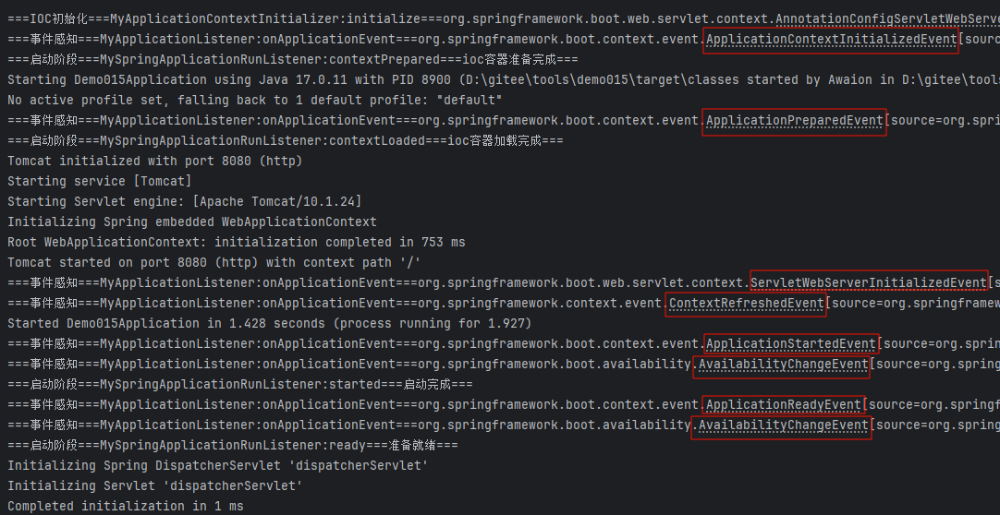

# Spring Boot 3 事件

# 主要内容

> [组件加载](#组件加载)  
> [ApplicationListener 监听的事件](#applicationlistener-监听的事件)  
> [SpringApplicationRunListener 扩展](#springapplicationrunlistener-扩展)  
> [应用事件驱动开发](#应用事件驱动开发)  

## 组件加载

BootstrapRegistryInitializer 初始化 引导阶段
- 加载方式一 META-INF/spring.factories
- 加载方式二 application.addBootstrapRegistryInitializer();
- 触发时间 创建引导上下文 bootstrapContext 的时候触发
- 使用场景 进行密钥校对授权

----

ApplicationContextInitializer 容器初始化 引导阶段
- 加载方式一 META-INF/spring.factories
- 加载方式二 application.addInitializers();

----

ApplicationListener 监听器初始化 启动阶段
- 加载方式一 @Bean 或 @EventListener 事件驱动
- 加载方式二 SpringApplication.addListeners(…) 或 SpringApplicationBuilder.listeners(…)
- 加载方式三 META-INF/spring.factories

----

SpringApplicationRunListener 运行监听器初始化,监听后面各阶段 启动阶段
- 加载方式 META-INF/spring.factories

--- 
ApplicationRunner 应用启用 运行阶段
- 加载方式 @Bean

----

CommandLineRunner 命令行启动 运行阶段
- 加载方式 @Bean

----

最佳实战：
- 如果项目启动前做事 BootstrapRegistryInitializer 和 ApplicationContextInitializer
- 如果想要在项目启动完成后做事 ApplicationRunner 和 CommandLineRunner
- 如果要干涉生命周期做事 SpringApplicationRunListener
- 如果想要用事件机制 ApplicationListener

## ApplicationListener 监听的事件

- ApplicationStartingEvent 应用启动,注册 listeners and initializers
- ApplicationEnvironmentPreparedEvent Environment 准备好,但 context 未创建
- ApplicationContextInitializedEvent ApplicationContext 准备好,ApplicationContextInitializers 调用,但是任何 bean 未加载
- ApplicationPreparedEvent 容器刷新之前,bean 定义信息加载
- ApplicationStartedEvent 容器刷新完成,runner 未调用
- AvailabilityChangeEvent LivenessState.CORRECT应用存活 存活探针
- ApplicationReadyEvent 任何 runner被调用 探针
- AvailabilityChangeEvent ReadinessState.ACCEPTING_TRAFFIC 可以接请求 就绪探针
- ApplicationFailedEvent 启动出错 探针



## SpringApplicationRunListener 扩展

SpringApplicationRunListener 会监听项目运行生命周期(引导,启动,运行),如需要在特性阶段增加业务,可实现此类

```text
spring.factories
org.springframework.boot.SpringApplicationRunListener=com.awaion.demo015.listener.MySpringApplicationRunListener

/**
 * 配置到 META-INF/spring.factories 自动加载
 */
@Slf4j
public class MySpringApplicationRunListener implements SpringApplicationRunListener {
    @Override
    public void starting(ConfigurableBootstrapContext bootstrapContext) {
        log.info("===引导阶段===MySpringApplicationRunListener:starting===正在启动===");
    }

    @Override
    public void environmentPrepared(ConfigurableBootstrapContext bootstrapContext, ConfigurableEnvironment environment) {
        log.info("===引导阶段===MySpringApplicationRunListener:environmentPrepared===环境准备完成===");
    }

    @Override
    public void contextPrepared(ConfigurableApplicationContext context) {
        log.info("===启动阶段===MySpringApplicationRunListener:contextPrepared===ioc容器准备完成===");
    }

    @Override
    public void contextLoaded(ConfigurableApplicationContext context) {
        log.info("===启动阶段===MySpringApplicationRunListener:contextLoaded===ioc容器加载完成===");
    }

    @Override
    public void started(ConfigurableApplicationContext context, Duration timeTaken) {
        log.info("===启动阶段===MySpringApplicationRunListener:started===启动完成===");
    }

    @Override
    public void ready(ConfigurableApplicationContext context, Duration timeTaken) {
        log.info("===启动阶段===MySpringApplicationRunListener:ready===准备就绪===");
    }

    @Override
    public void failed(ConfigurableApplicationContext context, Throwable exception) {
        log.info("===启动失败===MySpringApplicationRunListener:failed===应用启动失败===");
    }
}
```

## 应用事件驱动开发

应用启动过程生命周期事件感知有定义9大事件,应用运行中可自定义事件满足业务需求

如果业务逻辑之间没有相互依赖和干扰,可以考虑使用事件驱动开发.适用于单机,应用事件在虚拟机和虚拟机之间是不通信的.

```text
@Service
public class MyEventPublisher implements ApplicationEventPublisherAware {

    ApplicationEventPublisher applicationEventPublisher;

    public void mySendEvent(ApplicationEvent event) {
        // 发布事件
        applicationEventPublisher.publishEvent(event);
    }

    @Override
    public void setApplicationEventPublisher(ApplicationEventPublisher applicationEventPublisher) {
        this.applicationEventPublisher = applicationEventPublisher;
    }
}

/**
 * 自定义事件
 */
public class MyEvent extends ApplicationEvent {
    public MyEvent(Object source) {
        super(source);
    }
}

@Order(1)
@EventListener
public void onEvent1(MyEvent myEvent) {
    log.info("===事件监听===MyEventListener:onEvent1==={}", myEvent);
    String source = (String) myEvent.getSource();
    demo1Service.biz01(source);
}

@Order(2)
@EventListener
public void onEvent2(MyEvent myEvent) {
    log.info("===事件监听===MyEventListener:onEvent2==={}", myEvent);
    String source = (String) myEvent.getSource();
    demo2Service.biz02(source);
}

@Order(3)
@EventListener
public void onEvent3(MyEvent myEvent) {
    log.info("===事件监听===MyEventListener:onEvent3==={}", myEvent);
    String source = (String) myEvent.getSource();
    demo3Service.biz03(source);
}

@Autowired
private MyEventPublisher publisher;

/**
 * 请求 http://localhost:8080/register?username=%E5%BC%A0%E4%B8%89&password=fwkt
 */
@GetMapping("/register")
public String register(String username, String password) {
    log.info("===注册===Demo015Controller:register===username:{}===password:{}", username, password);
    // 发布注册成功事件
    publisher.mySendEvent(new MyEvent("username:" + username + ",password:" + password));
    return "注册成功";
}
```

----

以上就是本文核心内容.

[Github 源码](https://github.com/Awaion/tools/tree/master/demo015)

[返回顶部](#主要内容)

