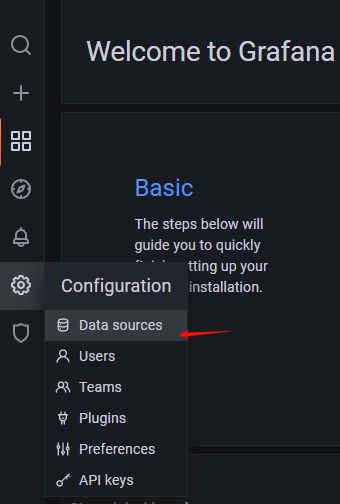

# SpringBoot 3 + Actuator + Prometheus

# 主要内容

> [Actuator](#actuator)  
> [Prometheus + Grafana](#)  

## Actuator

常用节点

|ID| 描述                                                                                   |
|--|--------------------------------------------------------------------------------------|
|auditevents| 暴露当前应用程序的审核事件信息,需要一个AuditEventRepository组件                                           |
|beans| 显示应用程序中所有Spring Bean的完整列表                                                            |
|caches| 暴露可用的缓存                                                                              |
|conditions| 显示自动配置的所有条件信息，包括匹配或不匹配的原因                                                            |
|configprops| 显示所有@ConfigurationProperties                                                         |
|env| 暴露Spring的属性ConfigurableEnvironment                                                   |
|flyway| 显示已应用的所有Flyway数据库迁移,需要一个或多个Flyway组件                                                  |
|health| 显示应用程序运行状况信息                                                                         |
|httptrace| 显示HTTP跟踪信息(默认情况下,最近100个HTTP请求-响应),需要一个HttpTraceRepository组件                          |
|info| 显示应用程序信息                                                                             |
|integrationgraph| 显示Spring integrationgraph,需要依赖spring-integration-core                                |
|loggers| 显示和修改应用程序中日志的配置                                                                      |
|liquibase| 显示已应用的所有Liquibase数据库迁移。需要一个或多个Liquibase组件                                            |
|metrics| 显示当前应用程序的“指标”信息                                                                      |
|mappings| 显示所有@RequestMapping路径列表                                                              |
|scheduledtasks| 显示应用程序中的计划任务                                                                         |
|sessions| 允许从Spring Session支持的会话存储中检索和删除用户会话,需要使用Spring Session的基于Servlet的Web应用程序              |
|shutdown| 使应用程序正常关闭,默认禁用                                                                       |
|startup| 显示由ApplicationStartup收集的启动步骤数据,需要使用SpringApplication进行配置BufferingApplicationStartup  |
|threaddump| 执行线程转储                                                                               |
|heapdump| 返回hprof堆转储文件                                                                         |
|jolokia| 通过HTTP暴露JMX bean(需要引入Jolokia,不适用于WebFlux)需要引入依赖jolokia-core                          |
|logfile| 返回日志文件的内容(如果已设置logging.file.name或logging.file.path属性),支持使用HTTPRange标头来检索部分日志文件的内容    |
|prometheus| 以Prometheus服务器可以抓取的格式公开指标,需要依赖micrometer-registry-prometheus                         |

自定义节点信息

```text
<dependency>
    <groupId>org.springframework.boot</groupId>
    <artifactId>spring-boot-starter-actuator</artifactId>
</dependency>
<dependency>
    <groupId>org.springframework.boot</groupId>
    <artifactId>spring-boot-starter-web</artifactId>
</dependency>

<dependency>
    <groupId>io.micrometer</groupId>
    <artifactId>micrometer-registry-prometheus</artifactId>
    <scope>runtime</scope>
</dependency>

management.endpoints.web.exposure.include=*
management.endpoint.health.enabled=true
management.endpoint.health.show-details=always

@Component
public class MyMeterComponent {
    Counter counter = null;

    public MyMeterComponent(MeterRegistry meterRegistry) {
        // metrics 节点 新增监控信息
        counter = meterRegistry.counter("my.meter");
    }

    public void myMeterCounter() {
        // 监控信息业务处理
        counter.increment();
    }
}

@Component
public class MyHealthIndicator extends AbstractHealthIndicator {

    @Override
    protected void doHealthCheck(Health.Builder builder) throws Exception {
        // health 节点 新增监控信息
        int check = myHealthCheck();
        if (check == 1) {
            builder.up()
                    .withDetail("code", "1000")
                    .withDetail("msg", "健康")
                    .withDetail("data", "吃得好睡得香")
                    .build();
        } else {
            builder.down()
                    .withDetail("code", "1001")
                    .withDetail("msg", "不健康")
                    .withDetail("data", "吃不好睡不香")
                    .build();
        }

    }

    public int myHealthCheck() {
        // 监控信息业务处理
        return 1;
    }
}
```


## Prometheus + Grafana

```text
# 下载 openjdk 17
wget https://download.oracle.com/java/17/latest/jdk-17_linux-x64_bin.tar.gz

# 创建文件夹
mkdir -p /opt/java

# 解压 jdk
tar -xzf jdk-17_linux-x64_bin.tar.gz -C /opt/java/

# 新增环境变量
sudo vi /etc/profile
export JAVA_HOME=/opt/java/jdk-17.0.11
export PATH=$PATH:$JAVA_HOME/bin

# 环境变量生效
source /etc/profile

# 验证
java -version

# 管理员权限打开文件管理器粘贴 
sudo nautilus

# 后台启动java应用
nohup java -jar demo022-0.0.1-SNAPSHOT.jar > output.log 2>&1 &

# 验证
http://192.168.1.16:9999/actuator/prometheus

# 修改 prometheus.yml 配置文件
scrape_configs:
  - job_name: 'spring-boot-demo022'
    metrics_path: '/actuator/prometheus' #指定抓取的路径
    static_configs:
      - targets: ['192.168.1.16:9999']
        labels:
          nodename: 'app-demo022'

# 根据配置文件启动容器
docker compose -f docker-compose.yml up -d

# 根据配置文件,停止容器
docker compose -f docker-compose.yml down

Prometheus http://192.168.1.16:9090

# 默认账户 admin/admin 登录可改密码
Grafana http://192.168.1.16:3000

# Prometheus
添加数据源,添加面板,可去 dashboard 市场找一个自己喜欢的面板,也可以自己开发面板.
https://grafana.com/grafana/dashboards/?plcmt=footer

# 添加数据源
configuration -> data sources -> add data source -> Prometheus -> url -> save and test

# 添加面板
create -> import -> 12900 -> load -> Prometheus -> import
```




## 结尾

以上就是本文核心内容.

[Github 源码](https://github.com/Awaion/tools/tree/master/demo022)

[返回顶部](#主要内容)

