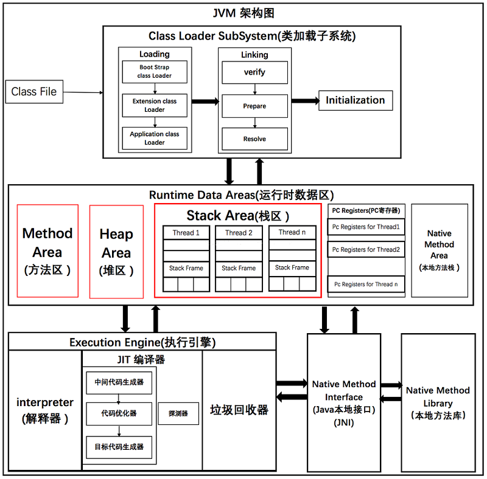
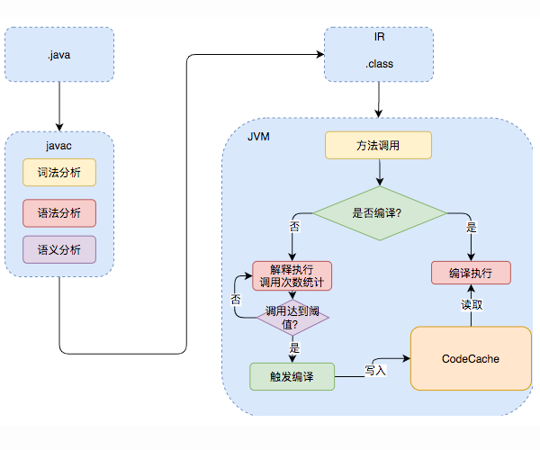
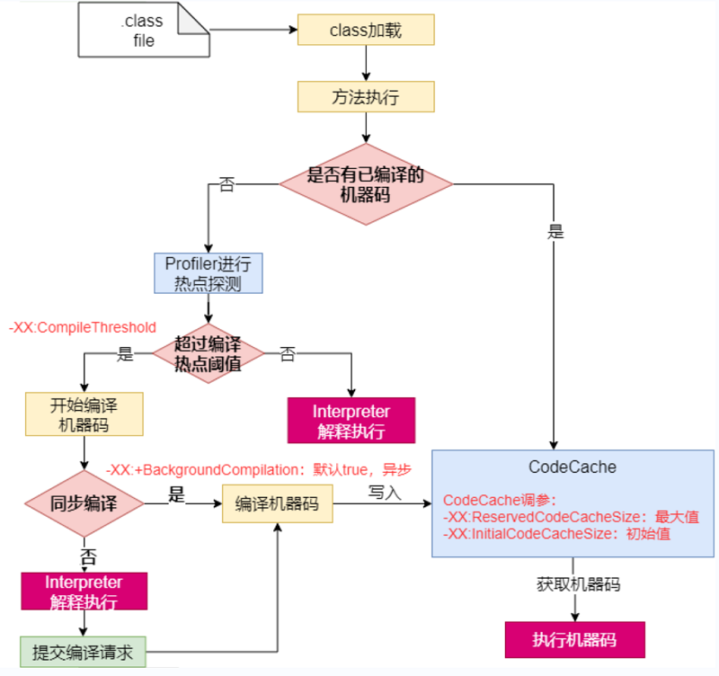
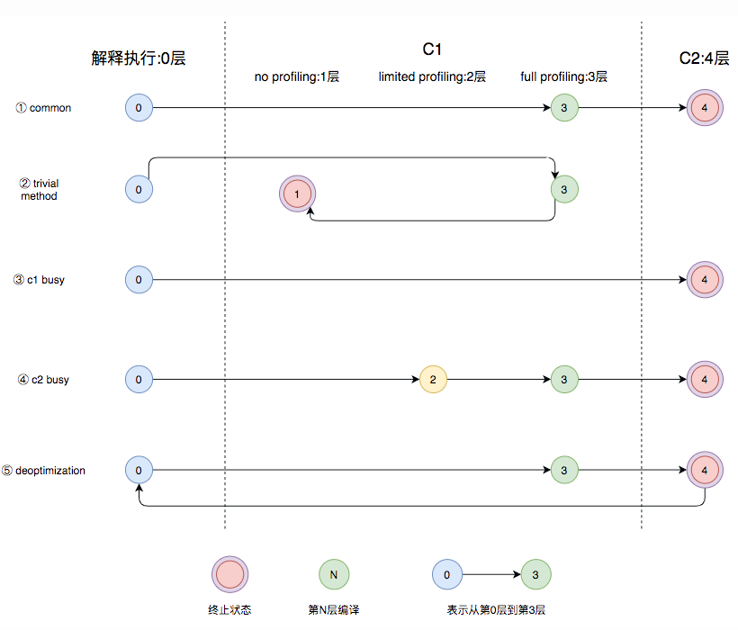
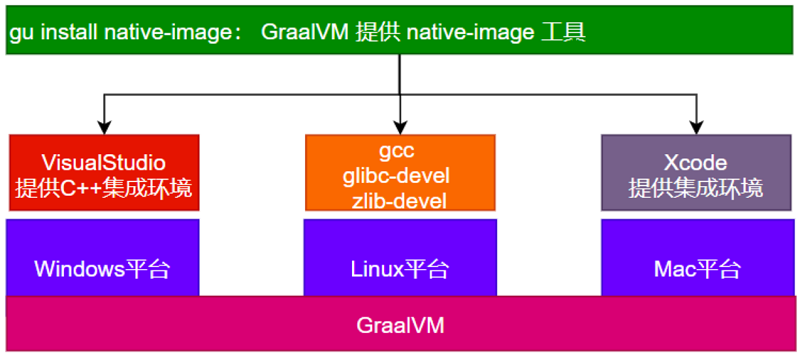
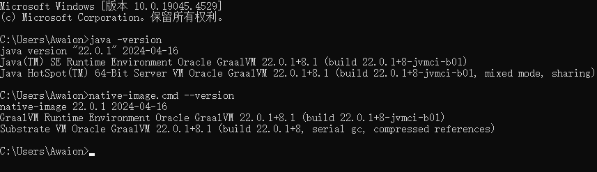
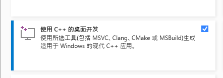
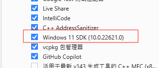

# SpringBoot 3 + JVM + GraalVM

# 主要内容

> [语言分类](#语言分类)  
> [编译分类](#编译分类)  
> [JVM](#jvm)  
> [GraalVM](#graalvm)  

## 语言分类

- Complier 编译型语言,需要编译器
- Interpreter 解释型语言,需要解释器

|对比项|编译器|解释器|
|-----|-----|-----|
|机器执行速度|快,因为源代码只需被转换一次|慢,因为每行代码都需要被解释执行|
|开发效率|慢,因为需要耗费大量时间编译|快,无需花费时间生成目标代码,更快的开发和测试|
|调试|难以调试编译器生成的目标代码|容易调试源代码|因为解释器一行一行地执行|
|可移植性(跨平台)|不同平台需要重新编译目标平台代码|同一份源码可以跨平台执行,因为每个平台会开发对应的解释器|
|学习难度|相对较高,需要了解源代码,编译器以及目标机器的知识|相对较低,无需了解机器的细节|
|错误检查|编译器可以在编译代码时检查错误|解释器只能在执行代码时检查错误|
|运行时增强|无|可以动态增强|

## 编译分类
- AOT Ahead of Time 提前编译,程序执行前,全部被编译成机器码
- JIT Just in Time 即时编译,程序边编译边运行

JIT	特点
- 具备实时调整能力
- 生成最优机器指令
- 根据代码运行情况优化内存占用
- 运行期边编译速度慢
- 初始编译不能达到最高性能

AOT 特点
- 速度快，优化了运行时编译时间和内存消耗
- 程序初期就能达最高性能
- 加快程序启动速度
- 程序第一次编译占用时间长
- 牺牲高级语言一些特性,比如反射

Java 半编译半解释

在线多语言编译: https://anycodes.cn/editor

## JVM

HotSpot 优化策略: https://wiki.openjdk.org/display/HotSpot/PerformanceTacticIndex


JVM 整体架构

.java -> .class -> 机器码

JVM 既有解释器,又有编译器,我们打包的 Jar 文件里面的人类可读文件就需要解释器执行,比如配置配错了,编译时并不会报错.

使用 -XX:+PrintCompilation 打印 JIT 编译信息



Java 执行过程

官方说明: https://wiki.openjdk.org/display/HotSpot/Compiler

大牛解读: https://tech.meituan.com/2020/10/22/java-jit-practice-in-meituan.html





HotSpot VM 编译器

Client Compiler
- 简称 C1 编译器
- 这种编译器启动速度快,但是性能比较Server Compiler来说会差一些
- 编译后的机器码执行效率没有 C2 的高

Server Compiler
- C2 和 Graal
- 默认 C2

分层编译

Java 7 开始引入了分层编译(Tiered Compiler)的概念,它结合了 C1 和 C2 的优势,追求启动速度和峰值性能的一个平衡.profiling 是收集能够反映程序执
行状态的数据,其中最基本的统计数据就是方法的调用次数,以及循环回边的执行次数.分层编译将 JVM 的执行状态分为了 五个层次,
- 解释执行
- 执行不带 profiling 的 C1 代码
- 执行仅带方法调用次数以及循环回边执行次数 profiling 的 C1 代码
- 执行带所有 profiling 的 C1 代码
- 执行 C2 代码



- 图中第①条路径,代表编译的一般情况,热点方法从解释执行到被3层的C1编译,最后被4层的C2编译
- 如果方法比较小(比如Java服务中常见的getter/setter方法),3层的profiling没有收集到有价值的数据,JVM就会断定该方法对于C1代码和C2代码的执行效率
相同,就会执行图中第②条路径.在这种情况下,JVM会在3层编译之后,放弃进入C2编译,直接选择用1层的C1编译运行.
- 在C1忙碌的情况下,执行图中第③条路径,在解释执行过程中对程序进行profiling,根据信息直接由第4层的C2编译
- 前文提到C1中的执行效率是1层>2层>3层,第3层一般要比第2层慢35%以上,所以在C2忙碌的情况下,执行图中第④条路径.这时方法会被2层的C1编译,然后再被3层
的C1编译,以减少方法在3层的执行时间.
- 如果编译器做了一些比较激进的优化,比如分支预测,在实际运行时发现预测出错,这时就会进行反优化,重新进入解释执行,图中第⑤条执行路径代表的就是反优化.
- 总的来说,C1的编译速度更快,C2的编译质量更高,分层编译的不同编译路径,也就是JVM根据当前服务的运行情况来寻找当前服务的最佳平衡点的一个过程.从
JDK 8开始,JVM默认开启分层编译.

Cloud Native 云原生时代要求

原生镜像 native-image
- 把应用打包成能适配本机平台的可执行文件
希望的效果
- java 应用也能提前被编译成机器码,随时急速启动,一启动就急速运行,达到最高性能
- 编译成机器码,无需再编译,可直接运行
存在的问题：
- java 应用如果用 jar 解释执行,热点代码才编译成机器码,初始启动速度慢,初始处理请求数量少
- 大型云平台,要求每一种应用都必须秒级启动,每个应用都要求效率高

## GraalVM

GraalVM 是一个高性能的JDK,旨在加速用 Java 和其他 JVM 语言编写的应用程序的执行,同时还提供JavaScript,Python和许多其他流行语言的运行时.

使用 GraalVM 编译成的原生应用已经是机器码了,无需再依赖 JDK 环境运行.

GraalVM 提供了两种运行 Java 应用程序的方式
1. 在 HotSpot JVM 上使用 Graal 即时编译器(JIT)
2. 作为预先编译(AOT)的本机可执行文件运行

GraalVM 的多语言能力使得在单个应用程序中混合多种编程语言成为可能,同时消除了外部语言调用的成本.




----

Windows 系统 GraalVM 安装和运行

文档: https://www.graalvm.org/latest/docs/

根据文档下载 Java 22: https://www.graalvm.org/downloads/

根据文档配置环境变量,然后打开cmd验证: java -version 出现 GraalVM 字样,查看云原生命令版本 native-image.cmd --version

根据文档下载VisualStudio: https://visualstudio.microsoft.com/thank-you-downloading-visual-studio/?sku=BuildTools&rel=16

GraalVM 22.0.1+8.1 构建 SpringBoot 应用可能会报错误: Error: Failed to find 'vcvarsall.bat' in a Visual Studio installation.
原因是源代码把 vcvarsall.bat 文件路径写死了,所以 Microsoft Visual Studio 2022 Community 安装不要改变默认路径,后续可能会修复.

https://stackoverflow.com/questions/77840039/graalvm-failed-to-find-vcvarsall-bat-in-a-visual-studio-installation

选择 Community 版本,版本要求 Visual Studio 2022 version 17.6.0 or later 安装必选: 使用 C++ 的桌面开发,Windows 11 SDK,
Visual Studio SDK,英文语言

SpringBoot 云原生构建

新增打包插件

```text
<plugin>
    <groupId>org.graalvm.buildtools</groupId>
    <artifactId>native-maven-plugin</artifactId>
</plugin>
```
原生插件编译 maven -> plugins -> native -> native:compile

运行 target/demo023.exe











----

Ubuntu 系统安装和运行

```text
# 安装上传工具, rz 命令打开上传界面,适用于 CentOS, Ubuntu 可能不适用
sudo apt install lrzsz

# ubuntu 安装 gcc 工具
sudo apt-get install build-essential zlib1g-dev

# 管理员权限打开文件管理器粘贴
sudo nautilus

根据文档下载 Java 17: https://www.graalvm.org/downloads/

# 上传 Java 17 并解压
tar -zxvf graalvm-jdk-17_linux-x64_bin.tar.gz -C /opt/java/

# 修改文件名
mv /opt/java/graalvm-jdk-17.0.11+7.1 /opt/java/graalvm-jdk-17

# 修改以下内容
sudo vi /etc/profile
export JAVA_HOME=/opt/java/graalvm-jdk-17
export PATH=$PATH:$JAVA_HOME/bin

# 生效环境变量
source /etc/profile

# 查看 Java 版本
java -version

# 查看 native-image 
native-image --version

# 管理员权限打开文件管理器粘贴,将代码上传
sudo nautilus

# pom.xml 目录下原生构建
mvn -Pnative native:build -f pom.xml

# 启动
./target/demo023
```


## 结尾

以上就是本文核心内容.

[Github 源码](https://github.com/Awaion/tools/tree/master/demo023)

[返回顶部](#主要内容)

