# IDEA 2024.1 安装

# 主要内容

> [简介](#简介)  
> [安装步骤](#安装步骤)  
> [总结](#总结)

# 正文

## 简介

众所周知,`IDEA`对`Java`的开发来说,无疑是一款优秀的`IDE`软件,今天就升级`IDEA`到最新的版本,看看如何.

## 安装步骤

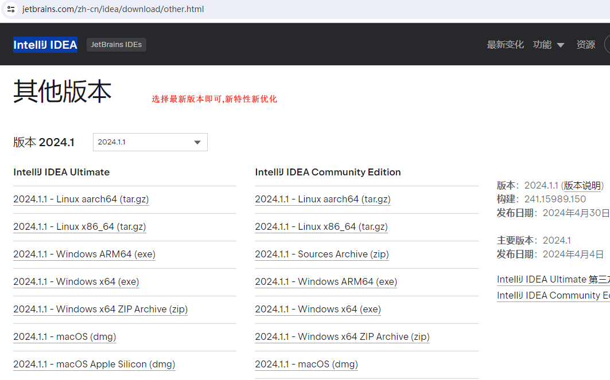

打开网站 `https://www.jetbrains.com/zh-cn/idea/download/other.html` 选则最新版本下载.

----

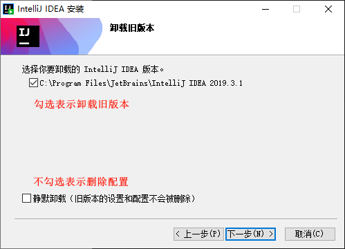

之前一直在用旧版本,先把旧版本卸载了,配置也删除,一切重头再来,对于已不是新手的中登来说,操作熟悉的东西是不需要战战兢兢,一板一眼的做事的,需要敢于重头
再来,敢于面对新事物的勇气.在了解底层的运行原理后,外在的变化是很容易理解和上手的.

----

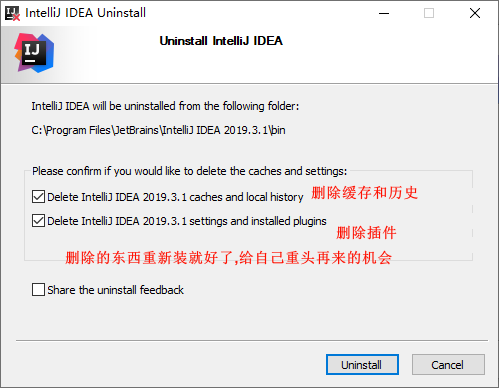

全删了,全删了.

----

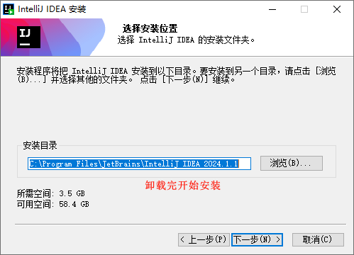

新版本安装路径看个人喜好即可,装哪都一样,我选默认路径就好了.

----

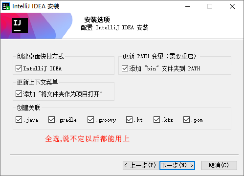

后续可能会用到各种技术,把关联项全选上就好了.

----

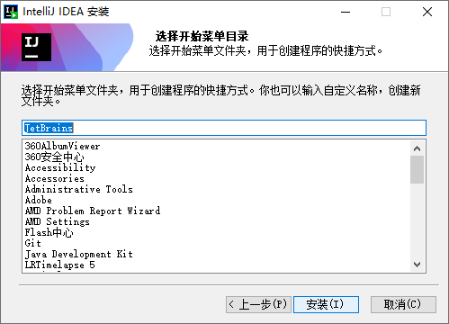

菜单文件夹默认,然后点安装.

----

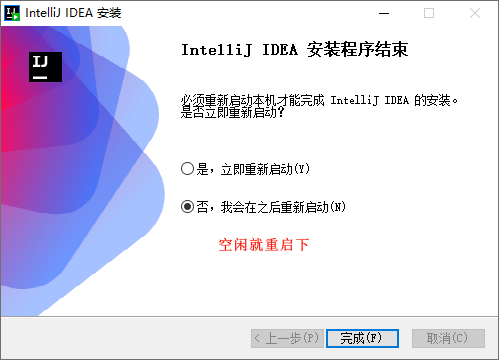

安装完后,最好重启下电脑,可以看到完整形态的`IDEA`

----

试用30天看看,激活还是很贵的.

----

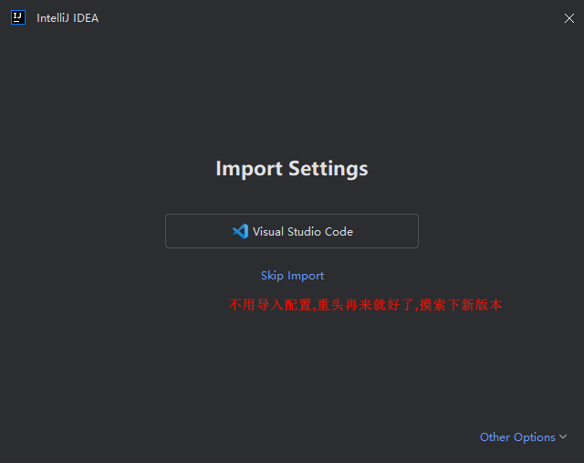

要不要导配置?当然不用,我都要重新摸索了,直接跳过.

----

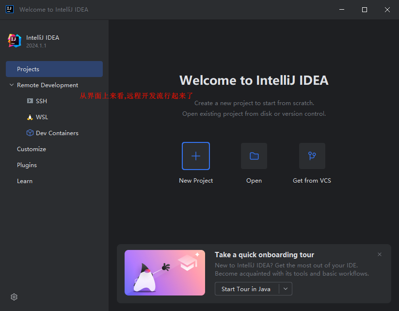

介绍下界面:
- Projects  
本地项目,提供三种方式`新建(New)(什么都没有就新建)`, `打开(Open)(本地有了就打开)`, `版本控制获取(VCS)(接手就拉取)`.
- Remote Development  
远程开发,提供三种连接`SSH`, `WSL`, `Dev Containers`.放在这么显眼位置,说明远程开发,大势所趋.
- Customize  
自定义啥呢?有兴趣可以了解下,对于我来说,前两个够用了.
- Plugins  
插件,不需要依赖就把插件装满,后续用到啥装啥插件,按需安装.
- Learn  
这肯定是教程了.

----

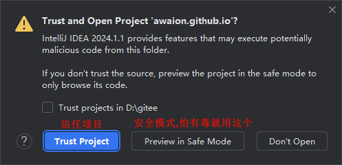

打开本地已有项目,会问你要不要信任项目,你相信没病毒,就直接选信任项目打开就好了.

----

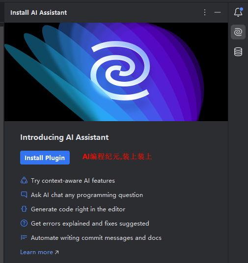

`IDEA`力推自家的`AI`插件,那就装上吧.

----

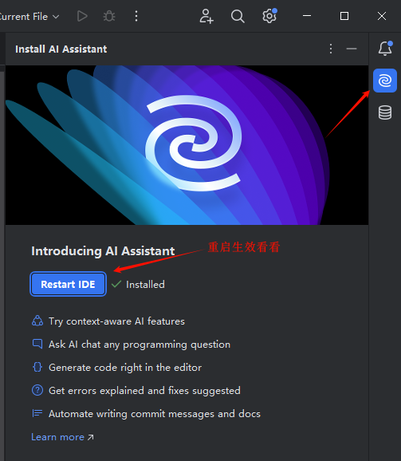

重启下看看效果,发现要登录账号...,后续注册个账号看看,试用完后肯定是收费,量力(钱)而行吧.

----

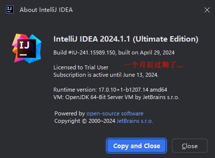

`IDEA`一个月试用期...

----

## 总结

**IDEA 2024.1 安装就到这里了,虽然界面很新,但依旧能找到想要的菜单,暂时不影响使用,后续就慢慢探索就好了**

## 题外话

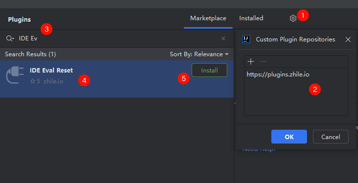

装个神奇的插件试试看,

----

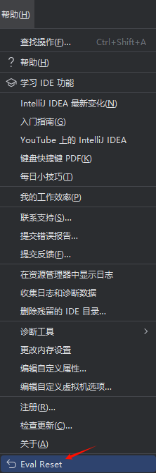

没有任何效果...,那么相信下后人的智慧,过段时间看看

[返回顶部](#主要内容)

