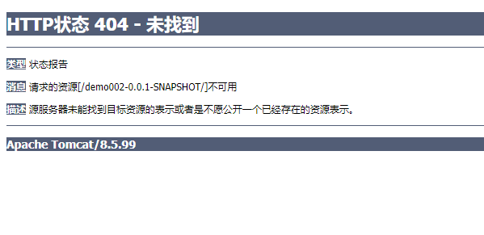
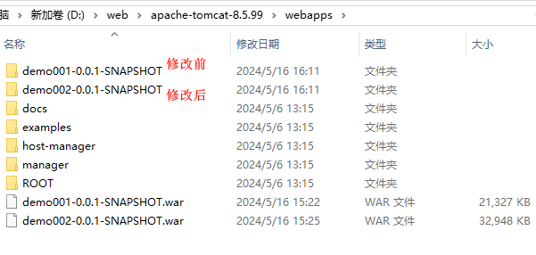
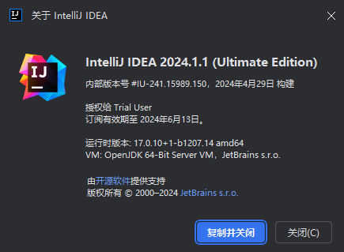
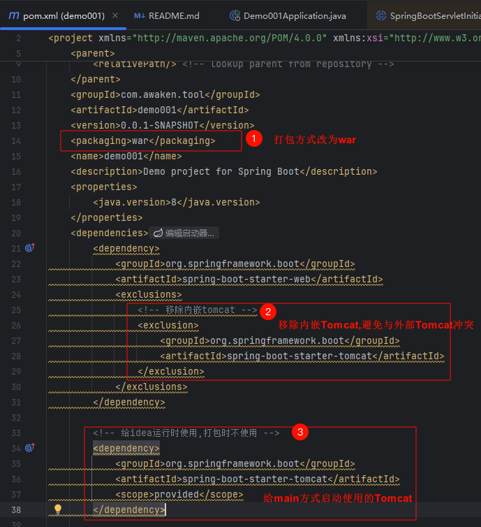

# Spring Boot + 外部 Tomcat

# 主要内容

> [前提](#前提)  
> [问题展示](#问题展示)  
> [代码修改步骤](#代码修改步骤)

# 正文

## 前提

众所周知,`SpringBoot`默认功能十分强大,使用它来启动一个`Java Web`服务,甚至不需要任何配置,只需要一个`pom.xml`文件和`Application.java`启动
类,就能启动`Java Web`服务.`简洁高效`应用的淋淋尽致,但企业使用场景各种各样,在最简配置下,我们需要去变更额外的配置以满足需求,`Tomcat`作为一款
`经典的`, `热门的`, `实现Java Servlet`的服务器,一直服务着广大Java应用程序,`SpringBoot`直接内嵌了`Tomcat核心组件`以快速启动`Web服务`,代价
是抛弃了一些功能,想要将`Tomcat`应用到极致,使用完整的`Tomcat`是必不可少的,这就引出了`如何用外部Tomcat启动SpringBoot项目`这个问题.

## 问题展示



直接将不修改的`SpringBoot`war包交给服务器部署,我们可以看到是加载不了的.

----


修改后的`SpringBoot`war包交给服务器部署,我们可以看到正常加载了.

----



两个war包,部署方式都是一样,直接放在`tomcat/webapps`目录下.

## 代码修改步骤



演示前提,本文章操作是使用`IDEA 2024.1`演示的.

----

```
@SpringBootApplication
public class Demo001Application extends SpringBootServletInitializer {

    @Override
    protected SpringApplicationBuilder configure(SpringApplicationBuilder builder) {
        // 外部tomcat启动需要调用初始化资源
        return builder.sources(Demo001Application.class);
    }

    public static void main(String[] args) {
        // 内嵌tomcat启动需要调用初始化资源
        SpringApplication.run(Demo001Application.class, args);
    }

}
```

在启动类上继承了`SpringBootServletInitializer`类,并且重写了`configure`方法,`main`方法是为了在开发阶段使用内嵌服务器而保留的,完全不用内嵌
服务器可删除`main`.

----



```
<!-- 打包方式改为war -->
<packaging>war</packaging>

<!-- 移除内嵌tomcat -->
<exclusion>
    <groupId>org.springframework.boot</groupId>
    <artifactId>spring-boot-starter-tomcat</artifactId>
</exclusion>

<!-- 给idea使用main运行时使用,打包后不使用 -->
<dependency>
    <groupId>org.springframework.boot</groupId>
    <artifactId>spring-boot-starter-tomcat</artifactId>
    <scope>provided</scope>
</dependency>
```

这里为什么要移除内嵌`Tomcat`呢?  
是为了避免因内嵌`Tomcat`版本和外部`Tomcat`版本不一致导致一些不必要的`BUG`,程序是按流程办事的,不会包容流程之外的意外,如果内外部`Tomcat`版本
一致,那就不会出现意外`BUG`,但是长远考虑,事物是会运动的,不能保证程序的升级或者服务器的升级版本不变,少挖一个坑就少填一个坑,就能空出更多的时间.

添加私有`Tomcat`是为了,在开发阶段能用`main`方式启动,这就产生了,开发和生产环境不一致的情况,刚刚少挖了个坑,现在又多挖了个坑,得不偿失.最好的方式还
是各环境保持一致.

我这样写是验证方案的可行性,企业开发尽量少挖坑.

----

以上就是本文核心内容.

## 题外话

为什么继承`SpringBootServletInitializer`就能使得外部`Tomcat`正确加载呢?

原因得追溯到JVM启动的过程了
- sun.misc.Launcher 启动器,Java的根源
- org.springframework.boot.loader.Launcher SpringBoot启动器
- org.springframework.web.WebApplicationInitializer
- org.springframework.web.SpringBootServletInitializer
- javax.servlet.ServletContext

以上大概就是外部`Tomcat`正确加载`SpringBoot`项目的流程了,简要概括就是`Java Servlet`找到了`SpringBoot`项目.

作者没有一步步验证,论证还是要亲自`Debug`一番.

[Github 源码](https://github.com/Awaion/tools/tree/master/demo001)

[返回顶部](#主要内容)

