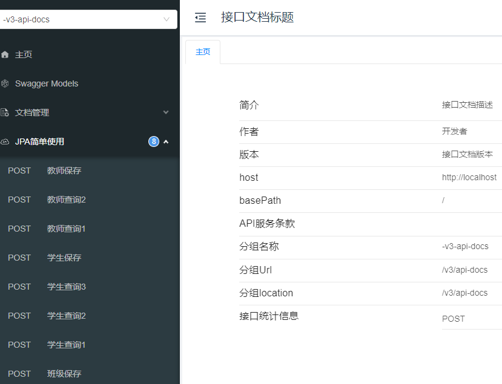
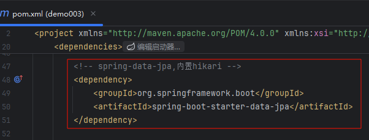
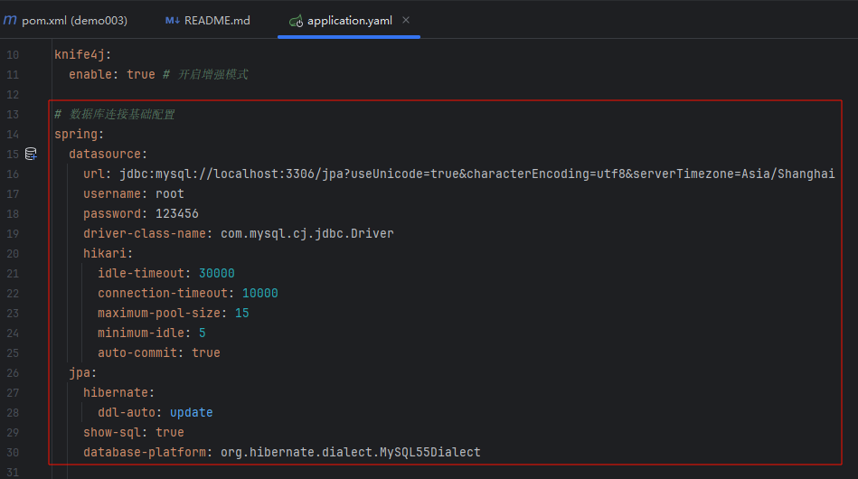
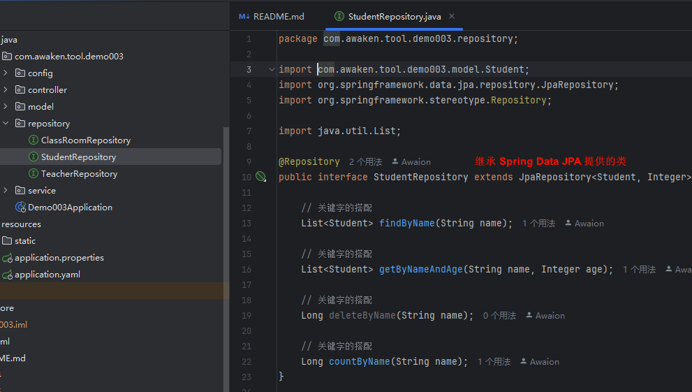
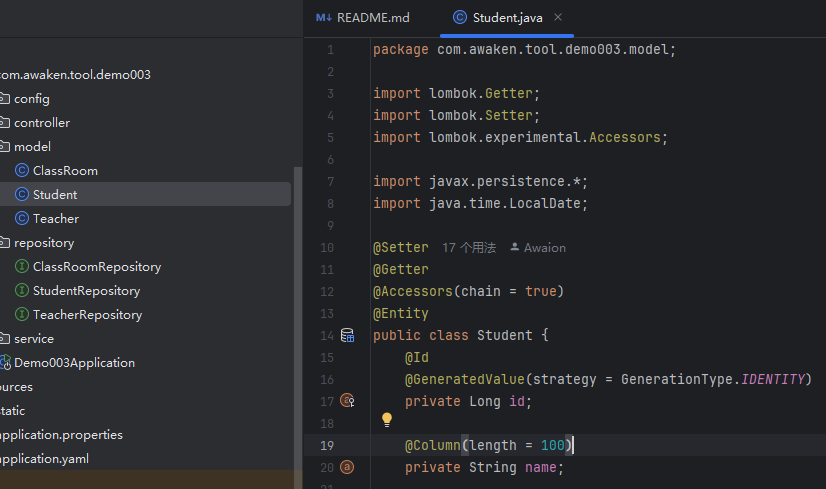

# Spring Boot + Spring Data JPA

# 主要内容

> [简介](#简介)  
> [展示](#展示)  
> [集成步骤](#集成步骤)

# 正文

## 简介

Spring Data JPA 是 Spring Data 项目家族中的一员,它为基于Spring框架应用程序提供了更加便捷和强大的数据操作方式.

Spring Data JPA 支持多种数据存储技术,包括关系型数据库和非关系型数据库.

Spring Data JPA 提供了简单/一致且易于使用的API来访问和操作数据存储,其中包括基本的CRUD操作/自定义查询方法/动态查询等功能.

Spring Data JPA 也支持QueryDSL/Jinq/Kotlin Query等其他查询框架

Spring Data JPA 官方文档: https://spring.io/projects/spring-data-jpa

## 展示



基于 SpringBoot2.7

----

## 集成步骤



```
<!-- spring-data-jpa,内置hikari -->
<dependency>
    <groupId>org.springframework.boot</groupId>
    <artifactId>spring-boot-starter-data-jpa</artifactId>
</dependency>
```

pom.xml 文件新增 spring-boot-starter-data-jpa 依赖

----



```
# 数据库连接基础配置
spring:
  datasource:
    url: jdbc:mysql://localhost:3306/jpa?useUnicode=true&characterEncoding=utf8&serverTimezone=Asia/Shanghai
    username: root
    password: 123456
    driver-class-name: com.mysql.cj.jdbc.Driver
    hikari:
      idle-timeout: 30000
      connection-timeout: 10000
      maximum-pool-size: 15
      minimum-idle: 5
      auto-commit: true
  jpa:
    hibernate:
      ddl-auto: update
    show-sql: true
    database-platform: org.hibernate.dialect.MySQL55Dialect
```

application.yaml 新增数据库及相关配置,连接池配置和 JPA 个性化配置.

----



```
@Repository
public interface StudentRepository extends JpaRepository<Student, Integer> {
```

在持久层定义接口,并继承 Spring Data JPA 提供的 JpaRepository.

----



```
public class Student {
    @Id
    @GeneratedValue(strategy = GenerationType.IDENTITY)
    private Long id;

    @Column(length = 100)
    private String name;
```

实体类中使用 Java JPA 注解

----

以上就是本文核心内容.

## 题外话

Spring Data JPA 底层是使用 Hibernate 框架实现的, 但是做了简化, 理解 Hibernate 就能很好的应用该框架.

[Github 源码](https://github.com/Awaion/tools/tree/master/demo003)

[返回顶部](#主要内容)

