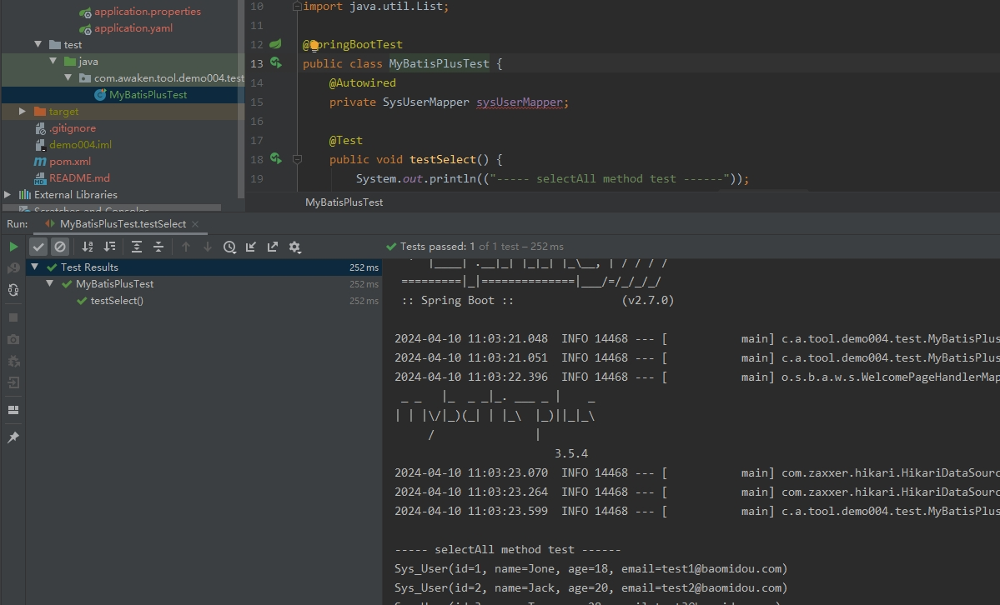
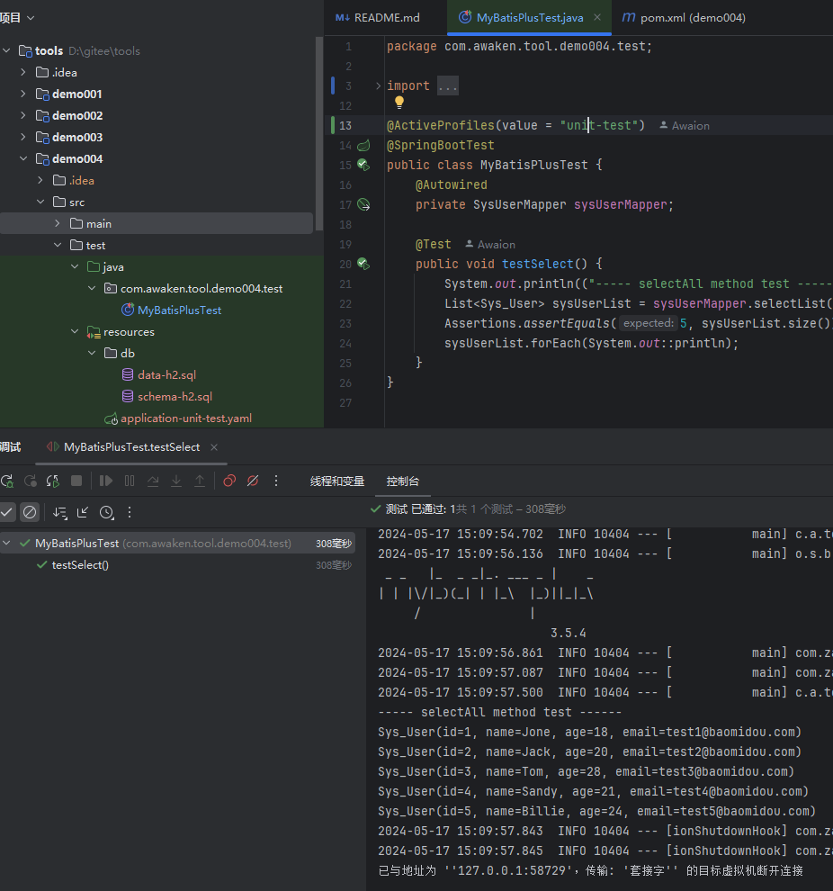
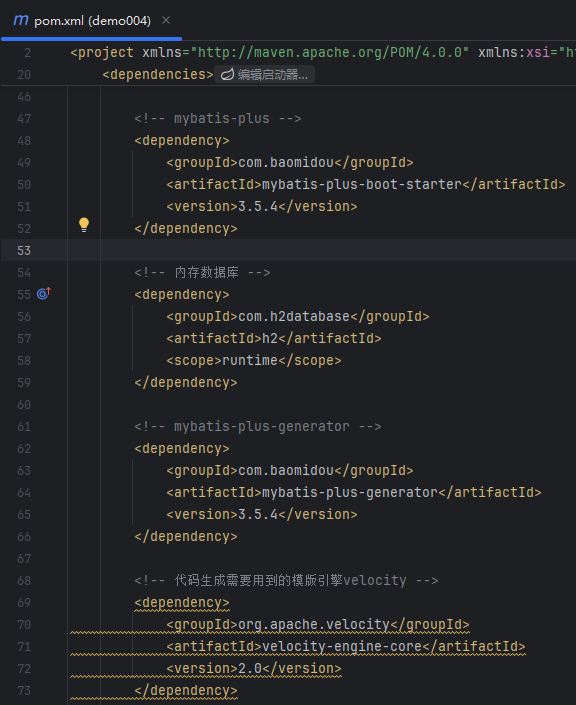
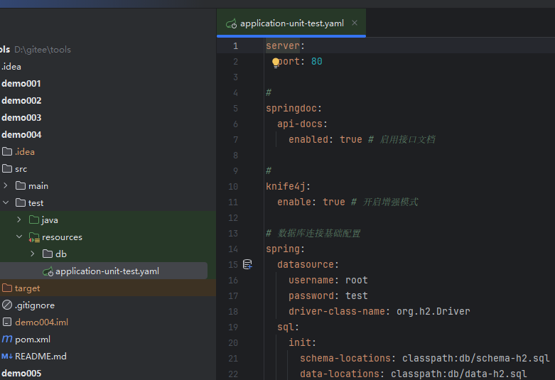
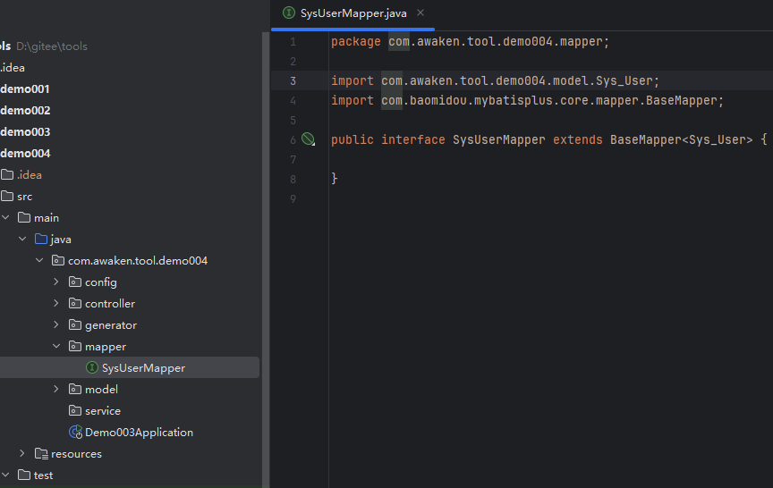
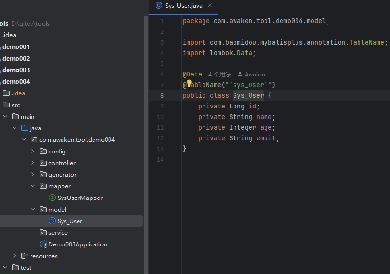

# Spring Boot + MyBatis-Plus

# 主要内容

> [简介](#简介)  
> [展示](#展示)  
> [集成步骤](#集成步骤)

# 正文

## 简介

MyBatis-Plus 是一个 MyBatis 的增强工具,在 MyBatis 的基础上只做增强不做改变,为简化开发/提高效率而生.
- 无侵入: 只做增强不做改变,引入它不会对现有工程产生影响,如丝般顺滑.
- 损耗小: 启动即会自动注入基本 CURD,性能基本无损耗,直接面向对象操作.
- 强大的 CRUD 操作: 内置通用 Mapper/通用 Service,仅仅通过少量配置即可实现单表大部分 CRUD 操作,更有强大的条件构造器,满足各
  类使用需求
- 支持 Lambda 形式调用:通过 Lambda 表达式,方便的编写各类查询条件,无需再担心字段写错.
- 支持主键自动生成: 支持多达 4 种主键策略(内含分布式唯一 ID 生成器 - Sequence),可自由配置,完美解决主键问题.
- 支持 ActiveRecord 模式:支持 ActiveRecord 形式调用,实体类只需继承 Model 类即可进行强大的 CRUD 操作.
- 支持自定义全局通用操作:支持全局通用方法注入(Write once, use anywhere).
- 内置代码生成器:采用代码或者 Maven 插件可快速生成 Mapper / Model / Service / Controller 层代码,支持模板引擎,更有超多自定
  义配置等您来使用.
- 内置分页插件:基于 MyBatis 物理分页,开发者无需关心具体操作,配置好插件之后,写分页等同于普通 List 查询.
- 分页插件支持多种数据库:支持 MySQL/MariaDB/Oracle/DB2/H2/HSQL/SQLite/Postgre/SQLServer 等多种数据库
- 内置性能分析插件:可输出 SQL 语句以及其执行时间,建议开发测试时启用该功能,能快速揪出慢查询.
- 内置全局拦截插件:提供全表 delete / update 操作智能分析阻断,也可自定义拦截规则,预防误操作.
- 官方文档: https://baomidou.com/

## 展示





基于 SpringBoot2.7

----

## 集成步骤



```
<!-- mybatis-plus -->
<dependency>
    <groupId>com.baomidou</groupId>
    <artifactId>mybatis-plus-boot-starter</artifactId>
    <version>3.5.4</version>
</dependency>

<!-- 内存数据库 -->
<dependency>
    <groupId>com.h2database</groupId>
    <artifactId>h2</artifactId>
    <scope>runtime</scope>
</dependency>

<!-- mybatis-plus-generator -->
<dependency>
    <groupId>com.baomidou</groupId>
    <artifactId>mybatis-plus-generator</artifactId>
    <version>3.5.4</version>
</dependency>

<!-- 代码生成需要用到的模版引擎velocity -->
<dependency>
    <groupId>org.apache.velocity</groupId>
    <artifactId>velocity-engine-core</artifactId>
    <version>2.0</version>
</dependency>
```

pom.xml 文件新增 mybatis-plus-boot-starter 和 h2 依赖, mybatis-plus-generator 和 velocity-engine-core 是代码生成器所需依赖,库表
的创建 后往往是需要开始编写基本的 Java 代码,自动生成可以省去一些基本工作. 

----



```
# 数据库连接基础配置
spring:
  datasource:
    username: root
    password: test
    driver-class-name: org.h2.Driver
  sql:
    init:
      schema-locations: classpath:db/schema-h2.sql
      data-locations: classpath:db/data-h2.sql
```

application-unit-test.yaml 新增数据库及相关配置,注意这是单元测试文件,应该放在 test/resources 文件夹下,还有初始化 sql 脚本

----



```
public interface SysUserMapper extends BaseMapper<Sys_User> {
```

在持久层定义接口,并继承 MyBatis-Plus 提供的 BaseMapper.

----



```
@TableName("`sys_user`")
public class Sys_User {
```

实体类中使用 MyBatis-Plus 注解

----

以上就是本文核心内容.

## 题外话

MyBatis-Plus 之所以能在 MyBatis 上进行增强,是因为 MyBatis 在扩展上留下了 org.apache.ibatis.plugin.Interceptor 拦截器. Plus 在此基
础上定义了自己的拦截器 com.baomidou.mybatisplus.extension.plugins.MybatisPlusInterceptor ,这符合面向对象编程(OOP)
(Object Oriented Programming),软件设计原则的开放封闭原则OCP(Open Close Principle)

[Github 源码](https://github.com/Awaion/tools/tree/master/demo004)

[返回顶部](#主要内容)

