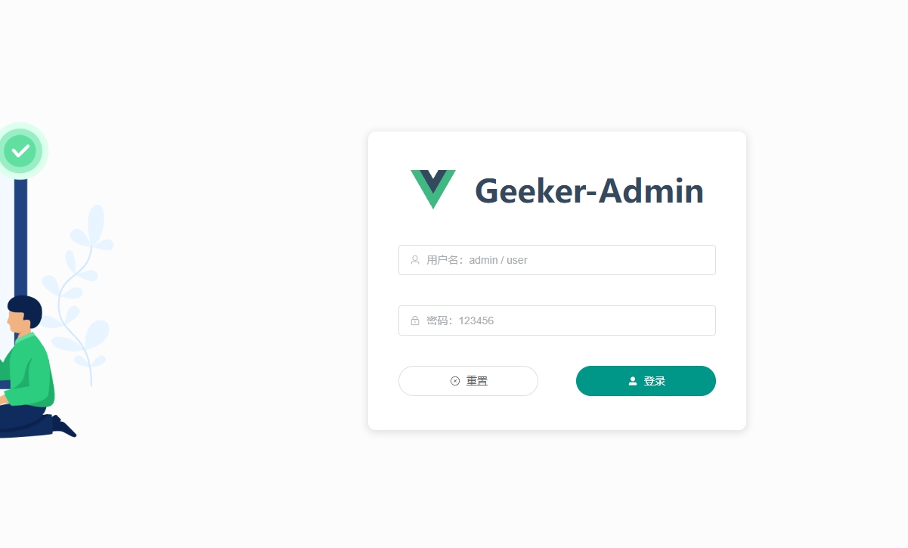
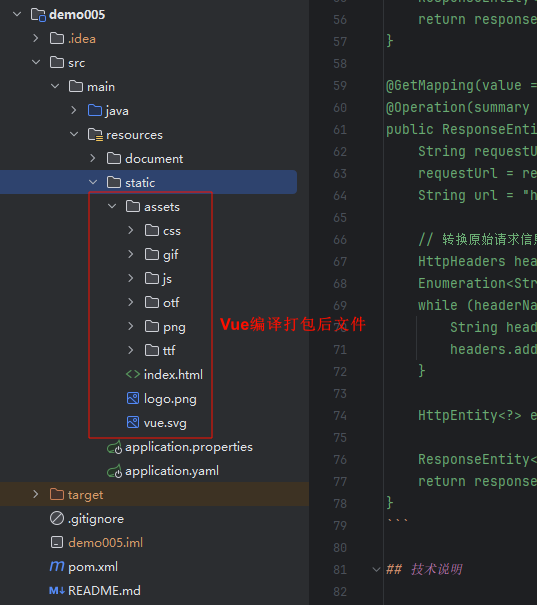
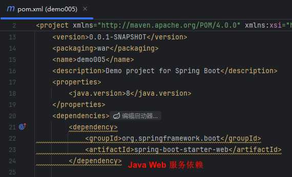
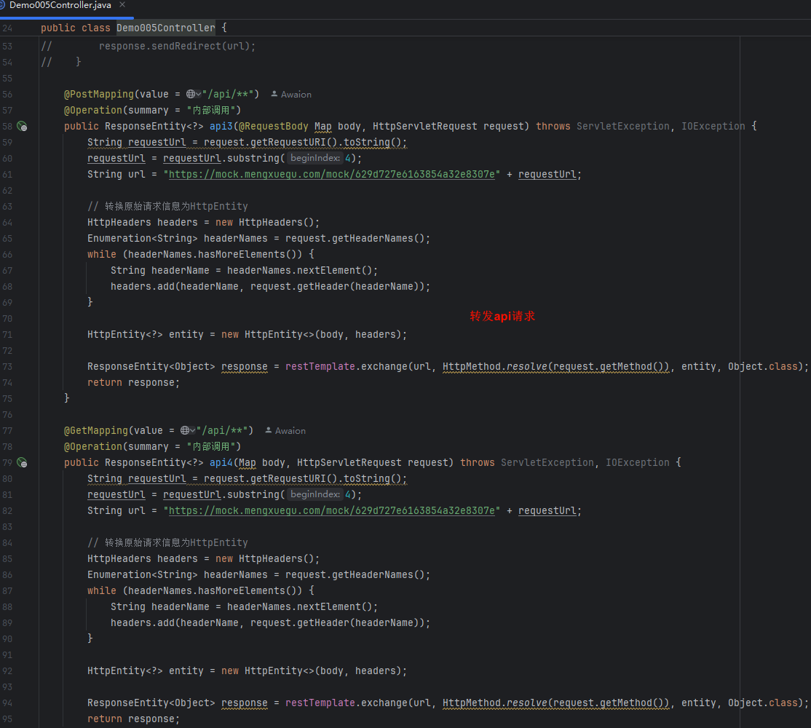

# Spring Boot + Vue

# 主要内容

> [简介](#简介)  
> [展示](#展示)  
> [集成步骤](#集成步骤)

# 正文

## 简介

Vue开发的前端代码在打包后本质上还是html,css,js等浏览器可解析的文件,将打包文件放入静态文件夹即可

前端使用mock服务器模拟api,这里在控制器把请求重新发给mock,然后响应给前端

前端代码地址(感谢分享): https://github.com/HalseySpicy/Geeker-Admin

Vue.js官方文档: https://cn.vuejs.org/

## 展示



基于 SpringBoot2.7

----

## 集成步骤



将 Vue 打包好的前端文件放在 resources/static 目录下.

----



```
<dependency>
    <groupId>org.springframework.boot</groupId>
    <artifactId>spring-boot-starter-web</artifactId>
</dependency>
```

pom.xml 新增 spring-boot-starter-web 依赖

----



```
@PostMapping(value = "/api/**")
@Operation(summary = "内部调用")
public ResponseEntity<?> api3(@RequestBody Map body, HttpServletRequest request) throws ServletException, IOException {
    String requestUrl = request.getRequestURI().toString();
    requestUrl = requestUrl.substring(4);
    String url = "https://mock.mengxuegu.com/mock/629d727e6163854a32e8307e" + requestUrl;

    // 转换原始请求信息为HttpEntity
    HttpHeaders headers = new HttpHeaders();
    Enumeration<String> headerNames = request.getHeaderNames();
    while (headerNames.hasMoreElements()) {
        String headerName = headerNames.nextElement();
        headers.add(headerName, request.getHeader(headerName));
    }

    HttpEntity<?> entity = new HttpEntity<>(body, headers);

    ResponseEntity<Object> response = restTemplate.exchange(url, HttpMethod.resolve(request.getMethod()), entity, Object.class);
    return response;
}

@GetMapping(value = "/api/**")
@Operation(summary = "内部调用")
public ResponseEntity<?> api4(Map body, HttpServletRequest request) throws ServletException, IOException {
    String requestUrl = request.getRequestURI().toString();
    requestUrl = requestUrl.substring(4);
    String url = "https://mock.mengxuegu.com/mock/629d727e6163854a32e8307e" + requestUrl;

    // 转换原始请求信息为HttpEntity
    HttpHeaders headers = new HttpHeaders();
    Enumeration<String> headerNames = request.getHeaderNames();
    while (headerNames.hasMoreElements()) {
        String headerName = headerNames.nextElement();
        headers.add(headerName, request.getHeader(headerName));
    }

    HttpEntity<?> entity = new HttpEntity<>(body, headers);

    ResponseEntity<Object> response = restTemplate.exchange(url, HttpMethod.resolve(request.getMethod()), entity, Object.class);
    return response;
}
```

Controller 代码中将请求转发到 Mock 服务器,这是为了节省时间让演示不出错,直接转发请求或者需要的数据.

----

以上就是本文核心内容.

## 题外话

Vue 本质是 JavaScript 框架, 可以直接在 html(Hyper Text Markup Language) 文件的 `<script>` 中运行, 更多的是在 Node.js 上开发, Node.js
是一个基于 Chrome V8 引擎的 JavaScript 运行环境.

[Github 源码](https://github.com/Awaion/tools/tree/master/demo005)

[返回顶部](#主要内容)

