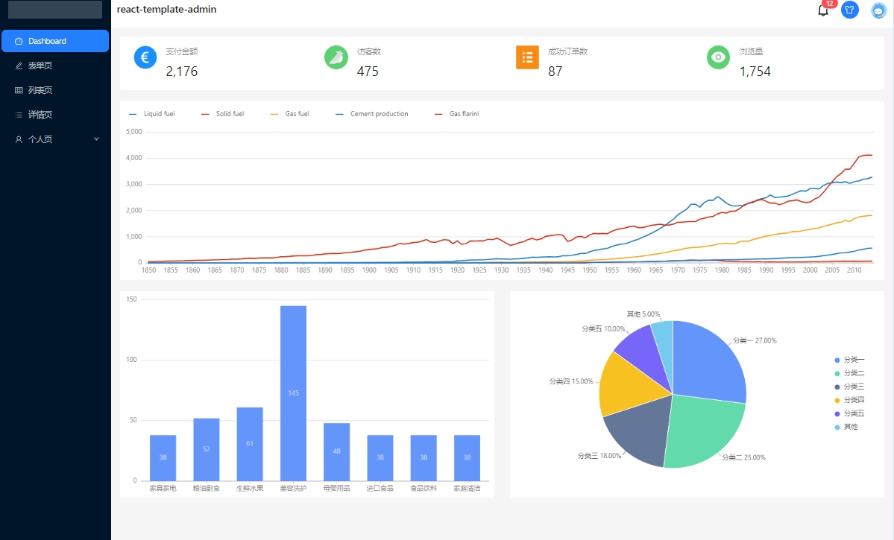
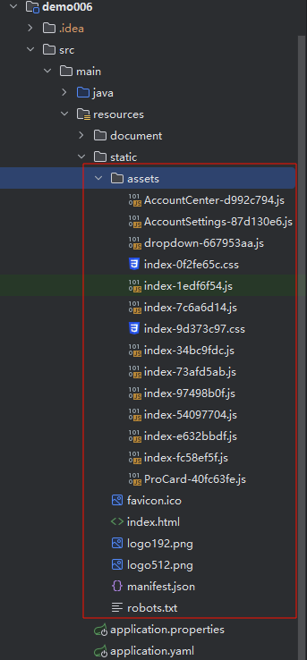

# Spring Boot + React

# 主要内容

> [简介](#简介)  
> [展示](#展示)  
> [集成步骤](#集成步骤)

# 正文

## 简介

React开发的前端代码在打包后本质上还是html,css,js等浏览器可解析的文件,将打包文件放入静态文件夹即可

前端代码地址(感谢分享): https://github.com/panyushan-jade/react-template-admin

React.js官方文档: https://react.docschina.org/

## 展示



基于 SpringBoot2.7

----

## 集成步骤



将 React 打包好的前端文件放在 resources/static 目录下.

----


```
<dependency>
    <groupId>org.springframework.boot</groupId>
    <artifactId>spring-boot-starter-web</artifactId>
</dependency>
```

pom.xml 新增 spring-boot-starter-web 依赖

----

以上就是本文核心内容.

## 题外话

React 本质是 JavaScript 框架, 可以直接在 html(Hyper Text Markup Language) 文件的 `<script>` 中运行, 更多的是在 Node.js 上开发, 
Node.js 是一个基于 Chrome V8 引擎的 JavaScript 运行环境.

[Github 源码](https://github.com/Awaion/tools/tree/master/demo006)

[返回顶部](#主要内容)

