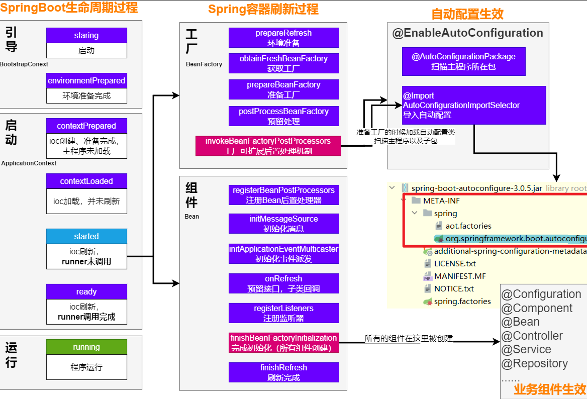

# Spring Boot 3 自动配置

# 主要内容

> [自动配置流程](#自动配置流程)  
> [SPI 机制](#spi-机制)  
> [自动配置和按需配置](#自动配置和按需配置)  
> [@SpringBootApplication](#springbootapplication)  
> [完整加载流程](#完整加载流程)  
> [自定义 starter](#自定义-starter)  


## 自动配置流程

- 导入 starter 组件
- 组件依赖导入 autoconfigure
- 寻找类路径下 META-INF/spring/org.springframework.boot.autoconfigure.AutoConfiguration.imports 文件
- 启动加载所有自动配置类 *AutoConfiguration
   - @Contional 派生的条件注解进行判断是否组件生效
   - 给容器中配置功能组件
   - 组件参数绑定到 *Properties 属性类中
   - *Properties 属性类和配置文件绑定

## SPI 机制

- Java 中的 SPI(Service Provider Interface)是一种软件设计模式,用于在应用程序中动态地发现和加载组件.SPI 的思想是定义一个接口或抽象类,然后通
过在 classpath 中定义实现该接口的类来实现对组件的动态发现和加载
- SPI 的主要目的是解决在应用程序中使用可插拔组件的问题.例如一个应用程序可能需要使用不同的日志框架或数据库连接池,但是这些组件的选择可能取决于运行
时的条件.通过使用 SPI,应用程序可以在运行时发现并加载适当的组件,而无需在代码中硬编码这些组件的实现类.
- Java SPI 的实现方式是通过在 META-INF/services 目录下创建一个以服务接口全限定名为名字的文件,文件中包含实现该服务接口的类的全限定名.当应
用程序启动时,Java SPI 机制会自动扫描 classpath 中的这些文件,并根据文件中指定的类名来加载实现类.
- 通过使用 SPI,应用程序可以实现更灵活,可扩展的架构,同时也可以避免硬编码依赖关系和增加代码的可维护性.
- 在 SpringBoot中, SPI 扩展文件 META-INF/spring/org.springframework.boot.autoconfigure.AutoConfiguration.imports

## 自动配置和按需配置

- 自动配置 项目一启动,SPI 文件中指定的所有都加载
- 按需配置 @Enable* 手动控制哪些功能的开启,利用 @Import 或者 @Component 把此功能要用的组件导入进去

## @SpringBootApplication

- @SpringBootConfiguration 类似于 @Configuration, spring ioc 启动就会加载创建这个类对象
- @EnableAutoConfiguration 开启自动配置
- @AutoConfigurationPackage 扫描主程序包和加载自己的组件
- @Import(AutoConfigurationImportSelector.class) 加载所有自动配置类,加载 starter 导入的组件
- @ComponentScan 组件扫描,排除过滤前面已经扫描进来的配置类和自动配置类

```text
// META-INF/spring/org.springframework.boot.autoconfigure.AutoConfiguration.imports
List<String> configurations = ImportCandidates.load(AutoConfiguration.class, getBeanClassLoader())
    .getCandidates();
    
@ComponentScan(excludeFilters = { @Filter(type = FilterType.CUSTOM, classes = TypeExcludeFilter.class),
  @Filter(type = FilterType.CUSTOM, classes = AutoConfigurationExcludeFilter.class) })
```

## 完整加载流程



## 自定义 starter

```
/**
 * 读取配置文件 demo016.*
 */
@ConfigurationProperties(prefix = "demo016")
@Component
@Data
public class Demo016Properties {
    private String loginName = "admin";
    private String password = "1qaz@wsx";
}

// 配置文件
demo016.login-name=zhangsan
demo016.password=lisi

// 业务代码
@Slf4j
@Service
public class Demo016Service {
    @Autowired
    private Demo016Properties properties;

    public String getInfo() {
        return "loginName:" + properties.getLoginName() + ",password:" + properties.getPassword();
    }
}

// 业务代码
@Slf4j
@RestController
public class Demo016Controller {
    @Autowired
    private Demo016Service service;

    /**
     * http://localhost:8080/demo016/getInfo
     * http://localhost:8081/demo016/getInfo
     */
    @GetMapping("/demo016/getInfo")
    public String getInfo() {
        return service.getInfo();
    }
}

// 业务代码
@Slf4j
@RestController
public class Demo016AutoController {
    @Autowired
    private Demo016Service service;

    /**
     * http://localhost:8080/demo016/auto/getInfo
     * http://localhost:8081/demo016/auto/getInfo
     */
    @GetMapping("/demo016/auto/getInfo")
    public String getInfo() {
        return service.getInfo()+service.getInfo();
    }
}

/**
 * 配置组件
 */
@Import({Demo016Properties.class}) // 导入别的配置组件
@Configuration
public class Demo016Configuration {
    @Bean
    public Demo016Service demo016Service() {
        return new Demo016Service();
    }

    @Bean
    public Demo016Controller demo016Controller() {
        return new Demo016Controller();
    }
}

/**
 * 自动配置组件
 * 自动加载路径 META-INF/spring/org.springframework.boot.autoconfigure.AutoConfiguration.imports
 * 自动加载路径2 META-INF/spring.factories
 */
@Import({Demo016Properties.class}) // 导入别的配置组件
@Configuration
public class Demo016AutoConfiguration {
    @ConditionalOnMissingBean // 条件加载
    @Bean
    public Demo016Service demo016Service() {
        return new Demo016Service();
    }

    @Bean
    public Demo016AutoController demo016AutoController() {
        return new Demo016AutoController();
    }
}

/**
 * 启用注解,启用配置 Demo016Configuration
 */
@Retention(RetentionPolicy.RUNTIME)
@Target({ElementType.TYPE})
@Documented
@Import({Demo016Configuration.class})
public @interface EnableDemo016Api {
}

<!-- 新增自定义启动组件 -->
<dependency>
    <groupId>com.awaion</groupId>
    <artifactId>demo016-spring-boot-starter</artifactId>
    <version>0.0.1-SNAPSHOT</version>
</dependency>

@EnableDemo016Api // 启用 Demo016Api 功能
```

----

以上就是本文核心内容.

[Github 源码](https://github.com/Awaion/tools/tree/master/demo016)

[返回顶部](#主要内容)

