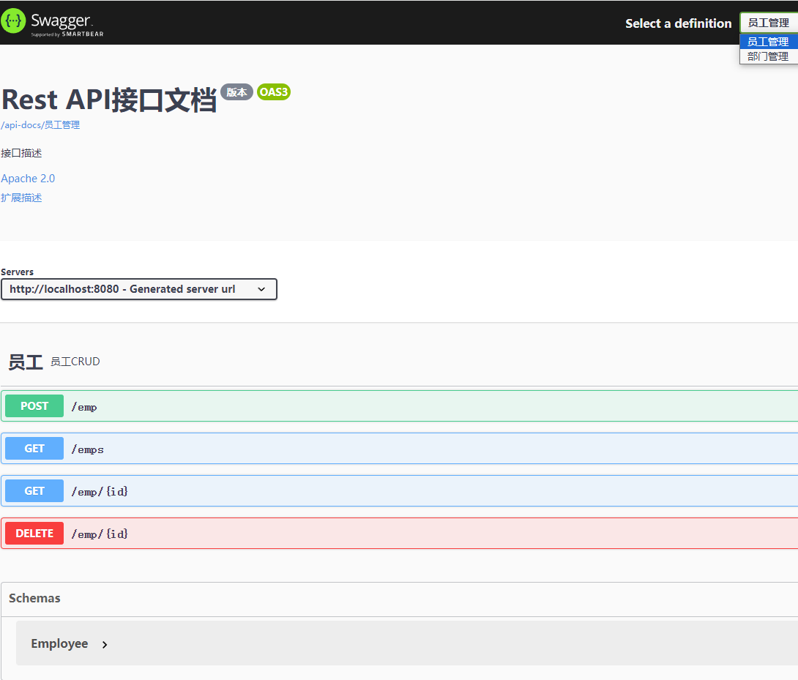

# SpringBoot 3 + Redis + Spring Doc

# 主要内容

> [docker启动容器](#docker启动容器)  
> [SpringBoot 3 + Redis]()  
> [SpringBoot 3 + OpenAPI 3 + Swagger]()  
> [结尾](#结尾)  

## docker启动容器

使用 docker 启动 redis,zookeeper,kafka,prometheus,grafana

[prometheus.yml](0025_springboot3_starter/prometheus.yml)

[docker-compose.yml](0025_springboot3_starter/docker-compose.yml)

```text
# 重启 docker
sudo systemctl restart docker

# 查看 docker 信息
sudo docker info

# 管理员权限打开文件管理器粘贴 
sudo nautilus

# 根据配置文件启动容器
docker compose -f docker-compose.yml up -d

# 查看容器日志
docker logs kafka

# 根据配置文件,停止容器
docker compose -f docker-compose.yml down

redis 192.168.1.16:6379
kafka-ui http://192.168.1.16:8080
Grafana http://192.168.1.16:3000
Prometheus http://192.168.1.16:9090
```

## SpringBoot 3 + Redis

```
<dependency>
    <groupId>org.springframework.boot</groupId>
    <artifactId>spring-boot-starter-data-redis</artifactId>
</dependency>

/**
 * 替换默认的 RedisTemplate 自定义序列化
 */
@Bean
public RedisTemplate<Object, Object> redisTemplate(RedisConnectionFactory redisConnectionFactory) {
    RedisTemplate<Object, Object> template = new RedisTemplate<>();
    template.setConnectionFactory(redisConnectionFactory);
    // json 序列化
    template.setDefaultSerializer(new GenericJackson2JsonRedisSerializer());
    return template;
}

@Autowired
StringRedisTemplate redisTemplate;

@Test
void redisTest(){
    redisTemplate.opsForValue().set("a","1234");
    Assertions.assertEquals("1234",redisTemplate.opsForValue().get("a"));
}
```

spring-boot-starter-data-redis 解析
- META-INF/spring/org.springframework.boot.autoconfigure.AutoConfiguration.imports 中导入了 RedisAutoConfiguration, 
RedisReactiveAutoConfiguration, RedisRepositoriesAutoConfiguration
- RedisReactiveAutoConfiguration 是响应式编程配置
- RedisRepositoriesAutoConfiguration 是 JPA 实现
- RedisAutoConfiguration 配置了以下组件
  - LettuceConnectionConfiguration 连接工厂 LettuceConnectionFactory 和 客户端 DefaultClientResources。
  - RedisTemplate<Object, Object> 模板操作工具类,使用 jdk 默认序列化
  - StringRedisTemplate 字符串模板操作工具类
- 属性绑定对象为 RedisProperties

## SpringBoot 3 + OpenAPI 3 + Swagger

Spring Doc: https://springdoc.org/



```
<dependency>
    <groupId>org.springdoc</groupId>
    <artifactId>springdoc-openapi-starter-webmvc-ui</artifactId>
    <version>2.1.0</version>
</dependency>

springdoc.api-docs.path=/api-docs
springdoc.swagger-ui.path=/swagger-ui.html
springdoc.show-actuator=true

@Configuration
public class ApiUiConfig {
    @Bean
    public GroupedOpenApi empApi() {
        return GroupedOpenApi.builder()
                .group("员工管理")
                .pathsToMatch("/emp/**", "/emps")
                .build();
    }

    @Bean
    public GroupedOpenApi deptApi() {
        return GroupedOpenApi.builder()
                .group("部门管理")
                .pathsToMatch("/dept/**", "/depts")
                .build();
    }

    @Bean
    public OpenAPI docsOpenAPI() {
        return new OpenAPI()
                .info(new Info()
                        .title("Rest API接口文档")
                        .description("接口描述")
                        .version("版本")
                        .license(new License().name("Apache 2.0").url("http://springdoc.org")))
                .externalDocs(new ExternalDocumentation()
                        .description("扩展描述")
                        .url("https://springshop.wiki.github.org/docs"));
    }
}

@Tag(name = "部门", description = "部门的CRUD")
@RestController
public class DeptController {
    @Autowired
    DeptService deptService;

    @Operation(summary = "查询", description = "按照id查询部门")
    @GetMapping("/dept/{id}")
    public Dept getDept(@PathVariable("id") Long id) {
        return deptService.getDeptById(id);
    }
```

常用注解
- @Tag 标识 controller 作用
- @Parameter 标识参数作用
- @Parameters 参数多重说明
- @Schema JavaBean 描述模型作用及每个属性
- @Operation 描述方法作用
- @ApiResponse 描述响应状态码等

注解变化

|原注解|现注解|作用|
|---|---|---|
|@Api|@Tag|描述Controller|
|@ApiIgnore|@Parameter(hidden = true)|描述忽略操作|
|@ApiIgnore|@Operation(hidden = true)|描述忽略操作|
|@ApiIgnore|@Hidden|描述忽略操作|
|@ApiImplicitParam|@Parameter|描述参数|
|@ApiImplicitParams|@Parameters|描述参数|
|@ApiModel|@Schema|描述对象|
|@ApiModelProperty(hidden = true)|@Schema(accessMode = READ_ONLY)|描述对象属性|
|@ApiModelProperty|@Schema|描述对象属性|
|@ApiOperation(value = "foo", notes = "bar")|@Operation(summary = "foo", description = "bar")|描述方法|
|@ApiParam|@Parameter|描述参数|
|@ApiResponse(code = 404, message = "foo")|@ApiResponse(responseCode = "404", description = "foo")|描述响应|

Swagger 2 写法

```text
@Bean
public Docket publicApi() {
    return new Docket(DocumentationType.SWAGGER_2)
            .select()
            .apis(RequestHandlerSelectors.basePackage("org.github.springshop.web.public"))
            .paths(PathSelectors.regex("/public.*"))
            .build()
            .groupName("springshop-public")
            .apiInfo(apiInfo());
}

@Bean
public Docket adminApi() {
    return new Docket(DocumentationType.SWAGGER_2)
            .select()
            .apis(RequestHandlerSelectors.basePackage("org.github.springshop.web.admin"))
            .paths(PathSelectors.regex("/admin.*"))
            .apis(RequestHandlerSelectors.withMethodAnnotation(Admin.class))
            .build()
            .groupName("springshop-admin")
            .apiInfo(apiInfo());
}
```

## 结尾

以上就是本文核心内容.

[Github 源码](https://github.com/Awaion/tools/tree/master/demo018)

[返回顶部](#主要内容)

