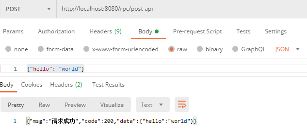

# SpringBoot 3 + RPC + Kafka

# 主要内容

> [远程调用](#远程调用)  
> [Kafka](#kafka)  

## 远程调用

Spring Web Flow: https://spring.io/projects/spring-webflow

RPC Remote Procedure Call 远程过程调用
- 方式一 API Application Programming Interface 远程提供功能
- 方式二 SDK Software Development Kit 导入jar包直接调用

远程常见使用场景
- 内部微服务通过依赖 cloud,注册中心,OpenFeign 等进行调用
- 外部可以发送 http 请求或遵循外部协议进行调用

SpringBoot远程调优方式
- 轻量级客户端方式: RestTemplate(普通开发),WebClient(响应式编程),Http Interface(响应声明式编程)
- Spring Cloud: Spring Cloud OpenFeign
- 第三方框架: Dubbo,gRPC

SpringBoot 3 + Spring Web Flow 远程调用
- WebClient
- HTTP Interface

```
<dependency>
    <groupId>org.springframework.boot</groupId>
    <artifactId>spring-boot-starter-webflux</artifactId>
</dependency>

@Bean
HttpServiceProxyFactory httpServiceProxyFactory(@Value("${api.token}") String token) {
    WebClient client = WebClient.builder()
            .defaultHeader("Authorization", token)
            .codecs(clientCodecConfigurer
                    -> clientCodecConfigurer
                    .defaultCodecs()
                    .maxInMemorySize(256 * 1024 * 1024))
            .build();
    return HttpServiceProxyFactory.builder(WebClientAdapter.forClient(client)).build();
}

@Bean
RpcDemo019Interface rpcDemo019Interface(HttpServiceProxyFactory httpServiceProxyFactory) {
    return httpServiceProxyFactory.createClient(RpcDemo019Interface.class);
}

@HttpExchange(url = "http://localhost:8080")
public interface RpcDemo019Interface {
    @GetExchange(url = "/get-api", accept = "application/json")
    Mono<String> getApi(@RequestParam("param") String param);

    @PostExchange(url = "/post-api", accept = "application/json")
    Mono<String> postApi(@RequestBody Map<String, Object> body);
}

@Autowired
private RpcDemo019Interface rpcDemo019Interface;

public Mono<String> getApi(String param) {
    return rpcDemo019Interface.getApi(param);
}

public Mono<String> postApi(Map<String, Object> body) {
    return rpcDemo019Interface.postApi(body);
}

public Mono<String> getByWebClient(String param) {
    WebClient client = WebClient.create();
    Map<String, String> params = new HashMap<>();
    params.put("param", param);
    return client.get()
            .uri("http://localhost:8080/get-api?param={param}", params)
            .accept(MediaType.APPLICATION_JSON)
            .header("Authorization", "qazwsx")
            .retrieve()
            .bodyToMono(String.class);
}

hosts文件 192.168.1.16 kafka
```





## Kafka

Spring for Apache Kafka: https://spring.io/projects/spring-kafka

消息队列常用于 异步,解耦,削峰,缓冲场景


名词说明
- Producer 生产者,用于生产消息
- Consumer 消费者,用于消费消息
- Consumer Group 消费者组,同一个消息只能被组中的某一个消费,这也是为了提高 Kafka 的吞吐量
- Message 消息,信息载体
- Broker 代理,实例对象,每个服务器有一个或多个 kafka 实例对象
- Topic 主题,可以理解为消息队列,数据就保存在 Topic,在每个 Broker 上都可以创建多个 Topic
- Partition 分区,每个 Topic 有多个分区,分区的作用是做负载,提高吞吐量.同一个 Topic 在不同分区数据是不重复的,表现形式是一个一个文件夹
- Replication 副本,每一个分区都有多个副本,作用是备份,主分区(Leader)会将数据同步到从分区(Follower),默认副本的最大数量是10个且副数量不能大于Broker的数量, Leader 和 Follower 绝对是在不同的机器
- Offset 存储文件是按照 offset.kafka 来命名,方便查找.例如找位于2049的位置,只要找到2048.kafka的文件即可
- Zookeeper 动物管理员,注册中心,Kafka 集群依赖 Zookeeper 来保存集群的的元信息,来保证系统的可用性.

kafka 自动配置在 KafkaAutoConfiguration
- KafkaTemplate 可以进行消息收发
- KafkaAdmin 可以进行 Kafka 的管理,比如创建 topic 等
- KafkaProperties 配置
- @EnableKafka 可以开启基于注解的模式

```
<dependency>
    <groupId>org.springframework.kafka</groupId>
    <artifactId>spring-kafka</artifactId>
</dependency>

@EnableKafka // 启动 kafka

@Bean
public NewTopic topic1() {
    // 创建 topic
    return TopicBuilder.name("demo0201")
            .partitions(1)
            .compact()
            .build();
}

@Bean
public NewTopic topic2() {
    // 创建 topic
    return TopicBuilder.name("demo0202")
            .partitions(1)
            .compact()
            .build();
}

private void sendMsg() {
    CompletableFuture[] futures = new CompletableFuture[10000];
    StopWatch stopWatch = new StopWatch();
    stopWatch.start();
    for (int i = 0; i < 10000; i++) {
        // JUC
        CompletableFuture future = kafkaTemplate.send("demo0201", "key-" + i, "value-" + i);
        futures[i] = future;
    }
    CompletableFuture.allOf(futures).join();
    stopWatch.stop();
    long millis = stopWatch.getTotalTimeMillis();
    log.info("10000消息发送完成时间:{}", millis);

    CompletableFuture future = kafkaTemplate.send("demo0202", "person", new Person(1L, "张三", "xxx@qq.com"));
    future.join();
    log.info("消息发送成功...");
}

// 默认的监听是从消息队列最后一个消息开始拿,新消息才能拿到
@KafkaListener(topics = "demo0201", groupId = "group01")
public void listener1(ConsumerRecord record) {
    Object key = record.key();
    Object value = record.value();
    log.info("topics:demo0201=1=,接收消息,key:{},value:{}", key, value);
}

@KafkaListener(topics = "demo0201", groupId = "group01")
public void listener3(ConsumerRecord record) {
    Object key = record.key();
    Object value = record.value();
    log.info("topics:demo0201=2=,接收消息,key:{},value:{}", key, value);
}

// 拿到以前的完整消息
@KafkaListener(
        groupId = "group01",
        topicPartitions = {
                @TopicPartition(topic = "demo0202",
                        partitionOffsets = {
                                @PartitionOffset(partition = "0", initialOffset = "0")
                        })
        })
public void listener2(ConsumerRecord record) {
    Object key = record.key();
    Object value = record.value();
    log.info("topics:demo0202,接收消息,key:{},value:{}", key, value);
}
```


## 结尾

以上就是本文核心内容.

[Github 源码](https://github.com/Awaion/tools/tree/master/demo019)

[Github 源码](https://github.com/Awaion/tools/tree/master/demo020)

[返回顶部](#主要内容)

