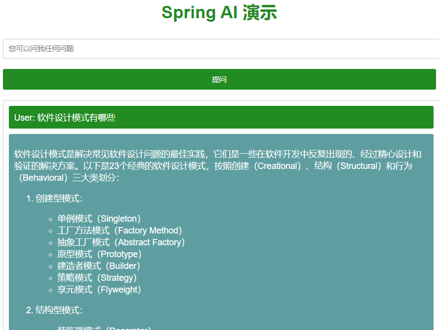

# Spring AI

# 主要内容

> [简介](#简介)  
> [集成步骤](#集成步骤)  


## 简介

Spring AI 最初专注于设计用于处理语言输入和生成语言输出的模型. 该项目背后的想法是为开发人员提供一个抽象接口,这是将生成式
AI API 作为独立组件添
加到应用程序中的基础. 其中一种抽象是接口 AiClient,它有两个基本实现 - OpenAI 和 Azure OpenAI.

Spring AI 的核心是提供抽象,作为开发 Java AI 应用程序的基础,提供以下功能：

- 提供多种大模型服务对接能力,包括业界大多数主流大模型服务等;
- 支持灵活的 Prompt Template 和模型输出解析 Output Parsing 能力;
- 支持多模态的生成式 AI 能力,如对话,文生图,文生语音等;
- 提供通用的可移植的 API 以访问各类模型服务和 Embedding 服务,支持同步和流式调用,同时也支持传递特定模型的定制参数;
- 支持 RAG 能力的基础组件,包括 DocumentLoader,TextSpillter,EmobeddingClient,VectorStore 等;
- 支持 AI Spring Boot Starter 实现配置自动装配;

Spring Cloud Alibaba 当前基于 Spring AI 提供了对阿里通义系列的完整支持,包括对话,prompt模板,Function Call,文生图,向量数据库等本.

- https://spring.io/projects/spring-ai
- https://sca.aliyun.com/docs/2023/user-guide/ai/quick-start/
- https://dashscope.console.aliyun.com/apiKey
- https://help.aliyun.com/zh/dashscope/
- https://github.com/alibaba/spring-cloud-alibaba/releases
- https://help.aliyun.com/zh/dashscope/developer-reference/api-details

## 集成步骤

```
// pom.xml 新增依赖
<dependencyManagement>
    <dependencies>
        <dependency>
            <groupId>com.alibaba.cloud</groupId>
            <artifactId>spring-cloud-alibaba-dependencies</artifactId>
            <version>2023.0.1.0</version>
            <type>pom</type>
            <scope>import</scope>
        </dependency>
    </dependencies>
</dependencyManagement>
<dependency>
    <groupId>com.alibaba.cloud</groupId>
    <artifactId>spring-cloud-starter-alibaba-ai</artifactId>
</dependency>

// application.yml 新增配置
spring:
  application:
    name: demo032
  cloud:
    ai:
      tongyi:
        api-key: sk-xxx

@Service
public class TongYiSimpleServiceImpl extends AbstractTongYiServiceImpl {
    private static final Logger logger = LoggerFactory.getLogger(TongYiService.class);
    private final ChatClient chatClient;
    private final StreamingChatClient streamingChatClient;

    @Autowired
    public TongYiSimpleServiceImpl(ChatClient chatClient, StreamingChatClient streamingChatClient) {
        this.chatClient = chatClient;
        this.streamingChatClient = streamingChatClient;
    }

    @Override
    public String completion(String message) {
        Prompt prompt = new Prompt(new UserMessage(message));
        return chatClient.call(prompt).getResult().getOutput().getContent();
    }
    
@GetMapping(value = "/example")
public String completion(@RequestParam(value = "message", defaultValue = "讲个笑话") String message) {
    // http://localhost:8080/ai/example?message=讲个笑话
    String x = getLimit();
    if (x != null) return x;
//        return String.valueOf(countMap.get(LocalDate.now().toString()));
    return tongYiSimpleService.completion(message);
}
```



## 结尾

以上就是本文核心内容.

[Github 源码](https://github.com/Awaion/tools/tree/master/demo032)

[返回顶部](#主要内容)

