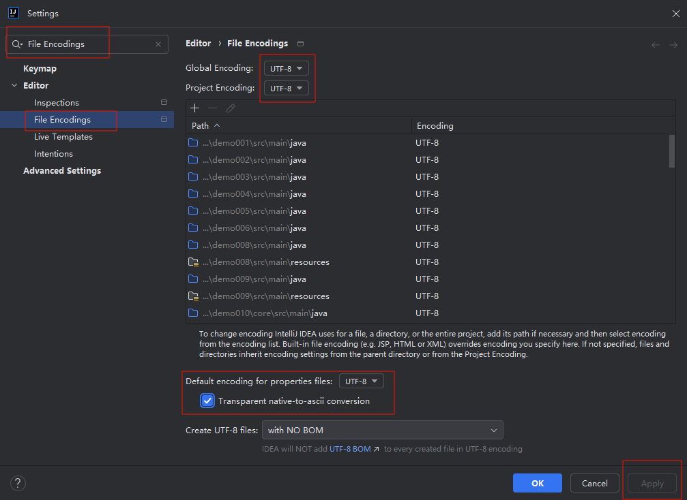
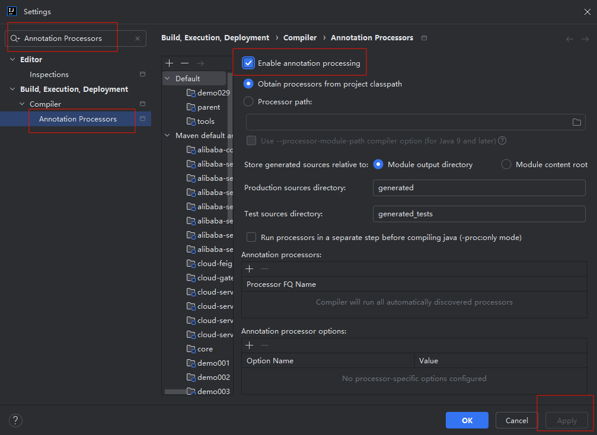
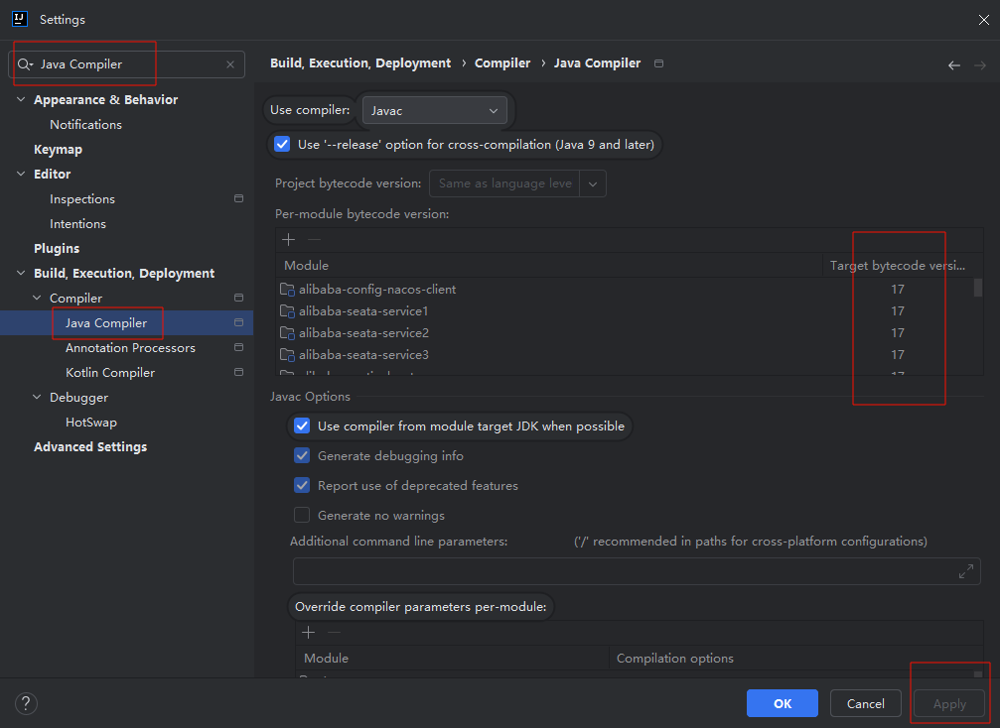
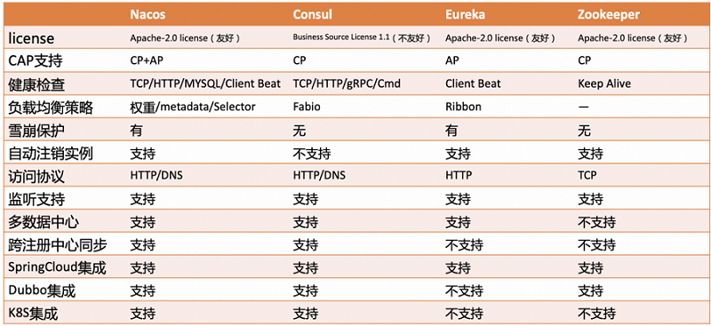
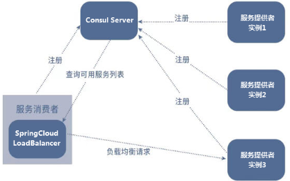
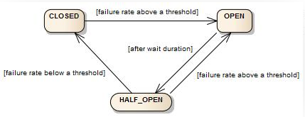
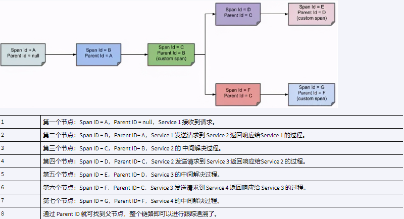
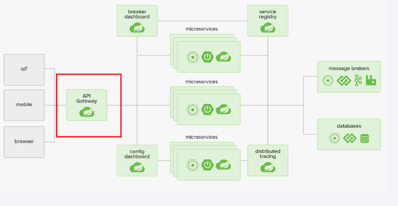

# Spring Cloud 2023

# 主要内容

> [简介](#简介)  
> [技术框架版本适配](#技术框架版本适配)  
> [文档和源码](#文档和源码)  
> [SpringBoot 特性](#springboot-特性)  
> [SpringCloud 特性](#springcloud-特性)  
> [IDE统一环境](#ide统一环境)  
> [代码统一规范](#代码统一规范)  
> [统一外部服务组件](#统一外部服务组件)  
> [代码生成和MyBatis](#代码生成和mybatis)  
> [服务注册和发现及配置 Consul](#服务注册和发现及配置-consul)  
> [微服务1](#微服务1)  
> [微服务2](#微服务2)  
> [微服务3](#微服务3)  
> [负载均衡 LoadBalancer](#负载均衡-loadbalancer)  
> [声明式Rest客户端 OpenFeign](#声明式rest客户端-openfeign)  
> [断路器 Circuit Breaker](#断路器-circuit-breaker)  
> [分布式链路追踪 Sleuth(Micrometer) + ZipKin]()  
> [网关 Gateway](#网关-gateway)  

## 简介

2014年,Netflix公司推出了一系列开源的微服务工具包,称为Netflix OSS.Netflix OSS包括Eureka(服务注册与发现),Ribbon(负载均衡),Hystrix(断路器)
Zuul(网关)等工具,这些工具被广泛应用于Netflix的分布式系统中.

Spring Cloud的创始人Spencer Gibb和Josh Long在学习Netflix OSS的过程中,意识到这些工具可以与Spring框架无缝集成,从而降低了开发人员在构建微服
务时的技术难度和成本.于是,他们开始开发Spring Cloud,将Netflix OSS的技术和Spring框架相结合,提供了一套全面的微服务解决方案.

而后,Netflix逐渐将重心转向云原生技术和Kubernetes等开源平台,减少了在Netflix OSS上的投入和更新

2018年11月底 Netflix OSS 宣布停止新特性开发,进入维护状态

之后 Spring Cloud 开始定义组件规范,及部分实现

2018年12月22日,Spring Cloud Alibaba 发布

本篇主要讲解 SpringCloud 2023.0.0

## 技术框架版本适配

- Java 17+
- Maven 3.9+
- MySQL 8.0+
- SpringBoot 3.2.0
- SpringCloud 2023.0.0
- SpringCloud Alibaba 2023.0.1.0

## 文档和源码

- https://spring.io/projects/spring-boot
- https://github.com/spring-projects/spring-boot
- https://github.com/spring-projects/spring-boot/releases/
- https://github.com/spring-projects/spring-boot/wiki
- https://stackoverflow.com/questions/tagged/spring-boot
- https://github.com/spring-cloud
- https://spring.io/projects/spring-cloud
- https://stackoverflow.com/questions/tagged/spring-cloud
- https://spring.io/projects/spring-cloud-alibaba
- https://github.com/alibaba/spring-cloud-alibaba/
- https://sca.aliyun.com/

## SpringBoot 特性

- 创建独立的 Spring 应用程序
- 直接嵌入Tomcat,Jetty,Undertow(无需外部服务器部署WAR文件)
- 提供 starter 依赖以简化构建配置
- 尽可能自动配置Spring和第三方库
- 提供指标,运行状况检查和外部化配置等生产就绪功能
- 绝对没有代码生成,也不需要XML配置

企业实践:
- 自定义 parent 工程,继承 spring-boot-parent,所有项目使用自定义 parent,统一管理技术框架版本,减少处理框架版本兼容性问题.
- 自定义 starter 工程,统一引入公共组件,实现公共业务逻辑,减少重复业务代码,统一规范以及方便扩展.

## SpringCloud 特性

- 分布式/版本化配置
- 服务注册和发现
- 路由网关
- 服务间调用
- 负载平衡
- 断路器
- 分布式消息传递
- 短期微服务(任务)
- 消费者驱动和生产者驱动的合同测试

企业实践:
- 自定义 dependencies 工程,继承 spring-cloud-dependencies,所有项目使用自定义 dependencies,统一管理分布式技术框架版本,减少处理框架版本兼容性问题.
- 自定义 cloud-starter 工程,统一引入公共分布式组件,实现公共分布式业务逻辑,减少重复业务代码,统一规范以及方便扩展.

## IDE统一环境

统一环境主要是避免因开发环境问题,导致项目跑不起来,代码出错.常见的环境问题有:编码,代码格式化,智能提醒,编译环境

以 IDEA2024 为例
- 编码 Settings -> File Encodings -> UTF-8 * 3 -> Transparent native-to-ascii conversion
- 注解处理 Settings -> Annotation Processors -> Enable annotation processing
- 编译环境 Settings -> Java Compiler -> 17







## 代码统一规范

为使代码具有可读性,易于运行,需要定义规范,通过简单的阅读文件,快速入门运行项目.
- README文件,说明编译环境,依赖组件,依赖服务,运行方式等.按照此文件即可运行项目.
- 只提交代码,不提交环境配置
- 写注释以及标注需求链接

## 统一外部服务组件

提供统一版本的外部服务组件,且配置相应使用文档,例如:Redis,MySQL,Kafka,Postman,JMeter

## 代码生成和MyBatis

通常,普通的CRUD操作具有相同的逻辑,使用通用模版即可实现,所以需要使用代码生成技术

MyBatis Generator: https://mybatis.org/generator/ & https://github.com/mybatis/generator

MyBatis-Plus(国产16K)(商业化趋势): https://baomidou.com/ & https://github.com/baomidou/mybatis-plus

MyBatis 通用 Mapper4(国产7k)(纯开源): https://github.com/abel533/Mapper

Maven -> Plugins -> mybatis-generator:generate -> Run


## 服务注册和发现及配置 Consul

特性
- 服务注册及发现机制,统一管理微服务
- 给 Spring Cloud 提供负载均衡
- 给 Spring Cloud Gateway 提供动态路由和过滤器
- 提供分布式配置,键值对(KV)存储方式
- 提供控制总线(Bus),实现分布式控制事件
- 自带可视化WebUI
- Go语言开发
- 社区版(community)免费使用,企业版收费

工作流程
- 服务注册 Register
- 服务查询 Query
- 服务通信安全加密 Secure

其它特性
- 使用 Raft 分布式一致性协议



服务端安装

```text
# window 查看系统架构
echo %PROCESSOR_ARCHITECTURE%

# window 查看端口使用
netstat -ano

# 查看版本
consul --version

# 开发模式启动,配置不会持久化
consul agent -dev

# 默认地址访问
http://localhost:8500

# 配置持久化方式启动,管理员权限
consul_start.bat
```

更多

- https://www.consul.io/
- https://developer.hashicorp.com/consul
- https://developer.hashicorp.com/consul/docs/intro
- https://developer.hashicorp.com/consul/docs/install/performance
- https://spring.io/projects/spring-cloud-consul
- https://www.hashicorp.com/terms-of-evaluation
- https://github.com/hashicorp/consul
- https://github.com/spring-cloud/spring-cloud-consul
- https://github.com/Netflix/eureka/wiki

## 微服务1

cloud-service1 依赖服务 consult,zipkin,mysql
- 测试从 Consul 中拉取配置
- 提供被 Feign 调用的接口
- 提供被 Gateway 调用的接口
- 测试 Micrometer(Sleuth) 调用链路
- 提供 MySQL CRUD
- 提供 Resilience4j(Circuit Breaker) 测试接口

更多

- https://docs.spring.io/spring-cloud-consul/reference/appendix.html
- https://spring.io/projects/spring-cloud-sleuth
- https://micrometer.io/docs/tracing
- https://github.com/mybatis/spring-boot-starter
- https://spring.io/projects/spring-cloud-commons

## 微服务2

cloud-service3 依赖服务 consul
- 使用 RestTemplate + LoadBalanced 做微服务之间的调用

更多

- https://docs.spring.io/spring-framework/docs/6.0.11/javadoc-api/org/springframework/web/client/RestTemplate.html
- https://docs.spring.io/spring-cloud-consul/reference/appendix.html
- https://spring.io/projects/spring-cloud-sleuth
- https://micrometer.io/docs/tracing

## 微服务3

cloud-service3 依赖服务 consul
- 使用 OpenFeign 做微服务之间的调用
- 使用 Circuit Breaker 作为接口断路器,实现框架为 Resilience4J

更多

- https://spring.io/projects/spring-cloud-openfeign
- https://spring.io/projects/spring-cloud-circuitbreaker
- https://github.com/resilience4j/resilience4j
- https://docs.spring.io/spring-cloud-consul/reference/appendix.html
- https://spring.io/projects/spring-cloud-sleuth
- https://micrometer.io/docs/tracing

## 负载均衡 LoadBalancer

LoadBalancer客户端负载均衡,在调用微服务接口时候,会在注册中心上获取注册信息服务列表之后缓存到JVM本地,从而在本地实现RPC远程服务调用技术.

LoadBalancer 在工作时分成两步:
1. 先选择ConsulServer从服务端查询并拉取服务列表,默认轮询调用谁都可以正常执行
2. 按照指定的负载均衡策略从server取到的服务注册列表中由客户端自己选择一个地址,所以LoadBalancer是一个客户端的负载均衡器

核心类
- 自动配置类 LoadBalancerAutoConfiguration common依赖
- 接口类 ReactorServiceInstanceLoadBalancer common依赖
- 轮询(默认)算法实现类 RoundRobinLoadBalancer loadbalancer依赖
- 随机算法实现类 RandomLoadBalancer loadbalancer依赖
- Nacos自定义实现类 NacosLoadBalancer

最新(4.1.3)支持的客户端 Spring RestTemplate ,Spring RestClient ,Spring WebClient ,Spring WebFlux WebClient

Nginx是服务器负载均衡,客户端所有请求都会交给Nginx,然后由nginx实现转发请求,即负载均衡是由服务端实现的



其它

- https://docs.spring.io/spring-framework/docs/6.0.11/javadoc-api/org/springframework/web/client/RestTemplate.html
- https://spring.io/projects/spring-cloud-commons
- https://docs.spring.io/spring-cloud-commons/reference/spring-cloud-commons/loadbalancer.html

## 声明式Rest客户端 OpenFeign

- 可插拔的注解支持,包括Feign注解和JAX-RS注解
- 支持可插拔的HTTP编码器和解码器
- 支持Sentinel和它的Fallback
- 支持SpringCloudLoadBalancer的负载均衡
- 支持HTTP请求和响应的压缩
- 超时控制
- 重试机制
- 变更 HttpClient 实现
- 日志打印
- 支持 OkHttpClient 和 Apache HttpClient 5,默认是 java.net.HttpURLConnection,没有池化
- 支撑 Spring Cloud CircuitBreaker 熔断降级限流

核心类
- 启用注解 @EnableFeignClients
- 客户端注解 @FeignClient
- 注册登记类 FeignClientsRegistrar
- 编码/解码 Encoder/Decoder
- 日志 Logger
- 链路追踪类 MicrometerObservationCapability
- 校验解析类 Contract
- 重试类 Retryer

更多

- https://docs.spring.io/spring-cloud-openfeign/reference/spring-cloud-openfeign.html
- https://spring.io/projects/spring-cloud-openfeign
- https://github.com/spring-cloud/spring-cloud-openfeign
- https://stackoverflow.com/questions/tagged/spring-cloud

## 断路器 Circuit Breaker

断口器抽象(接口)API,支持的实现 Resilience4J,Spring Retry

核心类

- 工厂类 CircuitBreakerFactory

Resilience4J

专为函数式编程而设计的轻量级容错库,提供高阶函数(装饰器),以增强任何功能接口,lambda 表达式或方法引用.包括断路器,限流,重试或舱壁隔离.

特性
- 断路器(熔断,重试,回退)
- 限流
- 舱壁隔离

状态

断路器通过有限状态机实现,该状态机具有三种正常状态:CLOSED,OPEN,HALF_OPEN 以及两种特殊状态 DISABLED,FORCED_OPEN



熔断指标

- 计数滑动窗口 Count-based sliding window 通过 N 个测量值的圆形阵列实现
- 时间滑动窗口 Time-based sliding window 通过 N 个部分聚合(桶)的循环数组实现

舱壁隔离

用于隔离故障,防止故障或性能问题从一个部分传播到系统的其他部分,实现方式有两种
1. 使用信号量 SemaphoreBulkhead
2. 使用有界队列和固定线程池 FixedThreadPoolBulkhead

限流

默认实现是 AtomicRateLimiter,可以切换成 SemaphoreBasedRateLimiter

常见限流算法

- 漏斗算法(LeakyBucket) 匀速处理,效率低
- 令牌桶算法(TokenBucket) 类似于响应式编程buffer区
- 滚动时间窗口(Tumbling Time Window) 流量0~2倍间波动,幅度大
- 滑动时间窗口(Sliding Time Window) 滚动时间窗口的优化,波动幅度小

更多

- https://spring.io/projects/spring-cloud-circuitbreaker
- https://github.com/resilience4j/resilience4j
- https://resilience4j.readme.io/docs/getting-started

## 分布式链路追踪 Sleuth(Micrometer) + ZipKin

作用

- 实时观测系统的整体调用链路情况,快速发现并定位到问题
- 判断故障对系统的影响范围与影响程度
- 梳理出服务之间的依赖关系,并判断出服务之间的依赖关系是否合理
- 助力分析整个系统调用链路的性能与瓶颈点
- 助力分析系统的存储瓶颈与容量规划

原理

- 检测来自 Spring 应用程序的常见入口和出口点(servlet filter, rest template, scheduled actions, message channels, feign client)
- 将跟踪和跨度 ID 添加到 Slf4J MDC,从日志聚合器中的给定跟踪或跨度中提取所有日志
- 一条链路追踪在每个服务调用的时候加上Trace ID(唯一标识) 和 Span ID(一次请求信息),Span 通过parent id 关联
- 通过 HTTP 生成并报告与 Zipkin 兼容的跟踪


zipkin 使用

```text
# 启动
java -jar zipkin-server-3.0.0-rc0-exec.jar
# 访问
http://127.0.0.1:9411/
```




更多

- https://spring.io/projects/spring-cloud-sleuth
- https://micrometer.io/docs/tracing
- https://zipkin.io/

## 网关 Gateway

特性

- 路由匹配
- 鉴权
- 限流
- 熔断
- 日志监控
- 修改请求响应信息

核心概念

- Route 路由,网关的基础构建
- Predicate 断言,匹配HTTP请求中的任何内容,例如标头或参数
- Filter 过滤,修改请求和响应

核心类

- 路由断言处理类 RoutePredicateHandlerMapping
- 过滤器链处理类 FilteringWebHandler
- 过滤器工厂 AbstractGatewayFilterFactory
- 路由断言工厂 AbstractRoutePredicateFactory
- 全局过滤类 GlobalFilter
- 网关配置类 GatewayProperties
- 路径发现类 DiscoveryLocatorProperties
- 服务发现自动配置类 GatewayDiscoveryClientAutoConfiguration




更多

- https://spring.io/projects/spring-cloud-gateway
- https://github.com/spring-cloud/spring-cloud-gateway
- https://docs.spring.io/spring-cloud-gateway/reference/spring-cloud-gateway/developer-guide.html
- https://docs.spring.io/spring-cloud-gateway/reference/appendix.html

## 结尾

以上就是本文核心内容.

[Github 源码](https://github.com/Awaion/tools/tree/master/demo029)

[返回顶部](#主要内容)

