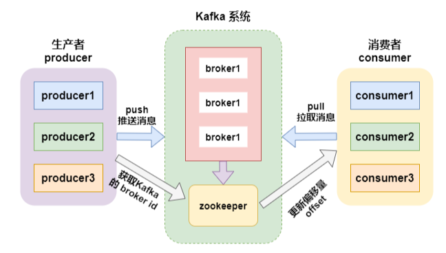
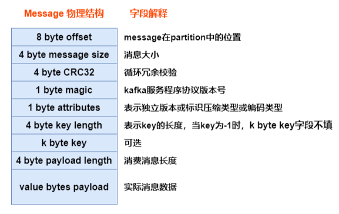

# Kafka

Apache Kafka 是一个分布式发布-订阅消息系统,消息保留在磁盘上,并在集群内复制以防止数据丢失.Kafka构建在Zookeeper同步服务之上.它与 Flink 和 
Spark 有非常好的集成,应用于实时流式数据分析,是用Scala语言开发的.

Kafka特点:
- 可靠性:具有副本及容错机制.
- 可扩展性:kafka无需停机即可扩展节点及节点上线.
- 持久性:数据存储到磁盘上,持久性保存.
- 高性能:kafka具有高吞吐量.达到TB级的数据,也有非常稳定的性能.
- 速度快:顺序写入和零拷贝技术使得kafka延迟控制在毫秒级.

- broker:kafka集群中包含一个或者多个服务实例(节点)broker
- topic:每条发布到kafka集群的消息都属于某个类别topic.
- partition:每个topic包含一个或者多个partition,每一个partition的数据是有序的,但全局的数据不能保证是有序的
- segment:一个partition当中存在多个segment文件段,每个segment分为两部分,.log数据的偏移量文件和 .index 索引文件.
- producer:消息的生产者,负责发布消息到 kafka 的 broker 中.
- consumer:消息的消费者,向 kafka 的 broker 中读取消息的客户端.
- consumer group:消费者组,每一个 consumer 属于一个特定的 consumer group(可以为每个consumer指定 groupName).

生产者生产数据不丢失

同步方式:
- 发送一批数据给kafka后,等待kafka返回结果:
- 生产者等待10s,如果broker没有给出ack响应,就认为失败.
- 生产者重试3次,如果还没有响应,就报错.

异步方式:
- 发送一批数据给kafka,只是提供一个回调函数:
- 先将数据保存在生产者端的buffer中.buffer大小是2万条 .
- 满足数据阈值或者数量阈值其中的一个条件就可以发送数据.
- 发送一批数据的大小是500条.

ack机制(确认机制)
- 生产者数据发送出去,需要服务端返回一个确认码,即ack响应码.ack的响应有三个状态值0,1,-1
- 0:生产者只负责发送数据,不关心数据是否丢失,丢失的数据,需要再次发送
- 1:partition的leader收到数据,不管follow是否同步完数据,响应的状态码为1
- -1:所有的从节点都收到数据,响应的状态码为-1

broker中数据不丢失
- 在broker中,保证数据不丢失主要是通过副本因子(冗余),防止数据丢失.

消费者消费数据不丢失
- 在消费者消费数据的时候,只要每个消费者记录好offset值即可,就能保证数据不丢失.也就是需要我们自己维护偏移量(offset),可保存在 Redis 中.消费者
通过提交偏移量来告知Kafka哪些消息已经被成功处理.提交偏移量的方式有自动提交和手动提交

