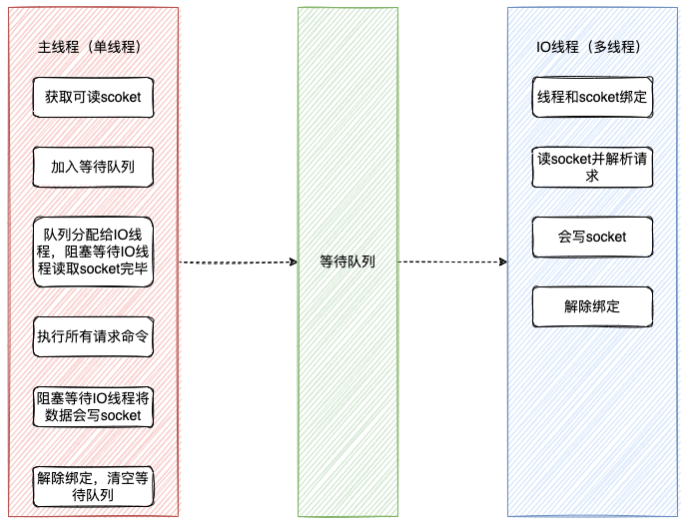

# Redis

## 简介

Redis是高性能的KV内存数据库,核心设计是单线程AE事件模型和IO多路复用技术.

## 特点

- 性能极高
- 数据的持久化,可以将内存中的数据保存在磁盘中,重启的时候可以再次加载进行使用.
- 提供 map,list,set,zset,hash等数据存储结构.
- master-slave 模式的数据备份.
- 单个操作是原子性的.多个操作通过 MULTI 和 EXEC 指令包起来.
- 发布订阅,通知,过期等特性

## 常见应用场景

- String:缓存,限流,分布式锁,计数器,分布式 Session 等.
- Hash:用户信息,用户主页访问量,组合查询等.
- List:简单队列,关注列表时间轴.
- Set:赞,踩,标签等.
- ZSet:排行榜,好友关系链表.
- bitmap:签到

## 版本更新

Redis 4 之后并不是单线程,除了主线程外,它也有后台线程在处理一些较为缓慢的操作,例如清理脏数据,无用连接的释放,大 key 的删除等等.

Redis 6 的多线程部分只是用来处理网络数据的读写和协议解析,执行命令仍然是单线程顺序执行.所以我们不需要去考虑线程安全问题.多线程默认是禁用的,只使用主线程.

## 过期键删除策略

- 定时删除:key设置过期时间
- 惰性删除:获取键时,判断是否应删除.
- 定期删除:activeExpireCycle函数以一定的频率运行执行删除.

## 分布式锁实现

- setnx expire
- Redisson 可重入锁,公平锁,红锁,读写锁

## 回收淘汰策略

- volatile-lru:过期数据集中挑选最近最少使用的数据淘汰
- volatile-ttl:过期数据集中挑选将要过期的数据淘汰
- volatile-random:过期数据集中任意选择数据淘汰
- allkeys-lru:数据集中挑选最近最少使用的数据淘汰
- allkeys-random:数据集中任意选择数据淘汰
- no-enviction:禁止驱逐数据（默认）

## 持久化方案

- RDB(Redis DataBase) 指定时间间隔的数据集快照写入磁盘,默认的文件名为 dump.rdb
- AOF(Append Only File) 追加保存数据库执行的命令,触发方式:每修改同步（always）,每秒同步（everysec）,不同步（no）

## 同类对比

Redis 和 Memcached 都采用了 master - worker 线程的模型,Redis 把处理逻辑交还给 master 线程,Memcached 执行主逻辑也是在
worker 线程

## 集群搭建模式

- 主从复制集群 master 主节点写,从节点读,高性能,但无法故障转移
- 哨兵集群 Sentinel 高可能,可故障转移
- 分片集群 Cluster 官方方案,自动分片,自动服务发现,自动选举

分片集群,将原来的线性hash槽变成逻辑上的环状.分片有 16384个槽位,最多可分1024片,该信息大小为2kb,16384÷8÷1024=2kb.

## 集群数据同步方式

主从同步刚连接的时候进行全量同步,全量同步结束后开始增量同步.

## 集群的故障转移流程

- 故障发现 节点通过 ping/pong 通信,通信一直失败则标记为主观下线(PFail)状态,当半数以上节点都标记为主观下线时.触发客观下线流程.
- 故障恢复 从节点替换下线主节点

## 最佳实践

- 如需集群,使用分片集群 Cluster
- 数据持久化只开启RDB,如果数据比较重要再开启每秒AOF.
- 使用同一局域网

## 缓存问题

- 缓存穿透 查询数据不存在,处理方案是布隆过滤器,空值缓存,限流,预加载,异步更新
- 缓存击穿 缓存过期并伴随大量对该key的请求,处理方案是热点数据不过期
- 缓存雪崩 大量key同时过期,处理方案是随机分配过期时间

