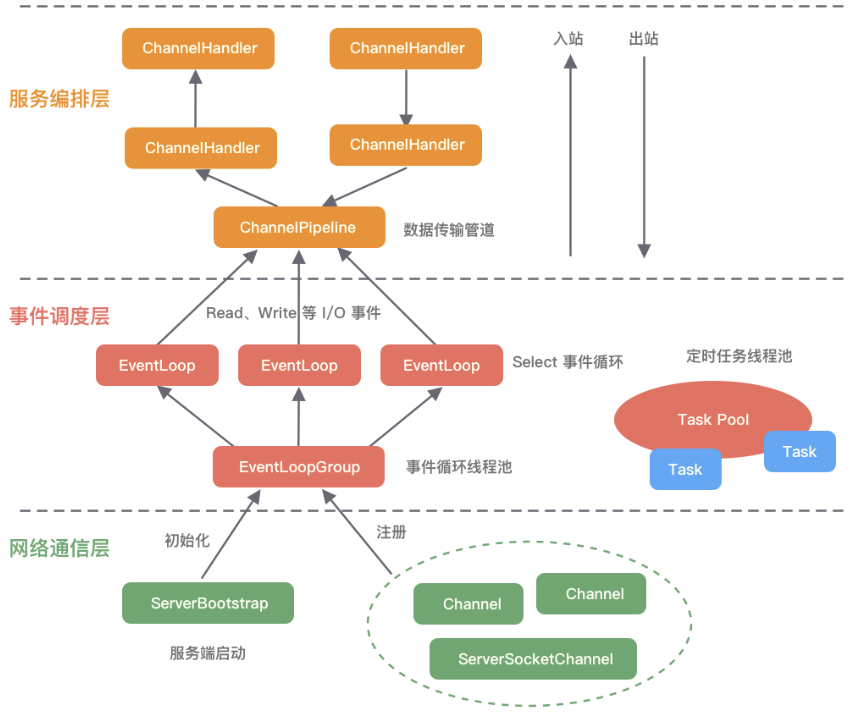

# Netty

## 简介

Netty提供异步事件驱动网络应用程序框架和工具,用以快速开发高性能,高可靠性的网络服务器和客户端程序.它用较简单的抽象,隐藏 Java网络编程底层实现的复杂性.

## 整体结构

- Core核心层：包括可扩展的事件模型,通用的通信 API,支持零拷贝的 ByteBuf 等.
- Protocol Support 协议支持层：支撑HTTP,SSL,Protobuf,压缩,大文件传输,WebSocket,文本,二进制等主流协议,也可自定义应用层协议.
- Transport Service 传输服务层：支持 Socket,HTTP 隧道,虚拟机管道等传输方式.Netty 对 TCP,UDP 等数据传输做了抽象和封装,用户可以更聚焦在
业务逻辑实现上,而不必关系底层数据传输的细节.

## 核心组件

引导类
- Bootstrap: 用于客户端,连接到远程主机和端口,1个EventLoopGroup
- ServerBootstrap: 用于服务器,绑定到一个本地端口,2个EventLoopGroup

针对网络抽象的组件
- Channel: 对应Socket.基本的IO操作(bind(), connet(), read(), write()), 依赖于底层网络传输,大大降低了直接使用Socket的复杂性.常用的实
现类有：EmbeddedChannel, LocalServerChannel, NioDatagramChannel, NioSctpChannel, NioSocketChannel
- EventLoop: 控制流,多线程处理,并发,用于处理连接的生命周期中所发生的事件.
- ChannelFuture: 异步通知.Netty提供了ChannelFuture接口,通过addListener()方法注册ChannelFutureListener,以便在操作完成时得到通知.

管理数据流及执行应用程序处理逻辑的组件

ChannelHandler: ChannelInboundHandler（SimpleChannelInboundHandler）处理入站操作, ChannelOutboundHandler处理出站操作.
ChannelPipeline: ChannelHandler 链的容器,并定义了入站和出站事件流的 API.当Channel 被创建时,它会被自动地分配到它专属的 ChannelPipeline.

## 基于MQTT协议基础实现

服务端

```text
pom.xml
<dependency>
    <groupId>io.netty</groupId>
    <artifactId>netty-all</artifactId>
    <version>4.1.63.Final</version>
</dependency>

application.properties
mqtt.serverIp=127.0.0.1
mqtt.serverPort=1883

public interface MessageStrategy {
    void sendResponseMessage(ChannelHandlerContext channelHandlerContext, MqttMessage mqttMessage);
}

@Slf4j
@Component
public class MessageStrategyManager {
    public Map<MqttMessageType, MessageStrategy> messageStrategyMap = new HashMap<>();

    //根据消息类型获取对应的策略类
    public MessageStrategy getMessageStrategy(MqttMessageType messageType) {
        switch (messageType) {
            case CONNECT:
                return new ConnectAckMessageStrategy();
            case PUBLISH:
                return new PublishAckMessageStrategy();
            case PUBREL:
                return new PublishCompleteMessageStrategy();
            case SUBSCRIBE:
                return new SubscribeAckMessageStrategy();
            case UNSUBSCRIBE:
                return new UnSubscribeAckMessageStrategy();
            case PINGREQ:
                return new PingMessageStrategy();
            default:
                return null;
        }
    }

    //根据消息类型获取返回消息的类型
    private static MqttMessageType getResMqttMessageType(MqttMessageType messageType) {
        switch (messageType) {
            case CONNECT:
                return MqttMessageType.CONNACK;
            case PUBLISH:
                return MqttMessageType.PUBACK;
            case PUBREL:
                return MqttMessageType.PUBLISH;
            case SUBSCRIBE:
                return MqttMessageType.SUBACK;
            case UNSUBSCRIBE:
                return MqttMessageType.UNSUBACK;
            case PINGREQ:
                return MqttMessageType.PINGRESP;
            default:
                return null;
        }
    }
}

@ChannelHandler.Sharable
@Component
@Slf4j
public class MqMessageChannelHandler extends ChannelInboundHandlerAdapter {
    // 消息队列请求处理器
    @Autowired
    ProducerService producerService;

    @Override
    public void channelRead(ChannelHandlerContext ctx, Object msg) {
        log.info("===MqMessageChannelHandler msg:{}", msg);
        if (!(msg instanceof MqMessage)) {
            return;
        }
        MqMessage mqMessage = (MqMessage) msg;
        log.info("===转发到Rabbitmq Server:" + mqMessage.data);
        producerService.sendData(mqMessage.data);
    }

}

@Component
@Slf4j
@ChannelHandler.Sharable
public class MqttMessageChannelHandler extends ChannelInboundHandlerAdapter {
    // MQTT(Message Queuing Telemetry Transport,消息队列遥测传输)协议处理器
    @Autowired
    MessageStrategyManager messageStrategyManager;

    @Override
    public void channelRead(ChannelHandlerContext channelHandlerContext, Object msg) {
        log.info("===MqttMessageChannelHandler msg:{}", msg);
        if (!(msg instanceof MqttMessage)) {
            return;
        }

        MqttMessage mqttMessage = (MqttMessage) msg;
        log.info("===from client:" + channelHandlerContext.channel().remoteAddress());
        log.info("===receive message:" + mqttMessage);
        try {
            MqttMessageType type = mqttMessage.fixedHeader().messageType();
            // 返回对于消息处理器对象
            MessageStrategy messageStrategy = messageStrategyManager.getMessageStrategy(type);
            if (messageStrategy != null) {
                messageStrategy.sendResponseMessage(channelHandlerContext, mqttMessage);
            }
        } catch (Exception e) {
            e.printStackTrace();
        }
        log.info("===MqttMessageChannelHandler channelRead end");

    }

    @Override
    public void exceptionCaught(ChannelHandlerContext ctx, Throwable cause) { // (4)
        // 当出现异常就关闭连接
        cause.printStackTrace();
        ctx.close();
    }
}

@Component
public class TCPServerChannelInitializer extends ChannelInitializer<SocketChannel> {
    @Autowired
    MqttMessageChannelHandler mqttMessageChannelHandler;
    @Autowired
    MqMessageChannelHandler mqMessageChannelHandler;

    public TCPServerChannelInitializer() {
        super();
    }

    @Override
    protected void initChannel(SocketChannel socketChannel) {
        // 频道流水线添加处理器
        socketChannel.pipeline().addLast("===mqttDecoder", new MqttDecoder());
        socketChannel.pipeline().addLast("===mqttEncoder", MqttEncoder.INSTANCE);
        //心跳超时控制
        socketChannel.pipeline().addLast("idle",
                new IdleStateHandler(15, 0, 0, TimeUnit.MINUTES));
        socketChannel.pipeline().addLast("===mqttHandler", mqttMessageChannelHandler);
        socketChannel.pipeline().addLast("===mqHandler", mqMessageChannelHandler);
    }
}

public void start() {
    log.info("mqtt server start:" + serverPort);
    bossGroup = new NioEventLoopGroup();
    workGroup = new NioEventLoopGroup();

    try {
        ServerBootstrap serverBootstrap = new ServerBootstrap();

        serverBootstrap.group(bossGroup, workGroup)
                .channel(NioServerSocketChannel.class)
                .childHandler(tcpServerChannelInitializer)
                .option(ChannelOption.SO_BACKLOG, 128)
                .childOption(ChannelOption.SO_KEEPALIVE, true);

        // 绑定端口,开始接收进来的连接
        channelFuture = serverBootstrap.bind(serverPort).sync();

    } catch (Exception e) {
        e.printStackTrace();
    }
}
```

客户端发送消息

```text
<dependency>
    <groupId>io.github.xzc-coder</groupId>
    <artifactId>netty-mqtt-client</artifactId>
    <version>1.1.0</version>
</dependency>

@RestController
public class MqttController {
    private MqttClient client;

    public MqttController() {
        //创建MQTT全局配置器(也可以不创建)
        MqttConfiguration mqttConfiguration = new MqttConfiguration(2);
        //创建MQTT客户端工厂
        MqttClientFactory mqttClientFactory = new DefaultMqttClientFactory(mqttConfiguration);
        //使用内存消息存储器(默认)
        MqttMsgStore mqttMsgStore = new MemoryMqttMsgStore();
        mqttClientFactory.setMqttMsgStore(mqttMsgStore);
        //创建连接参数,设置客户端ID
        //创建连接参数,设置客户端ID
        MqttConnectParameter mqttConnectParameter = new MqttConnectParameter("netty-client-mqtt-test");
        //设置客户端版本(默认为3.1.1)
        mqttConnectParameter.setMqttVersion(MqttVersion.MQTT_3_1_1);
        //是否自动重连
        mqttConnectParameter.setAutoReconnect(true);
        //Host
        mqttConnectParameter.setHost("127.0.0.1");
        //端口
        mqttConnectParameter.setPort(1883);
        //是否使用SSL/TLS
        mqttConnectParameter.setSsl(false);
        //遗嘱消息
        MqttWillMsg mqttWillMsg = new MqttWillMsg("test", "hello matt2".getBytes(), MqttQoS.EXACTLY_ONCE);
        mqttConnectParameter.setWillMsg(mqttWillMsg);
        //是否清除会话
        mqttConnectParameter.setCleanSession(true);
        //心跳间隔
        mqttConnectParameter.setKeepAliveTimeSeconds(60);
        //连接超时时间
        mqttConnectParameter.setConnectTimeoutSeconds(30);
        //创建一个客户端
        MqttClient mqttClient = mqttClientFactory.createMqttClient(mqttConnectParameter);
        //添加回调器
        mqttClient.addMqttCallback(new DefaultMqttCallback());
        mqttClient.connect();
        client = mqttClient;
    }

    @GetMapping("/sendMessage")
    public String sendMessage() {
        // http://localhost:8081/sendMessage
        client.publishFuture(new MqttMsgInfo("test", "hello matt".getBytes(), MqttQoS.EXACTLY_ONCE));
        return "success";
    }
}
```

## 逻辑架构

逻辑处理架构为典型网络分层架构设计,共分为网络通信层,事件调度层,服务编排层
- 网络通信层核心组件:BootStrap,ServerBootStrap,Channel.
- 事件调度层核心组件:EventLoopGroup,EventLoop,通过 Reactor 线程模型对各类事件进行聚合处理,通过 Selector 主循环线程集成多种事件（ I/O 事件,信号事件,定时事件等）
- 服务编排层的核心组件: ChannelPipeline,ChannelHandler,ChannelHandlerContext

Reactor 的三种线程模型
单线程模型：EventLoopGroup 只包含一个 EventLoop,Boss 和 Worker 使用同一个EventLoopGroup;
多线程模型：EventLoopGroup 包含多个 EventLoop,Boss 和 Worker 使用同一个EventLoopGroup;
主从多线程模型：EventLoopGroup 包含多个 EventLoop,Boss 是主 Reactor,Worker 是从 Reactor,它们分别使用不同的 EventLoopGroup

