# Docker 常用镜像安装

# 主要内容

> [简介](#简介)  
> [MySQL](#mysql)  
> [Redis](#redis)  
> [Nginx](#nginx)  

# 正文

## 简介

Docker Hub 是一个公共的云端镜像库,它可提供用户使用的 Docker 镜像,包括官方库和用户私人库.它还提供了包括构建,管理和分享 Docker 镜像的工具,被广泛
应用于 Docker 开发和部署.Docker Hub 为 Docker 镜像的构建和管理提供了一个简单的方法并且提高了基础设施的可移植性.

Docker Hub 官网: https://hub.docker.com/

## MySQL

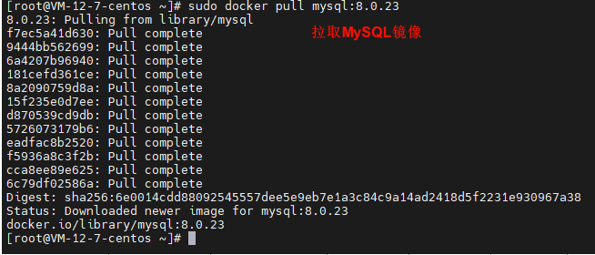

```shell
sudo docker pull mysql:8.0.23
```

拉取 MySQL 指定版本

----

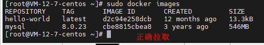

```shell
sudo docker images
```

查看是否正确拉取

----

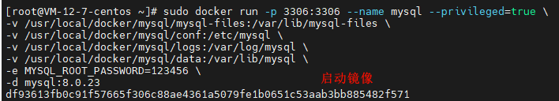

```shell
sudo docker run -p 3306:3306 --name mysql --privileged=true \
-v /usr/local/docker/mysql/mysql-files:/var/lib/mysql-files \
-v /usr/local/docker/mysql/conf:/etc/mysql \
-v /usr/local/docker/mysql/logs:/var/log/mysql \
-v /usr/local/docker/mysql/data:/var/lib/mysql \
-e MYSQL_ROOT_PASSWORD=123456 \
-d mysql:8.0.23
```

运行 MySQL 并映射主要文件到磁盘

----

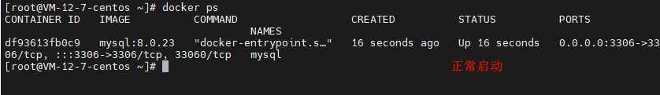

```shell
sudo docker ps
```

查看是否正常启动

----

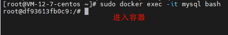

```shell
sudo docker exec -it mysql bash
```

进入容器

----

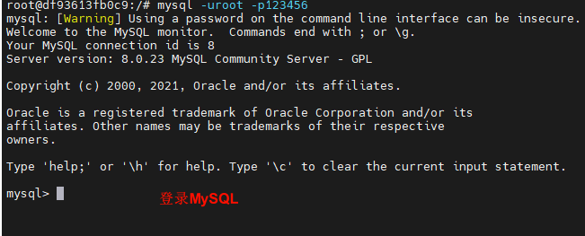


```shell
mysql -uroot -p123456
```

登录MySQL

----

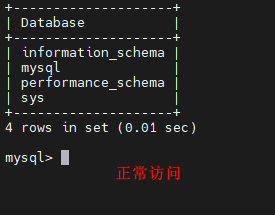

```shell
show databases;
```

执行下 MySQL 语句看看

----

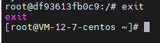

```shell
exit
```

退出容器

----

## Redis

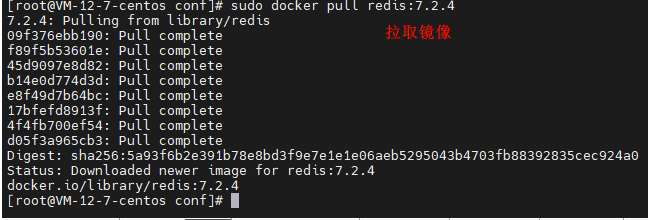

```shell
sudo docker pull redis:7.2.4
```

拉取 Redis 7.2.4 版本

----

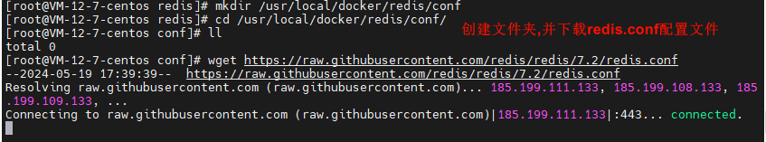

```shell
mkdir /usr/local/docker/redis/conf
```

```shell
wget https://raw.githubusercontent.com/redis/redis/7.2/redis.conf
```

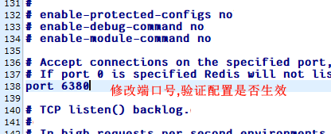

创建配置文件目录,赋予写权限,然后下载 redis.conf 文件(下载不下来就从镜像库中下载Redis,把配置文件拿来用即可),修改配置如端口号

redis.conf下载地址: https://redis.io/docs/latest/operate/oss_and_stack/management/config/

----

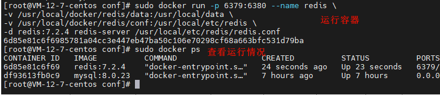

```shell
sudo docker run -p 6379:6380 --name redis \
-v /usr/local/docker/redis/data:/usr/local/data \
-v /usr/local/docker/redis/conf:/usr/local/etc/redis \
-d redis:7.2.4 redis-server /usr/local/etc/redis/redis.conf
```
```shell
sudo docker ps
```

运行镜像,指定外部配置文件,然后查看容器运行情况

----

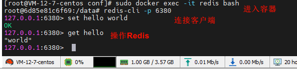

```shell
sudo docker exec -it redis bash
```
```shell
redis-cli -p 6380
```

进入容器,并打开客户端,操作下 Redis 命令,可以看到端口号是 6380 说明外部配置生效了

----

## Nginx

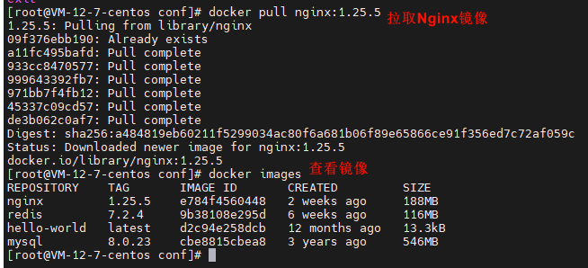

```shell
sudo docker pull nginx:1.25.5
```

```shell
sudo docker images
```

拉取 Nginx 镜像并查看

----

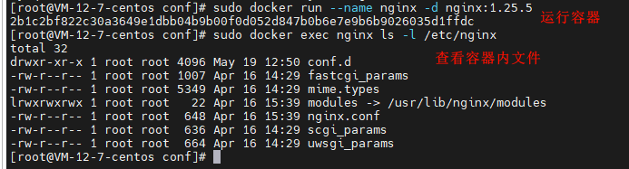

```shell
sudo docker run --name nginx -d nginx:1.25.5
```

```shell
sudo docker exec nginx ls -l /etc/nginx
```

运行容器并查看容器内文件

----

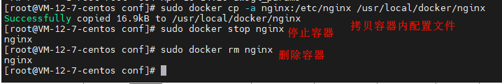

```shell
sudo docker cp -a nginx:/etc/nginx /usr/local/docker/nginx
```

```shell
sudo docker stop nginx
```

```shell
sudo docker rm nginx
```

拷贝容器内配置文件到磁盘,停止容器并移除

----

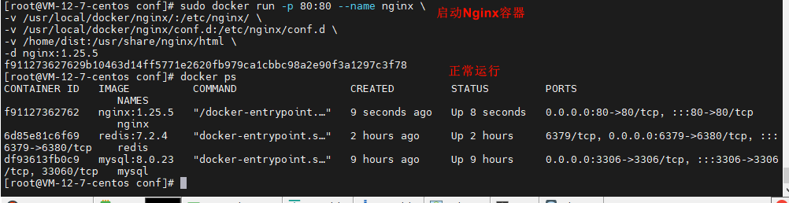

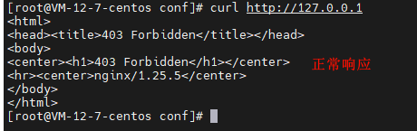

```shell
sudo docker run -p 80:80 --name nginx \
-v /usr/local/docker/nginx/:/etc/nginx/ \
-v /usr/local/docker/nginx/conf.d:/etc/nginx/conf.d \
-v /home/dist:/usr/share/nginx/html \
-d nginx:1.25.5
```

启动 Nginx 容器,并访问验证

----

以上就是本文核心内容.

## 题外话

Docker Hub 官网: https://hub.docker.com/

redis.conf下载地址: https://redis.io/docs/latest/operate/oss_and_stack/management/config/

[返回顶部](#主要内容)

