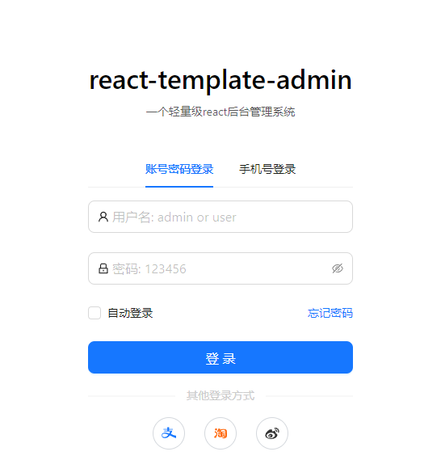
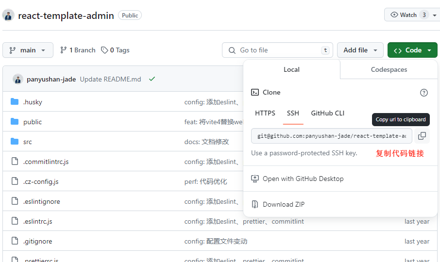
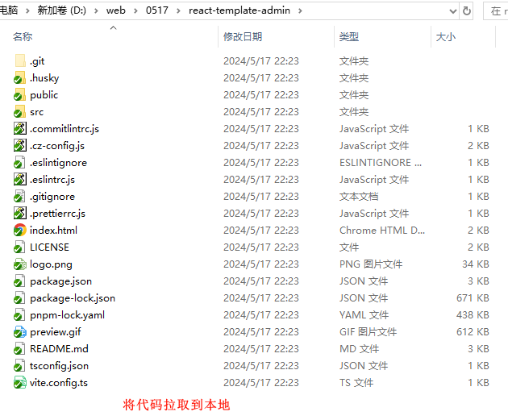
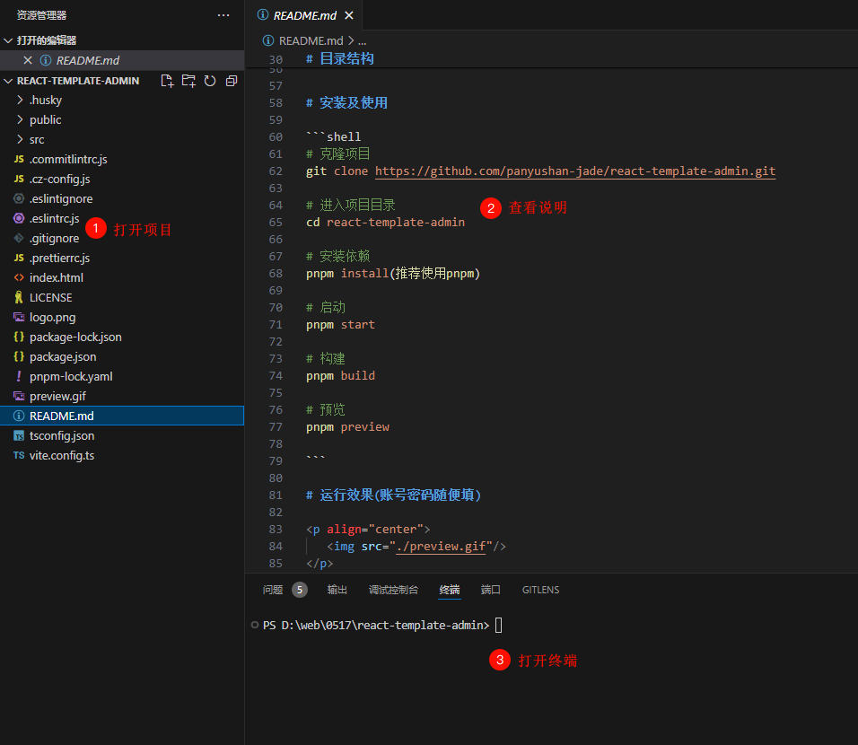
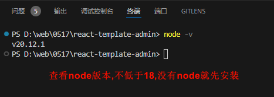
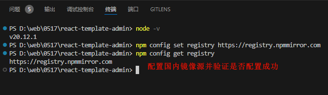
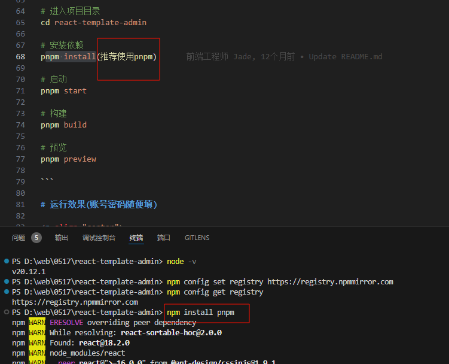
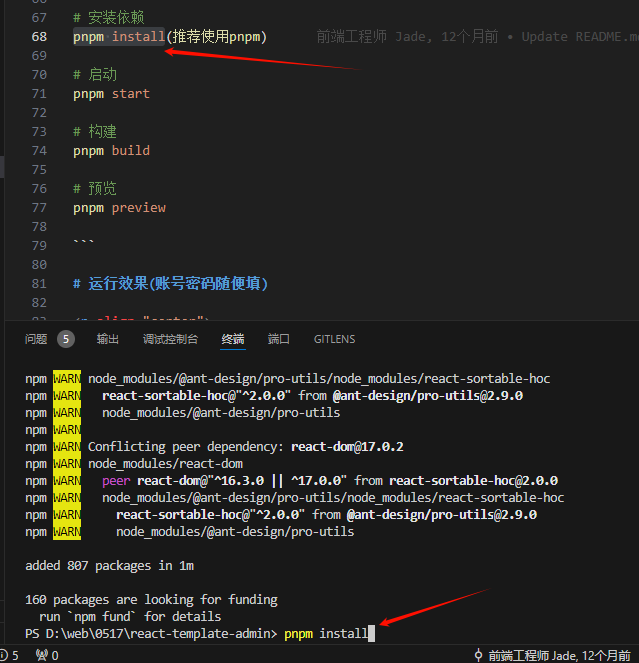
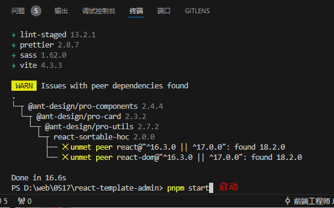
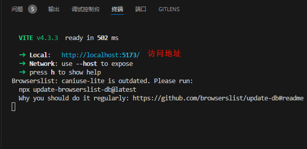

# React 项目运行

# 主要内容

> [简介](#简介)  
> [展示](#展示)  
> [集成步骤](#集成步骤)

# 正文

## 简介

React 是用于构建用户界面的 JavaScript 库, 起源于 Facebook 的内部项目, 该公司对市场上所有 JavaScript MVC 框架都不满意, 决定自行开发一套, 
用于架设 Instagram 的网站.于2013年5月开源.

演示代码(感谢分享) :https://github.com/panyushan-jade/react-template-admin

React.js官网: https://react.dev/

React.js中文网: https://react.nodejs.cn/

## 展示

基于 React 18 构建

----

## 集成步骤

打开代码地址: https://github.com/panyushan-jade/react-template-admin ,复制代码链接,拉取代码到本地.

----

本地代码展示,有很多文件,用 Visual Studio Code 打开看看

----

有个很好的描述文档,参照描述文档来构建看看

----

描述文档提到了 pnpm 命令,那么首先就要安装下 Node.js (基于 Chrome V8 引擎的 JavaScript 运行环境)

Node.js 下载地址: https://nodejs.org/en/download/package-manager

安装完成后,用 node -v 查看下能否正常使用

----

npm(Node Package Manager) 是一个用于管理 Node.js 包和模块的命令行工具,它要从一个仓库中拉取各种所需的包和模块,这个默认仓库地址是
https://registry.npmjs.org/ 服务器在国外,访问速度很慢,甚至会超时,把仓库地址改成国内的镜像仓库.

仓库地址设置为阿里镜像库: npm config set registry https://registry.npmmirror.com

重新查看仓库配置: npm config get registry

----

安装下 pnpm 包: npm install pnpm

----

用 pnpm 命令把其他的包安装: pnpm install

----

用 pnpm 命令启动服务: pnpm start

----

打开服务访问地址

----

可以看到服务正常启动了

----

以上就是本文核心内容.

## 题外话

Node.js 是一个基于 Chrome V8 引擎的 JavaScript 运行环境,它使得 JavaScript 可以脱离浏览器运行在服务器端.Node.js 的出现极大地扩展了 
JavaScript 的应用范围, 使得开发者能够使用 JavaScript 来编写服务器端代码, 进行文件操作, 网络通信等操作.Node.js 采用事件驱动, 非阻塞 I/O 模型
, 使其轻量又高效, 非常适合处理高并发的网络请求.

Node.js 非常适合开发实时应用,如在线聊天, 在线游戏, 实时通知等.其事件驱动和非阻塞 I/O 的特性使得它能够高效地处理大量的并发连接.

Node.js 也非常适合作为 API 服务器, 提供 RESTful 或 GraphQL API 服务.其高效的性能和对 JSON 的天然支持使其成为构建 API 服务器的理想选择.

Node.js 也适合用于构建微服务架构的应用.微服务架构是一种将应用拆分为一组小的, 独立的服务的架构风格, 每个服务运行在其自己的进程中, 并通过网络通信.

Node.js: https://nodejs.org/en

Node.js中文网: https://nodejs.p2hp.com/

[Github 源码备份](https://github.com/Awaion/tools/tree/master/demo011/react-template-admin)

[返回顶部](#主要内容)

