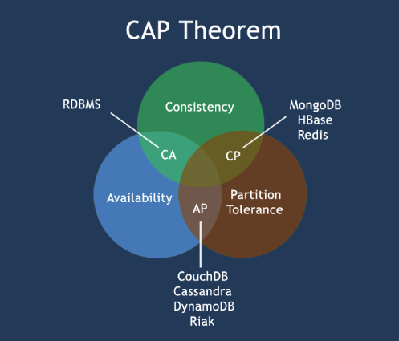

# 分布式系统 

# 主要内容

> [CAP理论](#cap理论)  
> [BASE理论](#base理论)  
> [Gossip数据一致性协议](#gossip数据一致性协议)  
> [Raft数据一致性协议](#raft数据一致性协议)  
> [负载均衡算法](#负载均衡算法)  
> [限流算法](#限流算法)  
> [MySQL事务隔离级别](#mysql事务隔离级别)  
> [分布式事务](#分布式事务)  

## CAP理论

CAP理论是用来描述分布式系统具备的特性

- Consistency 强一致性,分布式系统所有节点在同一时刻具有相同值,不管向哪台服务器写入数据,其他的服务器能实时同步数据
- Availability 可用性,部分节点宕机不影响整个集群对外提供服务,每次请求总能及时处理并响应,从用户角度来看不会出现错误,但实际内部系统有故障
- Partition Tolerance 分区容错性,某个节点因为网络等问题造成数据不一致,数据延迟同步虽然会影响部分节点数据的时效性,但是服务节点依然是可用的.

一个分布式系统不可能同时很好的满足强一致性,可用性和分区容错性这三个需求.根据 CAP 原理将 NoSQL 数据库分成三类.

- CA 单点集群,满足一致性,可用性的系统,通常在可扩展性上不太强大
- CP 满足一致性,分区容忍必的系统,通常性能不是特别高,Zookeeper/Consul
- AP 满足可用性,分区容忍性的系统,通常可能对一致性要求低一些,Eureka

牺牲一致性是指放弃强一致性,使用弱一致性或最终一致性,换取可用性和分区容错性.

!

## BASE理论

基于CAP定理演化而来,是对CAP中一致性和可用性权衡的结果

- Basically Available 基本可用,在出现故障的时候,允许损失部分可用性,保证核心可用
- Soft-state 软状态,允许系统存在中间状态且不会影响系统整体可用性,即允许系统在不同节点间副本同步的时候存在延时
- Eventual Consistency 最终一致性,所有数据副本经过一定时间后,最终能够达到一致的状态

举例:柔性事务满足BASE理论(基本可用,最终一致),刚性事务满足ACID理论

## Gossip数据一致性协议

Gossip(流言蜚语)数据一致性协议是通过广播方式传递的,其特点是

- Gossip协议是周期性散播消息,每隔一段时间传播一次
- 被感染的节点,每次可以继续散播N个节点
- 每次散播消息时,都会选择尚未发送过的节点进行散播,不会向发送的节点散播
- 同一个节点可能会收到重复的消息,因为可能同时多个节点正好向它散播
- 集群是去中心化的,节点之间都是平等的
- 消息的散播不用等接收节点的 ack,即消息可能会丢失,但是最终应该会被感染
- Redis Cluster采用了Gossip协议

## Raft数据一致性协议

当要求所有节点都收到数据才响应成功,性能有所欠缺,所以一般会在数据的安全和性能之间做个折中,只要保证绝大部分节点同步数据成功就算成功,Raft便是折中方式.

Raft中的角色:

- Leader节点: 所有数据的变更都需要先经过Leader
- Follower节点: Leader节点的追随者,负责复制数据并且在选举时候投票的节点
- Candidate候选节点: Follower节点参与选举时会切换的角色

Raft过程:

- Leader 选举: 无Leader时,所有的Follower节点切换为Candidate候选节点,然后拉票,票数最多变为Leader.
- 数据日志的复制: 将变更记录到log中,然后Leader会将这个变更随着下一次的心跳通知给Follower节点.

Nacos,Consul,Kafka采用Raft协议

## 负载均衡算法

在分布式系统中,用于请求如何分配

- 轮询(Round Robin):地址列表中依次选择一个地址,请求数上的分配相对比较均衡 -> 终生平等
- 随机(Random):随机分配给地址列表中的任一服务器,无规律 -> 概率论
- 源地址哈希(Source Hashing):对源IP地址求hash值,并对服务地址列表长度取余.同一源IP地址会被映射到同一个后端服务器上 -> 熟人对待
- 加权轮询(Weighted Round Robin):给每个服务器设置权重,权重指标可以是配置,负载等 -> 性价比+比后平等
- 最小连接数(Least Connections):选择连接请求数最小的服务器,需要维护一个连接数变量 -> 找空闲
- 加权随机(Weight Random):给每个服务器设置权重,权重指标可以是配置,负载等 -> 性价比+比后随机
- 动态加权轮询算法:实时给每个服务器设置权重,权重指标可以是配置,负载等 -> 频繁性价比+比后平等
- 最快响应算法:将请求分配给响应时间最短的节点 -> 多劳多得

常见负载均衡客户端: Spring Cloud Ribbon,内置轮询(默认)和随机

常见负载均衡服务端: DNS,Nginx(轮询,加权轮询,源地址哈希,加权最小连接数,加权最少请求数),LVS

## 限流算法

用于管理请求量

- 漏斗算法(LeakyBucket) 匀速处理 -> 效率低
- 令牌桶算法(TokenBucket) 类似于响应式编程buffer区
- 滚动时间窗口(Tumbling Time Window) 流量0~2倍间 -> 瞬间波动幅度大
- 滑动时间窗口(Sliding Time Window) 滚动时间窗口的优化,波动幅度小

## MySQL事务隔离级别

事务的四大特性
- 原子性 Atomicity
- 一致性 Consistency
- 隔离性 Isolation
- 持久性 Durability

- 读未提交 Read Uncommitted 事务不会对数据进行隔离,只满足持久性,会产生脏读,不可重复读,幻读
- 读已提交 Read Committed 默认事务隔离级别,满足持久性,隔离性,会产生不可重复读,幻读
- 可重复读 Repeatable Read 使用多版本并发控制(MVCC)来实现,满足持久性,隔离性,一致性,会产生幻读
- 串行化 Serializable 强制事务串行执行,四大特性均满足,性能最差

问题解释:

- 脏读 能读取事务还未提交的数据
- 不可重复读 同一行数据可同时被其它事务修改
- 幻读 查询出事务开始时没出现的数据

针对 读已提交 隔离级别处理不可重复读问题
- 悲观锁(FOR UPDATE(行锁)/LOCK TABLES(表锁)/FLUSH TABLES WITH READ LOCK(全局锁))和
- 乐观锁(WHERE version = (行锁))

## 分布式事务

理论

- 二阶段提交 2PC(Two-Phase Commit) prepare,commit/rollback
- 三阶段提交 3PC(Three-Phase Commit) CanCommit,PreCommit,doCommit/rollback
- 业务三阶段提交 TCC(Try-Confirm-Cancel) Try,Confirm,Cancel
- 最终一致性,通过独立消息微服务(RabbitMQ/KafKa)+消息消费ACK(Acknowledgment)机制正确处理
- 最大努力通知原则(Best-Effort Notification),事务完成后发通知

Seata 实践

AT 模式基于 支持本地 ACID 事务 的 关系型数据库,先获取全局锁+本地消息表

- 一阶段 prepare 行为:在本地事务中,一并提交业务数据更新和相应回滚日志记录.
- 二阶段 commit 行为:马上成功结束,自动 异步批量清理回滚日志.
- 二阶段 rollback 行为:通过回滚日志,自动 生成补偿操作,完成数据回滚.

TCC 模式,不依赖于底层数据资源的事务支持:

- 一阶段 prepare 行为:调用 自定义 的 prepare 逻辑.
- 二阶段 commit 行为:调用 自定义 的 commit 逻辑.
- 二阶段 rollback 行为:调用 自定义 的 rollback 逻辑.

Saga模式是SEATA提供的长事务解决方案,基于状态机引擎来实现的

- 业务流程中每个参与者都提交本地事务,
- 当出现某一个参与者失败则补偿前面已经成功的参与者,一阶段正向服务和二阶段补偿服务都由业务开发实现
- 优势:一阶段提交本地事务,无锁,高性能
- 优势:事件驱动架构,参与者可异步执行,高吞吐
- 优势:补偿服务易于实现
- 缺点:不保证隔离性

XA 规范 是 X/Open 组织定义的分布式事务处理(DTP,Distributed Transaction Processing)标准

- XA 协议要求事务资源本身提供对规范和协议的支持,所以事务资源(如数据库)可以保障从任意视角对数据的访问有效隔离,满足全局数据一致性
- 基于两阶段提交,数据库自身实现
- 业务无侵入
- XA prepare 后,分支事务进入阻塞阶段,收到 XA commit 或 XA rollback 前必须阻塞等待.事务资源长时间得不到释放,锁定周期长,而且在应用层上面无法干预,性能差.

## 结尾

以上就是本文核心内容.

[Github 源码](https://github.com/Awaion/tools/tree/master/demo029)

[返回顶部](#主要内容)

