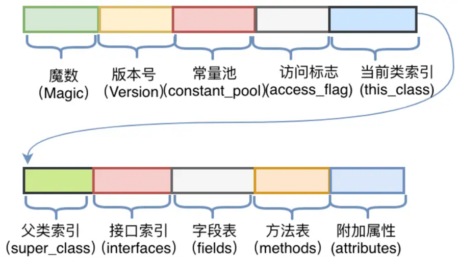
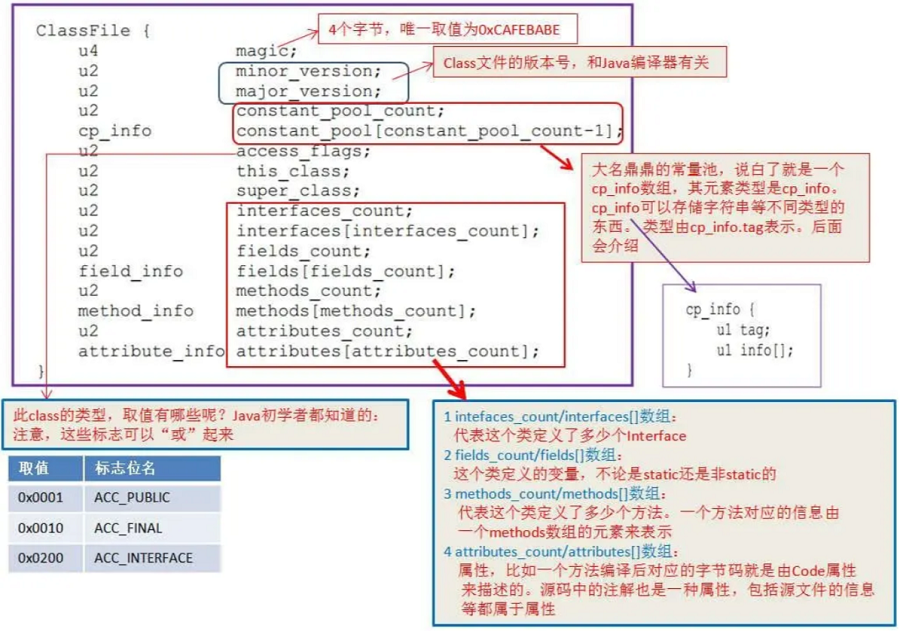
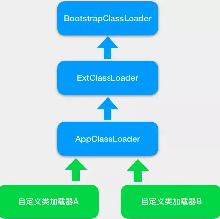
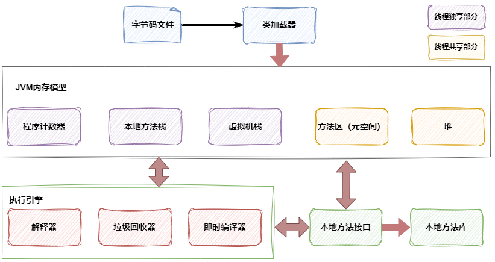

# JVM

## 字节码文件

Java字节码文件(Java Bytecode File)是Java虚拟机(JVM)执行的一种虚拟指令格式,通常具有.class的扩展名.这种文件是由Java编译器(如javac)
将Java源代码文件(.java)编译后生成的,包含了Java虚拟机可理解的指令集,具有以下特点:
- 中间表示形式:字节码文件是介于源代码和机器码之间.
- 跨平台性:由于字节码文件运行在Java虚拟机中,和操作系统,硬件平台没有直接关系.
- 面向对象:字节码文件是面向对象编程语言(如Java)的典型编译结果.
- 可优化和加密:字节码文件可以进行优化和加密,以提高执行效率和保护代码安全性.

Java字节码文件的组成通常包括以下几个部分:
魔数(Magic Number):标识文件是否是合法字节码文件,占4个字节.
版本信息:包括主要版本号和次要版本号,由编译器产生,标识字节码文件的版本,占4个字节.
常量池(Constant Pool):变长的数据结构,存储各种字面量和符号引用,如类名,字段名,方法名,接口名,字符串常量等.
访问标志(Access Flags):表示类或接口的访问属性,如public,final,abstract等,占2个字节.
类索引,父类索引和接口索引集合:描述类的继承关系和实现的接口.
字段表集合(Field Table):描述类中定义的所有字段.
方法表集合(Method Table):描述类中定义的所有方法.
属性表集合(Attribute Table):描述类的附加信息,包括源代码文件名,注解等.

查看和分析Java字节码文件,可以使用 jclasslib

## 类加载过程

Java类加载过程是指将Java类的字节码从磁盘或网络加载到内存中,并进行相关处理的过程.以下是Java类加载过程的详细阶段:

- 加载(Loading):

根据类的全限定名查找对应的类文件.
为类的数据结构分配内存空间.
将该字节流代表的静态存储结构转化为方法区的运行时数据结构.
在内存中生成一个代表该类的java.lang.Class对象,作为方法区该类的各种数据的访问入口.

- 验证(Verification):

确保.class文件字节流中包含的信息符合当前虚拟机的要求,不会危害虚拟机自身的安全.

- 准备(Preparation):

为类变量分配内存以及设置初始值(通常情况下是数据类型的零值).这里所说的初始值不包括实例变量,实例变量会在对象实例初始化时分配内存.

- 解析(Resolution):

将方法区中的字符引用转换成直接引用.

- 初始化(Initialization):

对静态的变量(static)进行赋值,包括初始化代码块.

- 使用(Using):

初始化完成后,类就可以被虚拟机使用了.

- 卸载(Unloading):

JVM的垃圾收集器判定该类没有再被引用时,类就会被卸载,即类所占用的内存空间会被释放.

## 类加载器

JVM有三大类加载器,分别是Bootstrap根加载器,Extension扩展加载器和System系统加载器.不同的加载器负责将不同的类加载到JVM内存中,它们之间遵循双
亲委派模型,当一个类加载器需要加载一个类时,它首先会请求父类加载器去加载这个类,如果父类加载器无法加载该类,那么再由当前类加载器去加载.

## 运行时内存模型

JVM运行时内存模型主要包括以下几个区域

- 堆(Heap):

堆是JVM中最大的一块内存区域,用于存放所有的对象实例,并被所有线程共享.

按照垃圾分代收集的角度划分,堆区又可以分成年轻代(Young Generation)和老年代(Old Generation).

年轻代内存又被分成Eden空间,From Survivor空间,To Survivor空间,默认情况下年轻代按照8:1:1的比例来分配.

- 方法区(Method Area):

也称为永久代(在JDK 1.8之前)或元空间(在JDK 1.8及之后),用于存储类信息,常量,静态变量等数据,并被所有线程共享的.

- 程序计数器(Program Counter Register):

是一块较小的内存空间,可以看作是当前线程所执行的字节码的行号指示器.

Java虚拟机的多线程是通过线程轮流切换并分配处理器执行时间的方式来实现的,在任一个确定的时刻,一个处理器(对于多核处理器来说是一个内核)只会执行一条
线程中的指令.每条线程都需要独立的程序计数器,在线程切换后能恢复到正确的执行位置,各条线程之间计数器互不影响,独立存储.

- 虚拟机栈(JVM Stacks):

线程私有的内存区域,每个线程在创建时都会创建一个虚拟机栈,其内部保存一个个栈帧(Stack Frame),对应着一次次的Java方法调用. 栈帧中存储着局部变量
表,操作数栈,动态链接,方法出口等信息.

- 本地方法栈(Native Method Stack):

与虚拟机栈所发挥的作用非常相似,其区别不过是虚拟机栈为虚拟机执行Java方法(也就是字节码)服务,而本地方法栈则为虚拟机使用到的Native方法服务.

- 直接内存(Direct Memory):

直接内存并不是JVM运行时数据区的一部分,但也被频繁地使用,而且也可能导致OutOfMemoryError异常出现.

## 垃圾回收器

- Serial GC 串行收集器:

最古老,最稳定的单线程收集器.在进行垃圾回收时会暂停所有用户线程.适用于单线程环境或小型应用,客户端模式下的默认新生代收集器.

- ParNew GC 并行收集器:

Serial GC的多线程版本.被称为“并行年轻代收集器”,可以与CMS收集器配合使用.适用于多核CPU,可以充分利用多核优势.

- CMS GC Concurrent Mark-Sweep 并发标记清除收集器:

以获取最短回收停顿时间为目标的收集器,主要用于老年代的垃圾回收. 特点是并发收集,低停顿.在JDK 14中被删除,被G1等收集器所取代.

- Parallel Scavenge GC 并行清除收集器:

多线程并行的垃圾收集器,用于新生代和老年代的回收.目标是达到一个可控制的吞吐量.

- G1 GC Garbage-First 垃圾优先收集器:

是一种面向服务端应用的垃圾收集器,逐步取代CMS收集器.具有更可控的停顿时间和高效的并发能力.主要针对配备多核CPU及大容量内存的机器,JDK 9及之后的版
本中,G1成为默认的垃圾收集器.

- Epsilon GC:

又被称为“No-Op(无操作)”回收器,JDK 11中引入. 不执行任何垃圾回收,当堆内存满时,JVM将直接退出.

- ZGC:

可伸缩的低延迟垃圾回收器,在JDK 11中以实验性质引入,并在后续版本中持续增强. 目标是支持TB级内存,同时保持低延迟.

- Shenandoah GC:

低停顿时间的GC,同样以实验性质在JDK 12中引入.

JVM垃圾回收器的选择涉及到一些评估指标,如吞吐量,暂停时间,内存占用,垃圾收集开销和收集频率等.

## 垃圾回收算法

- Mark-Sweep 标记-清除算法

标记阶段从根对象(GC Roots)开始,遍历整个对象图,标记所有可达对象.清除阶段遍历整个堆内存,清除所有未标记的对象,将它们的内存空间回收,标记和清除
过程会导致应用程序暂停(Stop-The-World),影响性能；清除阶段会产生内存碎片,导致大对象分配困难

- Copying 复制算法

内存划分为两块相等的区域,称为“From空间”和“To空间”,每次只使用其中的一块,复制完成后,清空From空间,交换From和To空间的角色,需要两块相同大小的
内存区域,空间浪费较大；不适用于存活对象较多的情况

- Mark-Compact 标记-整理算法

标记阶段与标记-清除算法相同,标记所有可达对象,整理阶段,将所有存活对象向堆的一端移动,保持内存的连续性.移动完成后,清除后半部分的内存空间,对象移
动过程较复杂,需要更新所有引用,回收效率相对较低

- Generational Collection 分代收集算法

垃圾回收器根据不同代的特点采用不同的回收策略,例如新生代采用复制算法,老生代采用标记-压缩算法

- G1(Garbage-First)垃圾优先算法:

G1将堆划分为多个大小相等的独立区域(Region),并且预测垃圾收集的停顿时间.优先收集垃圾最多的区域.

- Region 分区算法

将内存划分为多个独立的区域,每个区域可以独立地进行垃圾回收

- Reference Counting 引用计数算法

通过维护每个对象的引用计数来跟踪对象的生命周期,当对象的引用计数为0时,表示该对象不再被引用,可以被回收,引用计数算法存在循环引用的问题,因此在JVM
中并未被广泛采用

- 可达性分析

从一组称为“根”的对象出发,遍历对象图.在遍历对象图的过程中,所有经过的对象均被标记为可达.所有未被标记的对象都是不可达的,因此可以被回收.“根”对象
包括Java虚拟机栈中的本地变量,静态变量,常量,引用的对象,静态变量引用的对象以及本地方法栈中JNI(Java Native Interface)引用的对象

## 调优

- 堆内存调优 根据物理内存自动设置,默认最小1/64,最大1/4

初始堆大小(-Xms参数)和最大堆大小(-Xmx参数)

- 垃圾回收调优 JDK9默认G1

根据实际情况选择合适的垃圾回收器(如G1,CMS等),并调整相关参数以获得更好的性能

- 线程调优 根据系统的CPU和内存资源自动调整线程的数量和优先级

如线程栈大小(-Xss参数),线程池大小等

- 类加载调优 默认双亲委派模型

设置适当的类加载器层次结构,减少类加载的次数和提高加载速度

- 编译器优化 默认开启

开启JIT(Just-In-Time Compiler)编译器优化,JIT编译器可以将热点代码(频繁执行的代码路径)编译为本地机器代码,提高执行速度.

- 系统资源监控

监控JVM和系统的资源使用情况,及时发现和解决性能瓶颈

- 代码优化

通过优化代码结构,算法等提高程序的运行效率,减少不必要的资源消耗

